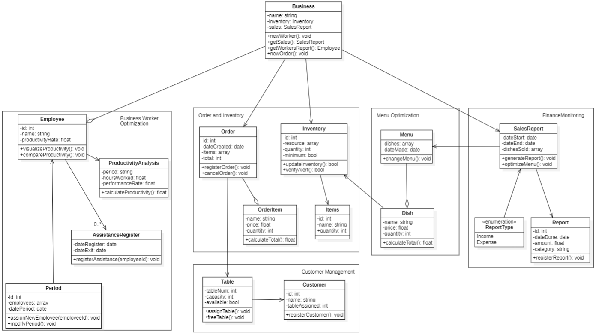
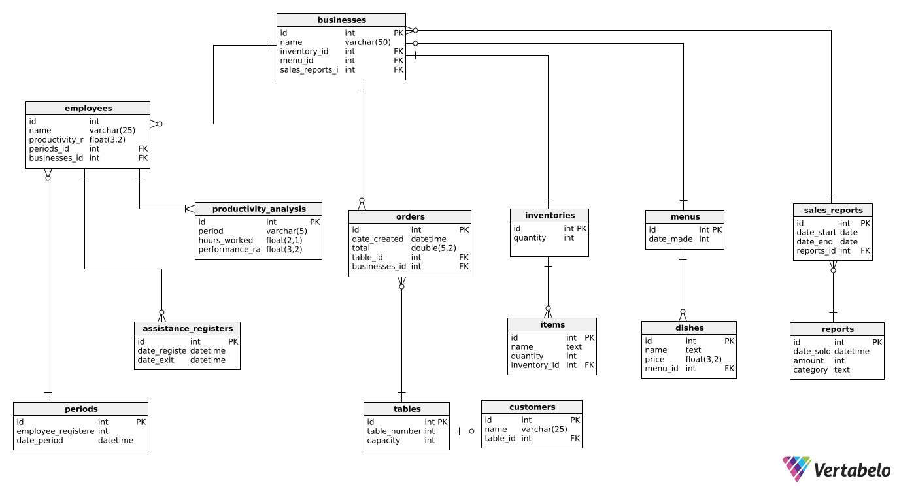

<div align="center">

## Universidad Peruana de Ciencias Aplicadas


#### Nombre del curso: Aplicaciones Web
##### Carrera: Ingeniería de Software
##### Nombre del profesor: Ángel Augusto Velasquez Nuñez
##### Sección: WS53

#### "Informe de Trabajo Final"
##### Nombre de la Startup: Latte
##### Nombre del Producto: FoodSuit

#### Integrantes
Bernaola Pérez, André Arturo (U202114192)<br>
Grandez Mansilla, Jean Pierre (U202212484)<br>
Pacheco Astiguetta, Sebastian (U202110291)<br>
Paiva Quispe, Josue Gonzalo (U202119095)<br>
Velarde Luyo, Piero Alberto (U20211A620)<br>

**Agosto de 2024**
</div>

# Registro de Versiones del Informe
<table BORDER>
    <tr>
        <td>VERSION</td>
        <td>FECHA</td>
        <td> AUTOR </td>
        <td>DESCRIPCION DE MODIFICACION</td>
    </tr>
    <tr>
        <td>01</td>
        <td>17/08/2024</td>
        <td> Sebastian Pacheco Astiguetta </td>
        <td>Formato del documento</td>
    </tr>
    <tr>
        <td>02</td>
        <td>20/08/2024</td>
        <td>Josue Paiva Quispe</td>
        <td>Antecedentes y problematicas</td>
    </tr>
    <tr>
        <td>03</td>
        <td>20/08/2024</td>
        <td>Josue Paiva Quispe</td>
        <td>Lean UX Hypothesis Statements</td>
    </tr>
    <tr>
        <td>04</td>
        <td>21/08/24</td>
        <td>Sebastian Pacheco Astiguetta</td>
        <td>Desarrollo del descipción de la StartUp y segmentos Objetivos</td>
    </tr>
    <tr>
        <td>05</td>
        <td>21/08/24</td>
        <td>Piero Velarde</td>
        <td>Desarrollo del Lean UX Canvas</td>
    </tr>
    <tr>
        <td>06</td>
        <td>27/08/24</td>
        <td>Jean Grandez Mansilla</td>
        <td>Desarrollo del Needfinding e Impact Mapping</td>
    </tr>
    <tr>
        <td>07</td>
        <td>29/08/24</td>
        <td>Sebatian Pacheco Astiguetta</td>
        <td>Desarrollo del Análisis competitivo, Estrategias y tácticas frente a competidores, entrevistasy análisis</td>
    </tr>
    <tr>
        <td>08</td>
        <td>30/08/24</td>
        <td>Andre Bernaola</td>
        <td>Desarrollo de las User Stories y Product Backlog </td>
    </tr>
    <tr>
        <td>09</td>
        <td>04/09/24</td>
        <td>Piero Velarde</td>
        <td>>Desarrollo Information Arquitecture y Application Wireframes</td>
    </tr>
    <tr>
        <td>10</td>
        <td>06/09/24</td>
        <td>Andre Bernaola</td>
        <td>Desarrollo del Style Guidelines y Landing Page</td>
    </tr>
    <tr>
        <td>11</td>
        <td>07/09/24</td>
        <td>Sebastian Pacheco Astiguetta</td>
        <td>Domain Driven Software Architecture, Software Object Oriented Design y Database Design</td>
    <tr>
        <td>12</td>
        <td>07/09/24</td>
        <td>Josue Paiva Quispe</td>
        <td>Desarrollo de Application Mockups</td>
    </tr>
    <tr>
        <td>13</td>
        <td>07/09/24</td>
        <td>Jean Grandez Mansilla</td>
        <td>Desarrollo de Software Configuration Management</td>
    </tr>
</table>

## Contenido

- [Student Outcome](#student-outcome)
- [Project Report Collaboration Insights](#project-report-collaboration-insights)

- [Capítulo I: Introducción](#cap1)
    - [1.1. Startup Profile](#11-startup-profile)
        - [1.1.1. Descripción de la Startup](#111-descripción-de-la-startup)
        - [1.1.2. Perfiles de integrantes del equipo](#112-perfiles-de-integrantes-del-equipo)
    - [1.2. Solution Profile](#12-solution-profile)
        - [1.2.1 Antecedentes y problemática](#121-antecedentes-y-problemática)
        - [1.2.2 Lean UX Process](#122-lean-ux-process)
            - [1.2.2.1. Lean UX Problem Statements](#1221-lean-ux-problem-statements)
            - [1.2.2.2. Lean UX Assumptions](#1222-lean-ux-assumptions)
            - [1.2.2.3. Lean UX Hypothesis Statements](#1223-lean-ux-hypothesis-statements)
            - [1.2.2.4. Lean UX Canvas](#1224-lean-ux-canvas)
    - [1.3. Segmentos objetivo](#13-segmentos-objetivo)

- [Capítulo II: Requirements Elicitation & Analysis](#cap2)
    - [2.1. Competidores](#21-competidores)
        - [2.1.1. Análisis competitivo](#211-análisis-competitivo)
        - [2.1.2. Estrategias y tácticas frente a competidores](#212-estrategias-y-tácticas-frente-a-competidores)
    - [2.2. Entrevistas](#22-entrevistas)
        - [2.2.1. Diseño de entrevistas](#221-diseño-de-entrevistas)
        - [2.2.2. Registro de entrevistas](#222-registro-de-entrevistas)
        - [2.2.3. Análisis de entrevistas](#223-análisis-de-entrevistas)
    - [2.3. Needfinding](#23-needfinding)
        - [2.3.1. User Personas](#231-user-personas)
        - [2.3.2. User Task Matrix](#232-user-task-matrix)
        - [2.3.3. User Journey Mapping](#233-user-journey-mapping)
        - [2.3.4. Empathy Mapping](#234-empathy-mapping)
        - [2.3.5. As-is Scenario Mapping](#235-as-is-scenario-mapping)
    - [2.4. Ubiquitous Language](#24-ubiquitous-language)


- [Capítulo III: Requirements Specification](#cap3)
    - [3.1. To-Be Scenario Mapping](#31-to-be-scenario-mapping)
    - [3.2. User Stories](#32-user-stories)
    - [3.3. Impact Mapping](#33-impact-mapping)
    - [3.4. Product Backlog](#34-product-backlog)


- [Capítulo IV: Product Design](#cap4)
    - [4.1. Style Guidelines](#41-style-guidelines)
        - [4.1.1. General Style Guidelines](#411-general-style-guidelines)
        - [4.1.2. Web Style Guidelines](#412-web-style-guidelines)
    - [4.2. Information Architecture](#42-information-architecture)
        - [4.2.1. Organization Systems](#421-organization-systems)
        - [4.2.2. Labeling Systems](#422-labeling-systems)
        - [4.2.3. SEO Tags and Meta Tags](#423-seo-tags-and-meta-tags)
        - [4.2.4. Searching Systems](#424-searching-systems)
        - [4.2.5. Navigation Systems](#425-navigation-systems)
    - [4.3. Landing Page UI Design](#43-landing-page-ui-design)
        - [4.3.1. Landing Page Wireframe](#431-landing-page-wireframe)
        - [4.3.2. Landing Page Mock-up](#432-landing-page-mock-up)
    - [4.4. Web Applications UX/UI Design](#44-web-applications-uxui-design)
        - [4.4.1. Web Applications Wireframes](#441-web-applications-wireframes)
        - [4.4.2. Web Applications Wireflow Diagrams](#442-web-applications-wireflow-diagrams)
        - [4.4.3. Web Applications Mock-ups](#443-web-applications-mock-ups)
        - [4.4.4. Web Applications User Flow Diagrams](#444-web-applications-user-flow-diagrams)
    - [4.5. Web Applications Prototyping](#45-web-applications-prototyping)
    - [4.6. Domain-Driven Software Architecture](#46-domain-driven-software-architecture)
        - [4.6.1. Software Architecture Context Diagram](#461-software-architecture-context-diagram)
        - [4.6.2. Software Architecture Container Diagrams](#462-software-architecture-container-diagrams)
        - [4.6.3. Software Architecture Components Diagrams](#463-software-architecture-components-diagrams)
    - [4.7. Software Object-Oriented Design](#47-software-object-oriented-design)
        - [4.7.1. Class Diagrams](#471-class-diagrams)
        - [4.7.2. Class Dictionary](#472-class-dictionary)
    - [4.8. Database Design](#48-database-design)
        - [4.8.1. Database Diagram](#481-database-diagram)


- [Capítulo V: Product Implementation, Validation & Deployment](#cap5)
    - [5.1. Software Configuration Management](#51-software-configuration-management)
        - [5.1.1. Software Development Environment Configuration](#511-software-development-environment-configuration)
        - [5.1.2. Source Code Management](#512-source-code-management)
        - [5.1.3. Source Code Style Guide & Conventions](#513-source-code-style-guide--conventions)
        - [5.1.4. Software Deployment Configuration](#514-software-deployment-configuration)
    - [5.2. Landing Page, Services & Applications Implementation](#52-landing-page-services--applications-implementation)
        - [5.2.1. Sprint 1](#521-sprint-1)
            - [5.2.1.1. Sprint Planning 1](#5211-sprint-planning-1)
            - [5.2.1.2. Sprint Backlog 1](#5212-sprint-backlog-1)
            - [5.2.1.3. Development Evidence for Sprint Review](#5213-development-evidence-for-sprint-review)
            - [5.2.1.4. Testing Suite Evidence for Sprint Review](#5214-testing-suite-evidence-for-sprint-review)
            - [5.2.1.5. Execution Evidence for Sprint Review](#5215-execution-evidence-for-sprint-review)
            - [5.2.1.6. Services Documentation Evidence for Sprint Review](#5216-services-documentation-evidence-for-sprint-review)
            - [5.2.1.7. Software Deployment Evidence for Sprint Review](#5217-software-deployment-evidence-for-sprint-review)
            - [5.2.1.8. Team Collaboration Insights during Sprint](#5218-team-collaboration-insights-during-sprint)
        - [5.2.2. Sprint 2](#522-sprint-2)
            - [5.2.2.1. Sprint Planning 2](#5221-sprint-planning-2)
            - [5.2.2.2. Sprint Backlog 2](#5222-sprint-backlog-2)
            - [5.2.2.3. Development Evidence for Sprint Review](#5223-development-evidence-for-sprint-review)
            - [5.2.2.4. Testing Suite Evidence for Sprint Review](#5224-testing-suite-evidence-for-sprint-review)
            - [5.2.2.5. Execution Evidence for Sprint Review](#5225-execution-evidence-for-sprint-review)
            - [5.2.2.6. Services Documentation Evidence for Sprint Review](#5226-services-documentation-evidence-for-sprint-review)
            - [5.2.2.7. Software Deployment Evidence for Sprint Review](#5227-software-deployment-evidence-for-sprint-review)
            - [5.2.2.8. Team Collaboration Insights during Sprint](#5228-team-collaboration-insights-during-sprint)
        - [5.2.3. Sprint 3](#523-sprint-3)
            - [5.2.3.1. Sprint Planning 3](#5231-sprint-planning-3)
            - [5.2.3.2. Sprint Backlog 3](#5232-sprint-backlog-3)
            - [5.2.3.3. Development Evidence for Sprint Review](#5233-development-evidence-for-sprint-review)
            - [5.2.3.4. Testing Suite Evidence for Sprint Review](#5234-testing-suite-evidence-for-sprint-review)
            - [5.2.3.5. Execution Evidence for Sprint Review](#5235-execution-evidence-for-sprint-review)
            - [5.2.3.6. Services Documentation Evidence for Sprint Review](#5236-services-documentation-evidence-for-sprint-review)
            - [5.2.3.7. Software Deployment Evidence for Sprint Review](#5237-software-deployment-evidence-for-sprint-review)
            - [5.2.3.8. Team Collaboration Insights during Sprint](#5238-team-collaboration-insights-during-sprint)
        - [5.2.4. Sprint 4](#524-sprint-4)
            - [5.2.4.1. Sprint Planning 4](#5241-sprint-planning-4)
            - [5.2.4.2. Sprint Backlog 4](#5242-sprint-backlog-4)
            - [5.2.4.3. Development Evidence for Sprint Review](#5243-development-evidence-for-sprint-review)
            - [5.2.4.4. Testing Suite Evidence for Sprint Review](#5244-testing-suite-evidence-for-sprint-review)
            - [5.2.4.5. Execution Evidence for Sprint Review](#5245-execution-evidence-for-sprint-review)
            - [5.2.4.6. Services Documentation Evidence for Sprint Review](#5246-services-documentation-evidence-for-sprint-review)
            - [5.2.4.7. Software Deployment Evidence for Sprint Review](#5247-software-deployment-evidence-for-sprint-review)
            - [5.2.4.8. Team Collaboration Insights during Sprint](#5248-team-collaboration-insights-during-sprint)
    - [5.3. Validation Interviews](#53-validation-interviews)
        - [5.3.1. Diseño de Entrevistas](#531-diseño-de-entrevistas)
        - [5.3.2. Registro de Entrevistas](#532-registro-de-entrevistas)
        - [5.3.3. Evaluación según Heurísticas](#533-evaluación-según-heurísticas)
    -[5.4. Video About-the-Product](#54-video-about-the-product)
- [Conclusiones](#conclusiones)
- [Bibliografía](#bibliografía)
- [Anexos](#anexos)

## Student Outcome
El curso contribuye al cumplimiento del Student Outcome ABET:
**ABET – EAC - Student Outcome 5**
Criterio: *La capacidad de funcionar efectivamente en un equipo cuyos miembros
juntos proporcionan liderazgo, crean un entorno de colaboración e inclusivo,
establecen objetivos, planifican tareas y cumplen objetivos.*
En el siguiente cuadro se describe las acciones realizadas y enunciados de
conclusiones por parte del grupo, que permiten sustentar el haber alcanzado el logro
del ABET – EAC - Student Outcome 5.

<table>
	<tbody>
		<tr>
			<td>Criterio específico</td>
			<td>Acciones realizadas</td>
			<td>Conclusiones</td>
		</tr>
		<tr>
			<td>Trabaja en equipo para proporcionar liderazgo en forma conjunta</td>
			<td>
                Bernaola Pérez, André Arturo<br>
                TB1<br>
                Desarrollé y analicé las historias de usuario, además de participar en la creación del prototipo de nuestro producto mediante el desarrollo de guías de estilo y la landing page, así como en la elaboración de un prototipo.<br>
		        TB2<br>
		        Cumplí con el desarrollo del bounded context inventory que se me fue designado. Este desarrollo compete a la parte del backend y frontend, este último solo requeriendo correcciones mínimas. A su vez finalicé el desarrollo del landing page.<br>
                TF<br>
                Fomenté la colaboración y participación en el desarrollo del backend, brindando apoyo a mis compañeros que lo requerían y alentando a los demás a hacer lo mismo. <br>
                Grandez Mansilla, Jean Pierre<br>
                TB1<br>
                Realicé el análisis del needfinding, impact mapping y el desarrollo de software. Además, supervisé y participé en el desarrollo del prototipo de la solución.<br>
                TB2<br>
                Realicé todas las tareas asignadas del bounded context asignado. Estas tareas fueron realizar ligeros cambios en el frontend, en el apartado del home, al mismo tiempo desarrollé todo el aspecto del backend que requería, esto compete al aspecto de attendance.<br>
                Pacheco Astiguetta, Sebastian<br>
                TB1<br>
                Desarrollé el análisis de competidores, estrategias y tácticas frente a competidores, entrevistas y análisis, además del diseño de la arquitectura de software.<br>
                TP<br>
                Realicé correcciones con respecto a la entrega anterior, además de presentar la primera versión del frontend con respecto a la generación de reportes. Esta actividad me permitió poder comprender cómo queremos que el usuario lleve cuenta de qué movimientos se realizan en el negocio.<br>
                TB2<br>
                Desarrollé la parte del backend de reports, este último siendo mi bounded context asignado. A la vez que realicé las correcciones necesarias de dicho bounded context en el frontend para, de esta manera, dejar este aspecto culminado.<br>
                TF<br>
                Corregí los errores que se presentaron en la entrega anterior, además de presentar culminado el prototipo de reportes para el frontend y backend. La funcionalidad culminada ha permitido como lógica de negocio que el usuario pueda llevar un control de los movimientos que se realizan en el negocio.<br>
                Paiva Quispe, Josue Gonzalo<br>
                TB1<br>
                Realicé el análisis de la startup, el perfil de la solución, el lean UX process y participé en la elaboración del prototipo, especialmente en la elaboración de la landing page como mockup.<br>
                TB2<br>
                Para esta entrega primero me concentre en concluir mi bounded context del frontend, implemente funcionalidad y lo deje listo para poder comunicar con el futuro backend
                <br>
                TF<br>
                En esta entrega participe en todos los aspectos del trabajo, revise y correji tanto el front y back de mi bounded context para que haya una conexion exitosa y hacer funcional el sistema de horario de empleados con sus respectivos metodos asi como evidenciar el progreso en la seccion Sprint 4 del reporte, documentando los acceptance criteria cumplidos para esta entrega, el sprint backlog del trello, etc.
                <br>
                Velarde Luyo, Piero Alberto<br>
                TB1<br>
                Desarrollé el Lean UX Canvas, participé en los wireframes del prototipo y supervisé la información de la arquitectura, asegurando su correcto diseño.<br>
		TB2<br>
               Finiquité los últimos cambios necesarios en el aspecto del frontend del bounded context que se me fue asignado, siendo este el de registro de órdenes, a su vez también desarrollé el backend de dicho bounded context.<br>
		TP<br>
  		Realicé algunos cambios requeridos en mi bounded context, esto con la finalidad de poder actualizar el bounded context de inventario al momento de terminar una order. A la par, fueron implementados más aspectos en el backend para su funcionamiento.<br> 
			</td>
            </td>
			<td>Al analizar todos los segmentos importantes de un proyecto de este nivel, y recibir todo tipo de retroalimentación, es posible poder fijar la base de lo que se desea del producto y por tanto se logra definir un producto confiable y con las suficientes funcionalidades para solventar la problemática.</td>
		</tr>
		<tr>
			<td>Crea un entorno colaborativo e inclusivo, establece metas, planifica tareas y cumple objetivos.</td>
			<td>
                Bernaola Pérez, André Arturo<br>
                TB1<br>
                Formé parte del avance como equipo, supervisando las actividades de todos y planificando actividades futuras, cumpliendo los objetivos propuestos.<br>
		TB2<br>
		Creé un cronograma detallado de tareas, asignando responsabilidades de acuerdo a las habilidades de cada miembro y colaborando en el desarrollo de funcionalidades clave.<br>
        TF<br>
Recopilé las tareas faltantes a desarrollar para la última reunión e incentivé a coordinar conjuntamente la delegación de tareas <br>
Grandez Mansilla, Jean Pierre<br>
                TB1<br>
                Incentivé al resto a realizar sus objetivos mientras cumplía con los míos, además de llevar a cabo un seguimiento de las actividades a desarrollar.<br>
                TB2<br>
                Incentivé al resto del grupo, reconociendo el esfuerzo conjunto en el desarrollo de las tareas y promoviendo un sentido de pertenencia y motivación entre los miembros.<br>
                Pacheco Astiguetta, Sebastian<br>
                TB1<br>
                Establecí los objetivos a alcanzar del equipo y supervisé el avance de todos los integrantes.<br>
                TP<br>
                Repartí las tareas a cada integrante con respecto a quién logra destacar más en cada aspecto, además de supervisar el avance de cada uno.<br>
                TB2<br>
                Organicé sesiones de retroalimentación regulares, permitiendo al equipo revisar el progreso y ajustar las estrategias mientras todos contribuían al desarrollo de tareas específicas.<br>
                TF<br>
                Para la entrega final, se ha considerado retroalimentación de los integrantes como grupo con respecto a las tareas asignadas, por tanto he organizado las tareas de manera equitativa mediante reuniones regulares. Llevé un seguimiento de las actividades a desarrollar, supervisando que el avance sea el más eficiente posible.<br>
                Paiva Quispe, Josue Gonzalo<br>
                TB1<br>
                Analicé mis objetivos con el proyecto, realicé las actividades propuestas y asistí en el avance de los objetivos de mis compañeros.<br>
                TB2<br>
                Cree el entorno de trabajo para facilitar el desarrollo de mis compañeros, ademas de asistir sin falta a las reuniones programadas y terminar con los pendientes de cada una el mismo dia<br>
                TF<br>
                Estuve presente en todas las reuniones grupales, fomentando la participacion y creacion de mas sesiones, asi como de la identificacion clara de los puntos a trabajar de modo que las reuniones sean mas productivas y el avance tangible.           
                <br>
                Velarde Luyo, Piero Alberto<br>
                TB1<br>
                Planifiqué los objetivos que se asignaron, desarrollándolos con eficiencia y respetando las decisiones que mis compañeros realizaron.<br>
		TB2<br>
                Facilité una reunión inicial para definir los objetivos del proyecto y establecer metas claras, asegurando que todas las voces del equipo fueran escuchadas.<br>
		TF<br>
                Verifiqué los objetivos a alcanzar para esta entrega y realicé mis actividades asignadas, a su vez, estuve pendiente de cada avancde de mis compañeros.<br>
            </td>
			<td>Al establecer metas claras y planificar las tareas de manera eficiente, se logra cumplir con los objetivos propuestos y se mantiene un ambiente de trabajo colaborativo e inclusivo, lo que permite alcanzar los objetivos propuestos.</td>
		</tr>
	</tbody>
</table>

## Project Report Collaboration Insights

URL de la organización del proyecto: [https://github.com/Latte-WebApps]

URL del reporte dentro de la organización: [https://github.com/Latte-WebApps/Report-FoodSuit]

**TB1**

|Integrante| Tareas Asignadas                                                                                          |
|-|-----------------------------------------------------------------------------------------------------------|
|Jean Pierre Grandez Mansilla| Elaboración de Needfinding e Impact Mapping                                                               |
|Sebastian Pacheco Astiguetta| Elaboración de Análisis competitivo, Estrategias y tácticas frente a competidores, entrevistas y análisis |
|Josue Gonzalo Paiva Quispe| Elaboración de User Stories y Product Backlog                                                             |
|Piero Alberto Velarde Luyo| Elaboración de Lean UX Canvas y Wireframes                                                                |
|André Arturo Bernaola Pérez| Elaboración de Style Guidelines y Landing Page                                                            |

**TP**

|Integrante|Tareas Asignadas|
|-|-|
|Jean Pierre Grandez Mansilla| Desarrollo del Needfinding e Impact Mapping |
|Sebastian Pacheco Astiguetta| Desarrollo del Análisis competitivo, Estrategias y tácticas frente a competidores, entrevistas y análisis |
|Josue Gonzalo Paiva Quispe| Desarrollo de Application Mockups |
|Piero Alberto Velarde Luyo| Desarrollo de Software Configuration Management |
|André Arturo Bernaola Pérez| Desarrollo de User Stories y Product Backlog |

**TB2**

|Integrante| Tareas Asignadas                                                                                          |
|-|-----------------------------------------------------------------------------------------------------------|
|Jean Pierre Grandez Mansilla| Desarrollo de endpoints para el bounded context de attendance en backend y frontend                                           |
|Sebastian Pacheco Astiguetta| Desarrollo de endpoints para el bounded context de reports en backend y frontend       |
|Josue Gonzalo Paiva Quispe| Implementación de funcionalidades en el bounded context del frontend                                                                         |
|Piero Alberto Velarde Luyo| Desarrollo de endpoints para el bounded context de registro de órdenes en backend y frontend                                                            |
|André Arturo Bernaola Pérez| Desarrollo de endpoints para el bounded context de inventory en backend y frontend                                                                         |

**TF**

| Integrante                        | Tareas Asignadas |
|-----------------------------------|------------------|
| Jean Pierre Grandez Mansilla      |            Elaboración de Heurísticas y análisis de entrevistas    |
| Sebastian Pacheco Astiguetta      |      Elaboración de    Testing Suite Evidence for Sprint Review  y registro de entrevistas      |
| Josue Gonzalo Paiva Quispe        |         Elaboración de  Testing Suite Evidence for Sprint Review y Services Documentation Evidence for Sprint Review       |
| Piero Alberto Velarde Luyo        |       Elaboración de  Testing Suite Evidence for Sprint Review    y development evidence for sprint review      |
| André Arturo Bernaola Pérez       |         Elaboración de deployment evidence, Execution Evidence for Sprint Review        |

**TF evidence**


***


## Capítulo I: Introducción <a id="cap1"></a>


### 1.1. Startup Profile
En esta seccion presentaremos nuestra start-up, el sector que buscamos incursionar, la soluciona propuesta a la problematica escojida y demas informacion permitente para poder entender la vision del equipo con respecto al proyecto

#### 1.1.1. Descripción de la Startup
En el presente informe presentamos la start-up: “Latte” y la solucion que buscamos desarrollar llamada "Foodsuit" la cual tiene como objetivo ser una aplicación que facilite y organice el flujo de trabajo tanto de empleados como de gerentes en un restaurante u negocio similar. Para ello buscamos ofrecer a los dos sectores de usuario previamente mencionados un espacio donde poder consultar información relevante que necesite de actualización constante, como lo sería el inventario de productos perecibles, el ingreso diario en la caja, el rendimiento laboral, etc.

#### Misión
“Nuestra misión es la de ofrecer una interfaz de trabajo ágil, rápida e intuitiva para los empleados y encargados de un restaurante, con el fin de facilitar la consulta de información, agilizar el ingreso y actualización de datos relevantes de distintas áreas y permitir la consulta de dicha información para todo el equipo de trabajo”

#### Visión
“Nuestra visión es la de apoyar el crecimiento de diversos negocios emergentes y ya establecidos en nuestro país, con el fin de promover el crecimiento económico de pequeños empresarios que buscan incursionar en este sector empresarial”

#### 1.1.2. Perfiles de integrantes del equipo
<table>
  <tr>
    <th colspan="2">Integrante 1</th>
  </tr>
  <tr>
    <td>FOTO</td>
    <td></td>
  </tr>
  <tr>
    <th colspan="2">André Arturo Bernaola Pérez</th>
  </tr>
  <tr>
    <td></td>
    <td> Soy Andre Bernaola, estoy cursando la carrera de Ingeniería de Software, me gusta jugar videojuegos y aprender cosas nuevas en mis ratos libres. Aspiro a trabajar como desarrollador fullstack.</td>
  </tr>
<tr>
    <th colspan="2"> Sebastian Pacheco Astiguetta </th>
  </tr>
  <tr>
    <td></td>
    <td> Soy Sebastian Pacheco, tengo 21 años y soy alumno de Ingeniería de Software en la UPC. Me considero una persona trabajadora y activa, priorizando las responsabilidades ante todo, pero también destaco en trabajo en equipo, permitiendo a todos que participen. Tengo conocimiento de C++ y Python, los cuales pongo en práctica mediante proyectos personales. </td>
  </tr>
<tr>
    <th colspan="2"> Piero Velarde Luyo </th>
  </tr>
  <tr>
    <td></td>
    <td>Soy Piero, estudio la carrera de ingeniería de software en la Universidad Peruana de Ciencias Aplicadas. Escogí esta carrera por mi facilidad en el uso de las computadoras. Asímismo, por mi interés en el funcionamiento de las anteriores mencionadas y todo respecto a la programación y las tecnologías emergentes. </td>
  </tr>
<tr>
    <th colspan="2">Josue Paiva</th>
  </tr>
  <tr>
    <td>
    
    </td>
    <td> Soy Josue Paiva, tengo 21 años y soy de la carrera de Ingenieria de Software, tengo conocimiento de C++, Python y SQL, me gusta mantener buena comunicación con mis commpañeros de equipo, cumplir con mis tareas y apoyar al resto cuando se requiera. </td>
  </tr>
</table>

### 1.2. Solution Profile
Como ya se menciono FoodSuit busca hacer eficiente la logistica de la administracion de un restaurante proporcionando diversas herramientas y caracteristicas que detallamos a continuacion:

- **Registro de inventario de productos perecibles:** Los administradores podran llevar un control del producto almacenado de una manera mas eficiente indicando fechas de caducidad, cantidad, tipo de producto, etc. Ellos podran registrar, modificar y eliminar componentes de este registro, podran consultarlo en el momento que deseen y los dias restantes de caducidad se actualizaran todos los dias en tiempo real

- **Ingreso diario de caja:** En esta seccion el administrador podra registrar su ingreso diario, esta informacion se almancenara en su calendario y podra consultarla, la aplicacion cada semana o mes le mostrara el crecimiento o decrecimiento con respecto a la semana pasada y mes pasado

- **Horario del personal:** El horario le permite al administrador indicar los turnos y horas de trabajo correspondientes a cada empleado con el fin de poder llevar un mejor control de su asistencia y sus horas de trabajo, al final de cada mes se le indicara al administrador cuantas horas trabajo cada empleado, facilitando asi el pago de los mismos
#### 1.2.1 Antecedentes y problemática
#### Uso de la técnica  The 5'W's w Y 2'H's

| LAS 5W y 2H | Pregunta| Descripción|
|-------------|---------------------------------------------------------|---------------------------------------------------------------------------------------------------------------------------------------------------------------------------------|
|Who?| ¿Quién podria beneficiarse?| Administradores y empleados de restaurantes y similares
|What?| ¿Cuál es el problema?|La complicada logistica detras de un restaurante y lo complicado que resulta consultar rapidamente informacion crucial|
|When?| ¿Cuando sucede?|Algunos problemas de logistica pueden ser cuando se acumula mucho producto sin fechar, llevar la cuenta de las horas de trabajo de un empleado sin un sistema de marcado, etc|
|Where?| ¿Donde aparece el problema?|En el ritmo frenetico de trabajo en un restaurante, pues se presentan situaciones todo el tiempo|
|Why?| ¿Porqué sucede el problema?|Es la naturaleza misma de este tipo de negocio, al ser un sector orientado a la atencion al cliente, siempre surgen situaciones y problematicas|
|How?| ¿Como?|Los negocion no cuentan con herramientas especificas para ellos, mas que las tradicionales pizarras y agendas que suelen acumular mucho registro y son complicadas de consultar|
|How much?| Cuanto?|Segun el INE cerca del 60% de restaurantes cierran en su primer año de vida y el 70% no pasa de los 5 años, estas son estadisticas preocupantes si tomamos en cuenta la gran cantidad de inversion que requiere un negocio de este estilo|

#### 1.2.2 Lean UX Process

##### 1.2.2.1. Lean UX Problem Statements

Nuestro producto busca ser una herramienta que facilite el flujo de trabajo en un restaurante u negocio similar, mediante nuestro producto tanto administradores como empleados encontraran un espacio donde consultar informacion pertinente para sus funciones del día. Mediante investigación hemos observado como los administradores tienen dificultades para llevar una logistica ordenada de su inventario, horarios de trabajo, etc. Asi como los empleados que muchas veces no cuentan con un sistema de marcado de ingreso y salida, no tienen acceso a información importante como inventariado, etc. Como podremos facilitar el flujo de trabajo de un restaurante, para poder mejorar el desempeño de todo el personal?

##### 1.2.2.2. Lean UX Assumptions
**Business Assumptions** 

1. Creo que mis clientes necesitan graficos que simplifiquen la vista de la información vital para la gestión de su estableciemiento.
2. Mis clientes necesitan que sus trabajadores pertenecientes al área de cocina puedan hacer un registro del inventario de la misma.
3. Mis clientes requieren de una alerta que le advierta sobre la escacez de los productos en el inventario de la cocina.
4. El valor primordial que un encargado de restaurante busca de mi servicio es que la información que este le brinda sea confiable e intuitiva.
5. El valor primordial que un trabajador de restaurante busca de mi servicio es su fácil uso y rapidez para que estos puedan agilizar su labor.
6. Se obtendrá dinero desde el momento que la aplicación esté abierta al publico por su modelo de suscripción.
7. Atraeremos a la mayoría de nuestros clientes por medio de publicidads en redes sociales como Facebook, TikTok e Instagram.
8. Mi principal competencia en el mercado serán otras aplicaciones que también se encargan de la gestión de restaurantes.
9. Los venceremos debido a la intuitibidad y eficacia de mostrar la información relevante en nuestra aplicación, lo que le brindará más tiempo aprobechable al encargado del restaurante.
10. Mi mayor riesgo de servicio es la cantidad de información que se necesita almacenar en la base de datos.
11. Resolveremos el riesgo por medio de la implementación de más discos de capacidad, al igual que la optimización en el almacenaje de los datos.

**User Assumptions**

1. Los usuarios son los encargados o gerentes de restaurantes y sus trabajadores.
2. Nuestro servicio encaja en su trabajo.
3. Reduce el esfuerzo y tiempo requerido al momento de administrar un restaurante, brindando con total fácilidad la información necesaria.
4. Nuestro servicio es usado diariamente por el gerente o encargado para monitorizar el desempeño del resturante, al igual que ciertas caracteristicas reservadas para el uso de los empleados.
5. Las características que encontramos son de vital importancia para nuestro servicio es que sea fácil de usar, que genere gráfico con respecto a la información primordial para un encargado , sea esta el desempeño de los empleados, el flujo de dinero diaro, entre otros, que brinde alertas automáticas con respecto a los insumos utilizados por el personal de cocina y que permita registrar el horario de ingreso y salida de los empleados.
6. Nuestro servicio debe mostrar toda la información del desempeño diario y general del restaurante de forma intuitiva, al igual que ofrecer una claridad de estos datos.

**Feature Assumptions**
1. El control de inventario reducira el margen de perdida por productos perecbiles
2. El Schedule permitira un mejor control de las horas de trabajo diarias
3. El control de ingresos permitira mas facilmente hacer proyecciones a largo y corto plazo del crecimiento del negocio
4. El Schedule permitira a los trabajadores organizarse mejor de cara a cumplir sus horas semanales

**User Outcomes**

1. El encargado del restaurante desea visualizar con claridad todos los datos respecto a la gestión del establecimiento, con el fin de poder ejercer una mejor toma de decisiones.
2. El encargado del restaurante desea tener la información en tiempo real con respecto al registro del inventario por parte del personal de la cocina, para así poder adquirir los productos faltantes a tiempo y no perjudicar el optimo funcionamiento del establecimiento.
3. El encargado del restaurante desea visualizar un registro del ingreso diario de caja para de esta manera saber el desempeño con respecto a los días o meses anteriores.
4. El personal del restaurante desea que la plataforma tenga una interfaz para el registro de pedidos de los clientes.
5. El personal del restaurante desea que la plataforma registre su horario de ingreso y salida para de esta manera hacer un seguimiento de su tiempo de trabajo.

**Business Outcomes**

1. El encargado del restaurante podrá realizar un mejor trabajo al momento de mejorar el desempeño de su establecimiento si este tiene acceso de fomra sencilla a toda la información necesaria.
2. El encargado del restaurante podrá evaluar el desempeño en lo que respecta a ingresos diarios del restaurante en un amplio rango de tiempo para poder analizar los días en los que más clientes asisten.
3. El encargado del restaurante podrá estar al tanto, en tiempo real, con respecto a los insumos utilizados en la cocina, así como recibir alertas si es que uno de estos empieza a escasear para no perjudicar la labor de sus empleados.
4. El encargado del restaurante podrá hacer un seguimiento sobre la eficiencia de sus empleados en el trabajo, al igual que establecer sus horarios de trabajo y visualizar el cumplimiento de estos mismos.
5. El personal del restaurante podrá aumentar trabajar sin complicación alguna si este mantiene un control diario del inventario de insumos de la cocina.

##### 1.2.2.3. Lean UX Hypothesis Statements

- Creemos que conseguiremos una mejora en la eficiencia de la gestión del restaurante si los encargados del restaurante logran visualizar de forma fácil y clara la información indispensable con los gráficos y tablas presentes en la aplicación.

- Creemos que conseguiremos evitar problemas en la elaboración de platillos si el personal encargado de la cocina logra registrar cada insumo que ingresa o es utilizado en la cocina con la opción de registro de inventario.

- Creemos que conseguiremos monitorear el desempeño laboral si los empleados logran agilizar sus tareas con la plataforma de registro de pedidos.

##### 1.2.2.4. Lean UX Canvas


### 1.3. Segmentos objetivo
Hemos identificado dos segmentos distintos de usuarios:

- Administrador: Se trata de usuarios de 25 años o mas, se trata de la persona que cubre el rol de de gerente o encargado del local, tiene que llevar en orden el inventariado, los ingresos, la cantidad de horas de trabajo de cada empleado, etc.

- Empleado: Este usuario puede encargarse de diversas areas del local, como la cocina, la atencion al cliente, caja, etc. Este sector cuenta con 18 años o mas.

## Capítulo II: Requirements Elicitation & Analysis <a id="cap2"></a>

### 2.1. Competidores
Identificamos tres competidores, cuyos productos son similares directamente o indirectamente a lo que nosotros queremos ofrecer.
1. **Restaurant\.pe**: Es un software para restaurantes que optimiza la gestión del restaurante mediante funcionalidades como un menú online, una plataforma para pedidos y emisión de comprobantes, visualizar ventas y stock, facturación electrónica, entre otros. Ofrece una interfaz amigable, es multiplataforma y puede funcionar con o sin conexión a internet.<br>
<br>

2. **El Tenedor**: Es un software para restaurantes y personas que buscan restaurantes donde comer. La aplicación almacena la carta del restaurante e información pública como reseñas, ubicación, etc. Permite a las personas reservar mesas del restaurante que disponga de esta aplicación para facilitar la atención.<br>
<br>

3. **Rest\.pe**: Es un software para restaurantes que optimiza la gestión del restaurante y capacita a los trabajadores para aumentar la eficacia del entorno laboral. Aparte de las funcionalidades básicas para un restaurante, presenta múltiples funcionalidades como publicidad local, recetarios, cocina smart, entre otros. Este software es customizable por empresa, por lo que se adapta a lo que la empresa desea según contrato.<br>
<br>

#### 2.1.1. Análisis competitivo
<table border="2" style="text-align: center;">
	<tbody>
		<tr >
			<td colspan="6">Competitive Analysis Landscape</td>
		</tr>
		<tr>
			<td colspan="2">¿Por que llevar a cabo este análisis?</td>
			<td colspan="4">El analizar nuestros competidores nos permite identificar qué estrategias debemos usar para poder desarrollar una aplicación que destaque en el mercado, analizando todos los detalles que diferencie nuestro producto de otros.
            </td>
		</tr>
		<tr>
			<td colspan="2"></td>
			<td>FoodSuite</td>
			<td>Restaurant.pe</td>
			<td>El Tenedor</td>
			<td>Rest.pe</td>
		</tr>
		<tr>
			<td rowspan="2">Perfil</td>
			<td>Overview</td>
			<td>Aplicación que ofrece funcionalidades de gestión para diversos áreas de un restaurante, como los pedidos. Permite la realización de actividades diarias en un restaurante que se pueda realizar en un dispositivo móvil o desde una aplicación web.</td>
			<td>Aplicación que optimiza la gestión del restaurante proporcionando una interfaz amigable de pedidos, emisión de comprobantes y visualización de ventas. Presenta un conteo de stock e inventario en tiempo real, además de poder ser manejado desde múltiples dispositivos.</td>
			<td>Aplicación que gestiona las mesas del restaurante de manera sencilla, además de un listado digital de reservas confirmadas. Estas reservas las permite la aplicación sin necesidad de llamar e incluye la opción de pago desde la misma app.</td>
			<td>Aplicación customizada por un equipo para cada empresa cliente, cuyas funcionalidades incluyen una cocina smart, capacitación, estadísticas, búsqueda por voz, recetarios, publicidad local, entre otros.</td>
		</tr>
		<tr>
			<td>Ventaja competitiva ¿Que valor ofrece a los clientes?</td>
			<td>Optimiza la gestión del inventario de restaurantes mediante actualizaciones y alertas en tiempo real, lo que permite a los usuarios mantener el control del stock desde cualquier lugar.</td>
			<td>Proporciona una solución para la gestión de restaurantes, que abarca desde el control de caja y la gestión de productos hasta la facturación electrónica y el delivery.</td>
			<td>Facilita la visibilidad en línea de los restaurantes a través de su plataforma de reservas y descubrimiento, lo que ayuda a atraer nuevos clientes y aumentar las reservas tanto locales como internacionales. </td>
			<td>Ofrece una solución integral y transparente para restaurantes, eliminando sobrecostos al proporcionar un sistema sin sorpresas, que es adaptable tanto para restaurantes pequeños como para cadenas medianas.</td>
		</tr>
		<tr>
			<td rowspan="2">Perfil de Marketing</td>
			<td>Mercado objetivo</td>
			<td>Restaurantes que buscan una solución especializada en la gestión administrativa</td>
			<td>Desde pequeños restaurantes y foodtrucks hasta grandes cadenas de restaurantes</td>
			<td>Restaurantes en Europa y Australia que desean mejorar su visibilidad en línea</td>
			<td>Restaurantes de tamaño mediano a grande que buscan una solución de punto de venta completa y adaptable</td>
		</tr>
		<tr>
			<td>Estrategias de marketing</td>
			<td><ul>
				<li>Optimización de Inventario</li>
				<li>Automatización y Eficiencia</li>
				<li>Informes y Análisis</li>
			</ul></td>
			<td><ul>
				<li>Ahorro de Tiempo y Dinero</li>
				<li>Multiplataforma y Flexibilidad</li>
				<li>Precio Competitivo</li>
			</ul></td>
			<td><ul>
				<li>Promociones y Descuentos</li>
				<li>Visibilidad en Línea</li>
				<li>Reducción de No-Shows</li>
			</ul></td>
			<td><ul>
				<li>Eliminación de Costos Adicionales</li>
				<li>Adaptabilidad y Soporte</li>
				<li>Experiencia y Fiabilidad</li>
			</ul></td>
		</tr>
		<tr>
			<td rowspan="3">Perfil de Producto</td>
			<td>Productos & Servicios</td>
			<td><ul>
				<li>Control y actualización del inventario en tiempo real</li>
				<li>Sincronización de datos entre dispositivos</li>
				<li>Generación de informes detallados</li>
				<li>Automatización de tareas y procesos</li>
			</ul></td>
			<td><ul>
				<li>Control de caja y gestión de productos</li>
				<li>Control de insumos y stock</li>
				<li>Facturación electrónica</li>
				<li>Gestión de pedidos, delivery interno y externo</li>
				<li>Registro de recetas y movimientos entre almacenes</li>
				<li>Operación en línea y fuera de línea</li>
			</ul></td>
			<td><ul>
				<li>Visibilidad en línea para restaurantes a través de una página personalizada</li>
				<li>Sistema de reservas</li>
				<li>Descuentos de hasta el 50% y programa de recompensas</li>
				<li>Herramientas para reducir la inasistencia de clientes</li>
				<li>Capacitación gratuita y soporte continuo</li>
			</ul></td>
			<td><ul>
				<li>Gestión de ventas, delivery interno y externo, y mesas mapeadas</li>
				<li>Carta QR funcional y aplicación/web propia para pedidos</li>
				<li>Facturación electrónica</li>
				<li>Control de inventario, estadísticas de ventas y cierre de caja</li>
				<li>Automatización de procesos</li>
			</ul></td>
		</tr>
		<tr>
			<td>Precios &amp; Costos</td>
			<td><ul>
				<li>Basic: $99</li>
				<li>Pro: $199</li>
				<li>Enterprise: $399</li>
			</ul></td>	
			<td><ul>
				<li>Para crecimiento: $94</li>
				<li>Para total control: $440</li>
			</ul></td>
			<td><ul>
				<li>Basic: $32</li>
				<li>Pro: $57</li>
				<li>Pro+: $113</li>
			</ul></td>	
			<td><ul>
				<li>Básico: $53</li>
				<li>Cadena: $120</li>
				<li>Básico (anual): $534</li>
				<li>Cadena (anual): $1334</li>
			</ul></td>	
		</tr>
		<tr>
			<td>Canales de distribución (Web y/o Móvil)</td>
			<td>Web y móvil</td>
			<td>Web y móvil</td>
			<td>Web y móvil</td>
			<td>Web y móvil</td>
		</tr>
		<tr>
			<td rowspan="4">Análisis SWOT</td>
			<td>Fortalezas</td>
			<td>Se especializa en gestión de inventario, automatización e interfaz intuitiva.</td>
			<td>Presenta una solución integral con una amplia gama de funciones cubriendo todas las áreas clave.</td>
			<td>Proporciona a los restaurantes una plataforma sólida para aumentar su visibilidad.</td>
			<td>Elimina sobrecostos y pagos adicionales, además de adaptarse a restaurantes de cualquier tamaño.</td>
		</tr>
		<tr>
			<td>Debilidades</td>
			<td>Tiene un enfoque limitado con respecto a trabajadores, no puede analizar roles que no necesitan de competencia.</td>
			<td>El costo inicial, aunque sea competitivo, puede ser una limitación para pequeños negocios.</td>
			<td>Su enfoque principal en un continente específico y algunos países puede limitar su alcance.</td>
			<td>Aunque tengan experiencia nacional e internacional, hay una falta de presencia internacional.</td>
		</tr>
		<tr>
			<td>Oportunidades</td>
			<td>Puede encajar fácilmente en el crecimiento de mercados emergentes gracias a la digitalización de la gestión.</td>
			<td>La digitalización de la gestión de restaurantes representa oportunidades para nuevos clientes, y tomó ventaja.</td>
			<td>Colaborar con otras plataformas de gestión de restaurantes ofreciendo una solución más completa.</td>
			<td>El desarrollo de funciones enfocados al análisis avanzado de datos o un marketing digital completo favorecería su crecimiento.</td>
		</tr>
		<tr>
			<td>Amenazas</td>
			<td>Podría perder mercado frente a software que presente una solución más completa y con más funciones.</td>
			<td>Tiene mucha dependencia tecnológica, y su servicio al cliente es limitado, por lo que genera desconfianza.</td>
			<td>Soluciones como éste tiene mucha competencia en el mercado, dificultando su dominio en el mismo.</td>
			<td>La saturación del mercado con respecto a competencia en soluciones de punto de venta puede limitar su crecimiento.</td>
		</tr>
	</tbody>
</table>

#### 2.1.2. Estrategias y tácticas frente a competidores.
Para destacar frente a los competidores, debemos establecer estrategias y tácticas que diferencie nuestro producto de otros. 
1. **Propuesta de Valor Único**:
* Estrategia: Diferenciación mediante una solución de gestión avanzado y específico.
* Táctica: Desarrollar y promover las estrategias de marketing que nuestro producto proporciona
2. **Experiencia del Usuario**:
* Estrategia: Enfoque en una interfaz de usuario intuitiva y un flujo de trabajo eficiente.
* Táctica: Implementar un soporte al cliente en la plataforma para resolver dudas.
3. **Ampliación de Base de Usuarios**
* Estrategia: Expandir la presencia en mercados emergentes y pequeños negocios.
* Táctica: Presentar un producto demo que permita a los usuarios poder experimentar con lo que ofrecemos.
4. **Marketing Digital Dirigido**
* Estrategia: Enfocar en la segmentación precisa dirigidas al marketing digital.
* Táctica: Utilizar estrategias de contenido público como redes sociales para promocionar a usuarios nuestro producto.
5. **Colaboraciones Estratégicas**
* Estrategia: Formar alianzas con empresas de mercado más relevantes para los restaurantes.
* Táctica: Colaborar con centros de suministros que proporcionen su contacto para que el usuario pueda tener contactos según su distrito.
### 2.2. Entrevistas
Las entrevistas siguientes nos sirven para conocer lo que los clientes esperan de un producto, qué experiencias tuvieron con productos similares y qué tipo de decisiones nosotros tenemos que tomar. Al analizar estas entrevistas, nosotros tendremos una idea de cómo desarrollar nuestro producto de manera que ésta se adapte a lo que el cliente desea.
#### 2.2.1. Diseño de entrevistas
El diseño de las entrevistas va acorde a la información que nosotros queremos conocer acerca de las experiencias y necesidades que nuestros grupos objetivos nos proporcionarán. Se han desarrollado preguntas para ambos grupos objetivos:
* **Administrador de restaurante**
1. Como administrador, ¿Qué papel desempeñas en la administración del restaurante? ¿Qué tipo de actividades debes desarrollar día a día?
2. ¿Cómo se organizan ustedes, administradores y trabajadores, en el restaurante?
3. ¿Has tenido problemas relacionados con el método de organización que mencionaste? ¿Qué tipo de soluciones deben llevar a cabo?
4. Aparte de la organización mencionada, ¿qué otros problemas has tenido que enfrentar?
5. ¿Tienen algún sistema que registre toda información relacionada con los aspectos de relaciones humanas, finanzas y productividad en general? ¿Llegó a ser lo que buscaban?
6. Acorde al tema de relaciones humanas, ¿qué pensarían de un sistema que permita a los trabajadores desde el móvil registrar las mesas que ha atendido y/o registrar los platos de una manera más eficiente?
7. Acorde al tema de finanzas, ¿qué pensarían de un sistema que pueda almacenar en un solo lugar (y de manera organizada) todos los reportes de inventario y gastos/ganancias que el negocio obtiene, además de generar estadísticas para una comparación sencilla?
8. Acorde al tema de productividad, ¿qué pensarían de un sistema que pueda mostrar gráficos mensuales conteniendo una comparación de productividad de un trabajador con fechas anteriores?
9. Si la aplicación presentara estadísticas, por ejemplo, cuándo se compra más un plato en el mes, ¿cómo crees que eso pueda ayudar? ¿Cambiarías el funcionamiento de la carta para beneficiar el negocio?
10. ¿Qué otras funcionalidades, muy aparte de los temas mencionados, quisieras que tuviera la aplicación?
11. Si esta aplicación tuviera todas estas funcionalidades, ¿sería suficiente para cambiar el sistema actual que el negocio usa?
12. ¿Cómo crees que los trabajadores reaccionarían ante un nuevo sistema?
* **Trabajador**
1. Como trabajador, ¿Qué actividades debes realizar en el restaurante?
2. ¿Tienen un sistema que ustedes usen para poder manejar pedidos, asistencia o similares?
3. Sea aplicación o manual la respuesta, ¿qué tan satisfecho te encuentras? ¿Estarías de acuerdo con que hubiera un cambio de sistema?
4. ¿Qué consideras que es importante que una aplicación de gestión de restaurante tenga para los trabajadores?
5. ¿Qué pensarías de una aplicación que te permitiera acceder a un sistema de pedidos y poder ingresar productos de la carta con mayor eficiencia?
6. ¿Qué pensarías de una aplicación que pueda calcular tu rendimiento laboral semanal y así poder insertar un sistema de recompensa si mantienes ese rendimiento alto?
7. Si la aplicación tuviera las funcionalidades mencionadas, ¿cómo crees que mejoraría tu rendimiento laboral? ¿Sería más eficiente?
#### 2.2.2. Registro de entrevistas.
Registramos las entrevistas para recopilar y organizar la información que se nos ha proporcionado. Gracias a las entrevistas a los grupos objetivos, podremos analizar y recalcar las necesidades que el cliente espera que la aplicación cumpla.<br>
Link a las entrevistas: https://tinyurl.com/55rja6hb<br>
*Las imágenes de las entrevistas pueden redireccionar al timestamp indicado.*
#### Administrador
* **Entrevista 1** <br>
Nombre completo: Verónica Astiguetta<br>
Edad: 54 años<br>
Papel desempeñado: Tesorera<br>
Empresa: Bodega Queirolo S.A.C.<br>
Distrito: Centro de Lima<br><br>
**Detalles de la entrevista:** <br>
	</a>
[URL de la entrevista](https://upcedupe-my.sharepoint.com/:v:/g/personal/u202110291_upc_edu_pe/EZ1hZ887ju9Ag-fvFRRxixsBBGySTT6oBEr-g8O-PN9Ftw?e=51tnB6&nav=eyJyZWZlcnJhbEluZm8iOnsicmVmZXJyYWxBcHAiOiJTdHJlYW1XZWJBcHAiLCJyZWZlcnJhbFZpZXciOiJTaGFyZURpYWxvZy1MaW5rIiwicmVmZXJyYWxBcHBQbGF0Zm9ybSI6IldlYiIsInJlZmVycmFsTW9kZSI6InZpZXcifSwicGxheWJhY2tPcHRpb25zIjp7InN0YXJ0VGltZUluU2Vjb25kcyI6MjguMDl9fQ%3D%3D)
Inicio de la entrevista: 0:28
Duración de la entrevista: 12:41<br>
**Transcripción resumen de entrevista:**<br>
Expresa satisfacción con una organización regulada mediante un sistema, ya que describe que cuando era manual hubo complicaciones. Indica que el sistema actual que usan les ayuda mucho en las actividades básica de la empresa; sin embargo, hay demasiadas funciones que no sacan el provecho máximo del sistema debido a falta de tiempo o son innecesarios. Muestra interés por permitir a los trabajadores usar sus dispositivos en vez de usar un solo dispositivo el cual sería el sistema principal, lo cual consideraría uno de los problemas de este sistema. Muestra interés por lograr almacenar todos los documentos relacionados a las finanzas en un solo lugar, en especial una página web donde pueda acceder desde cualquier lado. Muestra interés por aumentar la productividad de los trabajadores mediante un sistema de cálculo de rendimiento y por tanto establecer una competencia como motivación. Ve importante utilizar las estadísticas de platos más vendidos en cierta temporada para ajustar la carta. Ve posible el cambio de sistema, pues opina que las características proporcionadas son buenas para el negocio.

* **Entrevista 2**
Nombre completo: Iván Pacheco<br>
Edad: 53 años<br>
Papel desempeñado: Administración general<br>
Empresa: Bodega Queirolo S.A.C.<br>
Distrito: Centro de Lima<br><br>
**Detalles de la entrevista:** <br>
	</a>
  [URL de la entrevista](https://upcedupe-my.sharepoint.com/:v:/g/personal/u202110291_upc_edu_pe/EZ1hZ887ju9Ag-fvFRRxixsBBGySTT6oBEr-g8O-PN9Ftw?e=51tnB6&nav=eyJyZWZlcnJhbEluZm8iOnsicmVmZXJyYWxBcHAiOiJTdHJlYW1XZWJBcHAiLCJyZWZlcnJhbFZpZXciOiJTaGFyZURpYWxvZy1MaW5rIiwicmVmZXJyYWxBcHBQbGF0Zm9ybSI6IldlYiIsInJlZmVycmFsTW9kZSI6InZpZXcifSwicGxheWJhY2tPcHRpb25zIjp7InN0YXJ0VGltZUluU2Vjb25kcyI6MjguMDl9fQ%3D%3D)
Inicio de la entrevista: 13:35
Duración de la entrevista: 40:08<br>
**Transcripción resumen de entrevista:**<br>
Opina que la estructura actual que tiene el negocio es adecuado y todos respetan los roles, pero hubo problemas con trabajadores nuevos. El sistema que utiliza el negocio respeta estos roles: solo la administración utiliza esta aplicación, mientras que los trabajadores aún dependen de ciertos elementos materiales. Expresa satisfacción con el sistema actual, ya que cumple con los requisitos que la empresa exige que la aplicación tenga; sin embargo, hay varios problemas que experimenta con la aplicación. Se muestra indiferente con respecto a permitir a los trabajadores usar dispositivos para facilitar su labor, ya que es más eficiente usar el método del papel para recibir los pedidos, pero si el dispositivo logra ser eficiente para ahorrar tiempo, ve útil la funcionalidad propuesta. Ve conveniente que el sistema pueda manejar los reportes financieros desde la misma aplicación web. No ve necesario utilizar estadísticas para calcular el reporte de trabajadores, ya que es más verificable el observar al trabajador en comparación con otro durante el periodo laboral en comparación a depender de un sistema. Muestra totalmente útil la funcionalidad de mostrar estadísticas de, por ejemplo, los platos más vendidos, ya que podrá priorizar la salida de platos más pedidos y acelerar el servicio. Ve posible el cambio de sistema, pero tiene expectativas con respecto a que el sistema no caiga, sea fácil de usar, sea cómodo y el proveedor de servicio de atención tenga disponibilidad de tiempo larga (comparando con su sistema actual, que tiene estas desventajas).

* **Entrevista 3**
Nombre completo: Eduardo Ventura<br>
Edad: 20<br>
Papel desempeñado: Tesorero<br>
Empresa: Motif<br>
Distrito: San Juan de Lurigancho<br><br>
**Detalles de la entrevista:** <br>
	</a>
  [URL de la entrevista](https://upcedupe-my.sharepoint.com/:v:/g/personal/u202110291_upc_edu_pe/EZ1hZ887ju9Ag-fvFRRxixsBBGySTT6oBEr-g8O-PN9Ftw?e=51tnB6&nav=eyJyZWZlcnJhbEluZm8iOnsicmVmZXJyYWxBcHAiOiJTdHJlYW1XZWJBcHAiLCJyZWZlcnJhbFZpZXciOiJTaGFyZURpYWxvZy1MaW5rIiwicmVmZXJyYWxBcHBQbGF0Zm9ybSI6IldlYiIsInJlZmVycmFsTW9kZSI6InZpZXcifSwicGxheWJhY2tPcHRpb25zIjp7InN0YXJ0VGltZUluU2Vjb25kcyI6MjguMDl9fQ%3D%3D)
Inicio de la entrevista: 54:21
Duración de la entrevista: 10:28<br>
**Transcripción resumen de entrevista:**<br>
Expresa satisfacción con una organización regulada mediante un sistema, ya que describe que cuando era manual no era tan eficiente manejar papeles. A pesar de que el sistema que usa para manejar las finanzas es Excel, opina que la herramienta es suficiente para cumplir sus trabajos. Muestra interés por permitir a los trabajadores disponer de un sistema que les ayuda a realizar su labor de manera más rápida y que almacene pedidos para que él mismo pueda dar apoyo si hay muchas personas. Ve bien un sistema que almacene los reportes financieros, aunque el excel le satisface suficiente. No muestra tanto interés, pero le parece bien poder visualizar el rendimiento de los trabajadores mediante estadísticas. No muestra tanto interés, pero ve útil utilizar las estadísticas de platos más vendidos en cierta temporada para deshacerse de platos que no venden. Ve posible el cambio de sistema, pues opina que tener varias funciones automatizadas puede beneficiar al negocio.

#### Trabajador
* **Entrevista 4**
Nombre completo: Janaira Toledo<br>
Edad: 22<br>
Papel desempeñado: Cajera<br>
Distrito: San Miguel<br><br>
**Detalles de la entrevista:** <br>
	</a>
  [URL de la entrevista](https://upcedupe-my.sharepoint.com/:v:/g/personal/u202110291_upc_edu_pe/EZ1hZ887ju9Ag-fvFRRxixsBBGySTT6oBEr-g8O-PN9Ftw?e=51tnB6&nav=eyJyZWZlcnJhbEluZm8iOnsicmVmZXJyYWxBcHAiOiJTdHJlYW1XZWJBcHAiLCJyZWZlcnJhbFZpZXciOiJTaGFyZURpYWxvZy1MaW5rIiwicmVmZXJyYWxBcHBQbGF0Zm9ybSI6IldlYiIsInJlZmVycmFsTW9kZSI6InZpZXcifSwicGxheWJhY2tPcHRpb25zIjp7InN0YXJ0VGltZUluU2Vjb25kcyI6MjguMDl9fQ%3D%3D)
Inicio de la entrevista: 1:04:59
Duración de la entrevista: 02:00<br>
**Transcripción resumen de entrevista:**<br>
Prefiere que el restaurante tenga un nuevo sistema, ya que el actual presenta muchas fallas con respecto a asistencia y otros. Le parece buena idea el introducir un sistema que les permita registrar los pedidos desde sus dispositivos. Piensa que sería beneficioso un sistema que calcule el rendimiento de los trabajadores para impulsar el esfuerzo laboral que cada uno proporciona.

* **Entrevista 5**
Nombre completo: Fabricio Sánchez<br>
Edad: 20<br>
Papel desempeñado: Cocinero/Mozo<br>
Distrito: Chorrillos<br><br>
**Detalles de la entrevista:** <br>
	</a>
  [URL de la entrevista](https://upcedupe-my.sharepoint.com/:v:/g/personal/u202110291_upc_edu_pe/EZ1hZ887ju9Ag-fvFRRxixsBBGySTT6oBEr-g8O-PN9Ftw?e=51tnB6&nav=eyJyZWZlcnJhbEluZm8iOnsicmVmZXJyYWxBcHAiOiJTdHJlYW1XZWJBcHAiLCJyZWZlcnJhbFZpZXciOiJTaGFyZURpYWxvZy1MaW5rIiwicmVmZXJyYWxBcHBQbGF0Zm9ybSI6IldlYiIsInJlZmVycmFsTW9kZSI6InZpZXcifSwicGxheWJhY2tPcHRpb25zIjp7InN0YXJ0VGltZUluU2Vjb25kcyI6MjguMDl9fQ%3D%3D)
Inicio de la entrevista: 1:07:10
Duración de la entrevista: 02:46<br>
**Transcripción resumen de entrevista:**<br>
Se encuentra satisfecho con el sistema actual que usa la empresa, aunque suele ser lento en cuanto al rendimiento. Quiere que la aplicación sea rápida y permita a los trabajadores poder registrar los pedidos y ver el rendimiento laboral semanal. Le parece motivador tener funciones como ésta para que pueda desempeñar mejor ya que facilita la comunicación de los trabajadores.

* **Entrevista 6**
Nombre completo: Gonzalo Velarde<br>
Edad: 20<br>
Papel desempeñado: Cocinero/Mozo<br>
Distrito: Pueblo Libre<br><br>
**Detalles de la entrevista:** <br>
	</a>
  [URL de la entrevista](https://upcedupe-my.sharepoint.com/:v:/g/personal/u202110291_upc_edu_pe/EZ1hZ887ju9Ag-fvFRRxixsBBGySTT6oBEr-g8O-PN9Ftw?e=51tnB6&nav=eyJyZWZlcnJhbEluZm8iOnsicmVmZXJyYWxBcHAiOiJTdHJlYW1XZWJBcHAiLCJyZWZlcnJhbFZpZXciOiJTaGFyZURpYWxvZy1MaW5rIiwicmVmZXJyYWxBcHBQbGF0Zm9ybSI6IldlYiIsInJlZmVycmFsTW9kZSI6InZpZXcifSwicGxheWJhY2tPcHRpb25zIjp7InN0YXJ0VGltZUluU2Vjb25kcyI6MjguMDl9fQ%3D%3D)
Inicio de la entrevista: 1:10:30
Duración de la entrevista: 07:46<br>
**Transcripción resumen de entrevista:**<br>
El sistema actual que el restaurante usa no es sencillo para principiantes, tuvo que acostumbrarse al sistema y piensa que puede mejorar en algunos aspectos. Sugiere que lo mejor que puede tener la aplicación es una sección donde vea en qué puede mejorar. Se enfoca en el sector de atención al cliente, las sugerencias que se proporcionaron como el cálculo del rendimiento laboral y similares puede incentivar a los trabajadores a ser reconocidos por su esfuerzo y por tanto ser premiados.

#### 2.2.3. Análisis de entrevistas
Al analizar las entrevistas, podemos comprender las expectativas y necesidades que los usuarios piden, además de recibir feedback en cuanto a cómo debería ser su producto ideal. Con esto, recurriremos a la toma de decisiones para el desarrollo del producto.
#### **Administrador**
<br>
<br>
<br>
<br>
<br>
<br>

#### **Trabajador**
<br>
<br>


### 2.3. Needfinding
#### 2.3.1. User Personas
En esta sección se presentarán las User Personas, una herramienta que permite identificar las características y necesidades de los usuarios, así como sus comportamientos y motivaciones. En este caso, se han creado dos User Personas para los segmentos de Administrador y Trabajador.
### User Persona Segmento Administrador
</a><br>
<br>
### User Persona Segmento Trabajador
</a><br>

#### 2.3.2. User Task Matrix
En esta sección se presentará el User Task Matrix, una herramienta que permite identificar las tareas más relevantes para cada segmento, así como la frecuencia e importancia de cada una de ellas.

<table>
  <tr>
    <th rowspan="2" valign="top"><b><i>User Task Matrix</i></b></th>
    <th colspan="2" valign="top"><b><i>Eduardo Ventura</i></b></th>
    <th colspan="2" valign="top"><b><i>Laura Martínez</i></b></th>
  </tr>
  <tr>
    <td valign="top"><b><i>Frecuencia</i></b></td>
    <td valign="top"><b><i>Importancia</i></b></td>
    <td valign="top"><b><i>Frecuencia</i></b></td>
    <td valign="top"><b><i>Importancia</i></b></td>
  </tr>
  <tr>
    <td>Registrar boletas y facturas</td>
    <td><b><i>Siempre</i></b></td>
    <td><b><i>Alta</i></b></td>
    <td><b><i>Nunca</i></b></td>
    <td><b><i>Baja</i></b></td>
  </tr>
  <tr>
    <td>Optimización de procesos internos</td>
    <td><b><i>A menudo</i></b></td>
    <td><b><i>Alta</i></b></td>
    <td><b><i>A veces</i></b></td>
    <td><b><i>Medio</i></b></td>
  </tr>
  <tr>
    <td>Supervisión de flujo de ingresos y egresos</td>
    <td><b><i>Siempre</i></b></td>
    <td><b><i>Alta</i></b></td>
    <td><b><i>A veces</i></b></td>
    <td><b><i>Alta</i></b></td>
  </tr>
  <tr>
    <td>Coordinación con el equipo de operaciones</td>
    <td><b><i>A veces</i></b></td>
    <td><b><i>Medio</i></b></td>
    <td><b><i>Siempre</i></b></td>
    <td><b><i>Alta</i></b></td>
  </tr>
  <tr>
    <td>Atención al cliente</td>
    <td><b><i>A veces</i></b></td>
    <td><b><i>Medio</i></b></td>
    <td><b><i>Siempre</i></b></td>
    <td><b><i>Alta</i></b></td>
  </tr>
  <tr>
    <td>Programación de servicios</td>
    <td><b><i>A veces</i></b></td>
    <td><b><i>Medio</i></b></td>
    <td><b><i>A menudo</i></b></td>
    <td><b><i>Alta</i></b></td>
  </tr>
  <tr>
    <td>Recepción y atención de mesas</td>
    <td><b><i>A veces</i></b></td>
    <td><b><i>Medio</i></b></td>
    <td><b><i>Siempre</i></b></td>
    <td><b><i>Alta</i></b></td>
  </tr>
  <tr>
    <td>Resolución de problemas operativos</td>
    <td><b><i>A menudo</i></b></td>
    <td><b><i>Alta</i></b></td>
    <td><b><i>Siempre</i></b></td>
    <td><b><i>Alta</i></b></td>
  </tr>
  <tr>
    <td>Seguimiento de la satisfacción del cliente</td>
    <td><b><i>A veces</i></b></td>
    <td><b><i>Medio</i></b></td>
    <td><b><i>Siempre</i></b></td>
    <td><b><i>Alta</i></b></td>
  </tr>
</table>

### Explicación de la User Task Matrix

- **Registrar boletas y facturas**: Eduardo lo hace siempre y es de alta importancia, ya que mediante a esto mantiene un flujo de caja organizado.
- **Optimización de procesos internos**: Eduardo lo hace a menudo y es de alta importancia, ya que busca mejorar la eficiencia de su empresa.
- **Supervisión de flujo de ingresos y egresos**: Eduardo lo hace siempre y es de alta importancia, ya que necesita tener un control de sus finanzas.
- **Adopción de nuevas tecnologías para la gestión**: Eduardo lo hace a menudo y es de alta importancia, ya que busca mejorar la eficiencia de su empresa.
- **Coordinación con el equipo de operaciones**: Laura lo hace siempre y es de alta importancia, ya que día a día necesita coordinarse con su equipo.
- **Atención al cliente**: Laura lo hace siempre y es de alta importancia, ya que necesita mantener una buena relación con sus clientes.
- **Programación de servicios**: Laura lo hace a menudo y es de alta importancia, y con esto mantiene un orden en su día de trabajo.
- **Manejo de pedidos**: Laura lo hace siempre y es de alta importancia, ya que necesita mantener un control de los pedidos.
- **Resolución de problemas operativos**: Laura lo hace siempre y es de alta importancia, ya que debe saber resolver estos casos con efectividad y rapidez para la
  satisfacción de los clientes.

#### 2.3.3. User Journey Mapping
Mediante los User Journey Maps, se representa la situación (AS-Is) de la experiencia de los usuarios al interactuar desde la creación hasta la finalización
del proyecto de gestión interna de un restaurante. Estos mapas permiten visualizar los puntos de contacto,
emociones y acciones de los usuarios a lo largo de su recorrido, identificando oportunidades de mejora y optimización.

#### **User Journey Map Administrador**
Para el segmento de Administrador, tomamos en cuenta las necesidades y expectativas de Eduardo Ventura, un administrador de 20 años del restobar Motiv. A continuación, se presenta el User Journey Map de Eduardo Ventura.
<br>
#### **User Journey Map Trabajador** 
Para el segmento de Trabajador, tomamos en cuenta las necesidades y expectativas de Laura Martínez, una mesera de 25 años.
<br>
#### 2.3.4. Empathy Mapping
En esta sección se presentarán los Empathy Maps, una herramienta que permite identificar las necesidades, expectativas, emociones y comportamientos de los usuarios, así como sus pensamientos y percepciones. En este caso, se han creado dos Empathy Maps para los segmentos de Administrador y Trabajador.
- Empathy Map Administrador
<br>

- Empathy Map Trabajador
<br>


#### 2.3.5. As-is Scenario Mapping

**As-Is Scenario Mapping Administrador**
#### Preparación de la actividad
Graficamos el cuadro y lo dividimos en fases: Steps, Doing, Thinking y Feeling
<br>
<br>
#### Brainstorming
 Luego de la lluvia de ideas, se obtuvo el siguiente resultado:
<br>
#### As-Is Scenario Mapping Administrador
Luego de organizar las ideas e identificar las fases, se obtuvo el siguiente resultado:
<br>

**As-Is Scenario Mapping Trabajador**
#### Preparación de la actividad
Graficamos el cuadro y lo dividimos en fases: Steps, Doing, Thinking y Feeling
<br><br>
#### Brainstorming
Luego de la lluvia de ideas, se obtuvo el siguiente resultado:
<br>
#### As-Is Scenario Mapping Administrador
Luego de organizar las ideas e identificar las fases, se obtuvo el siguiente resultado:
<br>
### 2.4. Ubiquitous Language

En esta sección se presentará el lenguaje ubicuo, una herramienta que permite establecer un vocabulario común y preciso para la comunicación entre los miembros del equipo de desarrollo y los stakeholders.
Este lenguaje facilita la comprensión y el consenso en torno a los conceptos y términos clave del proyecto.

- **Admin:** Usuario que tiene acceso a la gestión de la empresa.
- **Trabajador:** Usuario que tiene acceso a la gestión de los pedidos.
- **Gestión:** Acción de administrar y organizar los recursos de la empresa.
- **Pedidos:** Solicitud de un cliente para adquirir un producto o servicio.
- **Facturas:** Documento que detalla la venta de un producto o servicio.
- **Boletas:** Documento que detalla la venta de un producto o servicio.
- **Ingresos:** Dinero que entra a la empresa.
- **Egresos:** Dinero que sale de la empresa.
- **Clientes:** Personas que adquieren productos o servicios de la empresa.

## Capítulo III: Requirements Specification <a id="cap3"></a>

### 3.1. To-Be Scenario Mapping

**To-Be Scenario Mapping Administrador**

#### Preparación de la actividad
Graficamos el cuadro y lo dividimos en fases: Steps, Doing, Thinking y Feeling
<br>
 <br>

#### Brainstorming
Luego de la lluvia de ideas, se obtuvo el siguiente resultado:
<br>

#### To-Be Scenario Mapping Administrador
Luego de organizar las ideas e identificar las fases, se obtuvo el siguiente resultado:

<br>

**To-Be Scenario Mapping Trabajador**

#### Preparación de la actividad
Graficamos el cuadro y lo dividimos en fases: Steps, Doing, Thinking y Feeling
<br>
 <br>

#### Brainstorming
Luego de la lluvia de ideas, se obtuvo el siguiente resultado:
<br>

#### To-Be Scenario Mapping Trabajador
Luego de organizar las ideas e identificar las fases, se obtuvo el siguiente resultado:
<br>

### 3.2. User stories

###### Epics

| Epic ID | Título                                                | Descripción                                                                                                                                                                                                     |
|---------|-------------------------------------------------------|-----------------------------------------------------------------------------------------------------------------------------------------------------------------------------------------------------------------|
| EP001   | Optimización del Registro y Control de Finanzas       | Implementar un sistema automatizado para registrar y controlar las finanzas del restaurante, incluyendo pedidos, gastos, e informes financieros.                                                                |
| EP002   | Mejora en la Gestión de Pedidos y Asistencia          | Desarrollar una solución para registrar pedidos desde dispositivos móviles, marcar horas de trabajo y calcular automáticamente las horas trabajadas.                                                            |
| EP003   | Análisis y Optimización del Desempeño del Restaurante | Proporcionar herramientas para analizar la productividad del personal, ventas de platos y optimización del menú basada en datos.                                                                                |
| EP004   | Gestión de Recursos                                   | Facilitar la organización y disponibilidad de los recursos necesarios para el funcionamiento del restaurante, incluyendo inventario, asistencia, turnos y administración de mesas.                              |
| EP005   | Optimización y Adaptación Técnica de la Landing Page  | Optimizar y adaptar la landing page para mejorar el rendimiento, la accesibilidad y la experiencia del usuario.                                                                                                 |
| EP006   | Implementación de la Landing Page                     | Diseñar y desarrollar una landing page efectiva, que permita a los visitantes entender claramente el producto, sus características y beneficios, y facilite la conversión de visitantes en clientes potenciales |

<br>

| Story ID | Título                                                                          | Descripción                                                                                                                                                                                     | Criterios de Aceptación                                                                                                                                                                                                                                                                                                                                                                                                                                                                                                                                                               | Relacionado con (Epic ID) |
|----------|---------------------------------------------------------------------------------|-------------------------------------------------------------------------------------------------------------------------------------------------------------------------------------------------|---------------------------------------------------------------------------------------------------------------------------------------------------------------------------------------------------------------------------------------------------------------------------------------------------------------------------------------------------------------------------------------------------------------------------------------------------------------------------------------------------------------------------------------------------------------------------------------|---------------------------|
| US-01    | Guardar pedidos automáticamente en el historial para análisis                   | Como administrador del restaurante, quiero que los pedidos se guarden automáticamente en el historial del sistema, para poder revisarlos y analizarlos posteriormente.                          | **Escenario 1: Registro exitoso** <br> **Dado** que el trabajador ha completado un pedido, <br> **Cuando** el pedido es confirmado en el sistema, <br> **Entonces** el sistema guarda automáticamente el pedido en el historial y confirma el registro al trabajador. <br><br> **Escenario 2: Registro fallido** <br> **Dado** que el trabajador intenta registrar un pedido, <br> **Cuando** ocurre un error en el sistema, <br> **Entonces** el sistema muestra un mensaje indicando que el registro ha fallado y no guarda el pedido en el historial.                              | EP001                     |
| US-02    | Recibir alertas de inventario bajo para evitar faltantes                        | Como administrador del inventario, quiero recibir alertas cuando los recursos estén por debajo de la cantidad mínima, para poder reponerlos a tiempo y evitar faltantes en la operación diaria. | **Escenario 1: Alerta generada** <br> **Dado** que un recurso ha alcanzado la cantidad mínima en el inventario, <br> **Cuando** el sistema detecta la cantidad baja, <br> **Entonces** el sistema envía una alerta al administrador y actualiza el estado del inventario. <br><br> **Escenario 2: Sin alerta** <br> **Dado** que el recurso está por encima de la cantidad mínima, <br> **Cuando** el administrador revisa el inventario, <br> **Entonces** no se genera ninguna alerta y el inventario se mantiene actualizado.                                                      | EP001                     |
| US-03    | Generar reportes financieros detallados para análisis                           | Como administrador financiero, quiero generar reportes detallados de ingresos y gastos, para evaluar el desempeño financiero del restaurante.                                                   | **Escenario 1: Reporte de ingresos** <br> **Dado** que el administrador solicita un reporte de ingresos, <br> **Cuando** el sistema procesa la solicitud, <br> **Entonces** se genera un informe detallado de los ingresos y el administrador recibe una notificación. <br><br> **Escenario 2: Reporte de gastos** <br> **Dado** que el administrador solicita un reporte de gastos, <br> **Cuando** el sistema procesa la solicitud, <br> **Entonces** se genera un informe detallado de los gastos y el administrador recibe una notificación.                                      | EP001                     |
| US-04    | Registrar gastos imprevistos para control financiero                            | Como administrador financiero, quiero registrar gastos imprevistos, para mantener un control exhaustivo sobre los gastos del restaurante.                                                       | **Escenario 1: Registro de gasto imprevisto** <br> **Dado** que el administrador necesita registrar un gasto imprevisto, <br> **Cuando** ingresa los detalles del gasto en el sistema, <br> **Entonces** el sistema lo guarda en la categoría correspondiente y actualiza el balance de gastos. <br><br> **Escenario 2: Clasificación de gasto** <br> **Dado** que el administrador ha registrado un gasto imprevisto, <br> **Cuando** se ingresa el gasto, <br> **Entonces** el sistema clasifica correctamente el gasto en la categoría adecuada y ajusta los reportes financieros. | EP001                     |
| US-05    | Registrar costos de platos para calcular ganancias                              | Como administrador del restaurante, quiero registrar el costo de cada plato, para poder calcular las ganancias netas diarias.                                                                   | **Escenario 1: Registro de nuevo costo** <br> **Dado** que el administrador necesita registrar el costo de un nuevo plato, <br> **Cuando** ingresa el costo en el sistema, <br> **Entonces** el sistema muestra el costo total del plato y lo refleja en el cálculo de las ganancias diarias. <br><br> **Escenario 2: Actualización de costo** <br> **Dado** que el administrador actualiza el costo de un plato existente, <br> **Cuando** ingresa los nuevos costos, <br> **Entonces** el sistema recalcula y actualiza las ganancias netas del día.                                | EP001                     |
| US-06    | Registrar pedidos desde un dispositivo móvil                                    | Como trabajador, quiero registrar los pedidos desde un dispositivo móvil, para agilizar el proceso.                                                                                             | **Escenario 1: Registro exitoso en móvil** <br> **Dado** que el trabajador ingresa un pedido desde el móvil, <br> **Cuando** el pedido es enviado al sistema, <br> **Entonces** el pedido se registra correctamente. <br><br> **Escenario 2: Error en el registro** <br> **Dado** que ocurre un error en la conexión, <br> **Cuando** el trabajador intenta registrar un pedido, <br> **Entonces** el sistema muestra un mensaje de error y no se guarda el pedido.                                                                                                                   | EP002                     |
| US-07    | Marcar horas de entrada y salida para registro preciso                          | Como trabajador, quiero marcar mis horas de entrada y salida, para un registro preciso.                                                                                                         | **Escenario 1: Marcación de hora correcta** <br> **Dado** que el trabajador marca la hora de entrada o salida, <br> **Cuando** se realiza la marcación, <br> **Entonces** la hora se registra correctamente. <br><br> **Escenario 2: Error en la marcación** <br> **Dado** que ocurre un problema técnico, <br> **Cuando** el trabajador marca la hora, <br> **Entonces** el sistema muestra un mensaje de error y no se registra la hora.                                                                                                                                            | EP002                     |
| US-08    | Calcular automáticamente las horas trabajadas para facilitar el proceso de pago | Como trabajador, quiero que la aplicación calcule automáticamente las horas trabajadas, para facilitar el proceso de pago.                                                                      | **Escenario 1: Cálculo correcto de horas** <br> **Dado** que el trabajador ha registrado sus horas trabajadas, <br> **Cuando** se calcula el total de horas, <br> **Entonces** el total se refleja correctamente en el reporte. <br><br> **Escenario 2: Error en el cálculo** <br> **Dado** que ocurre un problema con el cálculo, <br> **Cuando** se realiza el cálculo de horas, <br> **Entonces** el sistema muestra un mensaje de error indicando que los registros son incorrectos o incompletos y no se calcula el total de horas hasta que se corrijan los datos.              | EP002                     |
| US-09    | Visualizar gráficos de productividad del personal                               | Como administrador, quiero visualizar gráficos de productividad para evaluar el rendimiento de los empleados.                                                                                   | **Escenario 1: Visualización correcta** <br> **Dado** que el administrador solicita la visualización de gráficos de productividad, <br> **Cuando** se accede a los gráficos, <br> **Entonces** se muestran las estadísticas actualizadas de productividad. <br><br> **Escenario 2: Datos insuficientes** <br> **Dado** que no hay suficientes datos para generar un gráfico, <br> **Cuando** el administrador intenta visualizar los gráficos, <br> **Entonces** el sistema muestra un mensaje indicando que los datos son insuficientes.                                             | EP003                     |
| US-10    | Comparar la productividad del personal entre períodos                           | Como administrador, quiero comparar la productividad del personal entre diferentes períodos, para identificar mejoras.                                                                          | **Escenario 1: Comparación exitosa** <br> **Dado** que el administrador selecciona diferentes períodos para la comparación, <br> **Cuando** se realiza la comparación, <br> **Entonces** se muestran las diferencias de productividad entre los períodos. <br><br> **Escenario 2: Falta de datos para comparación** <br> **Dado** que no hay datos para algunos períodos, <br> **Cuando** se intenta realizar la comparación, <br> **Entonces** el sistema muestra un mensaje indicando que faltan datos.                                                                             | EP003                     |
| US-11    | Recibir informes de platos más y menos vendidos                                 | Como administrador, quiero recibir informes sobre los platos más y menos vendidos, para ajustar el menú.                                                                                        | **Escenario 1: Informe de platos más vendidos** <br> **Dado** que el administrador solicita un informe de ventas, <br> **Cuando** se genera el informe, <br> **Entonces** se muestra una lista de los platos más vendidos. <br><br> **Escenario 2: Informe de platos menos vendidos** <br> **Dado** que el administrador solicita un informe de ventas, <br> **Cuando** se genera el informe, <br> **Entonces** se muestra una lista de los platos menos vendidos.                                                                                                                    | EP003                     |
| US-12    | Recibir sugerencias para optimizar la carta del restaurante                     | Como administrador, quiero recibir sugerencias basadas en datos de ventas, para optimizar la carta del restaurante.                                                                             | **Escenario 1: Sugerencias basadas en ventas** <br> **Dado** que el sistema analiza los datos de ventas, <br> **Cuando** se generan sugerencias, <br> **Entonces** se presentan recomendaciones para optimizar la carta del restaurante. <br><br> **Escenario 2: Ajuste de la carta** <br> **Dado** que el administrador recibe sugerencias, <br> **Cuando** se ajusta la carta según las recomendaciones, <br> **Entonces** el sistema actualiza la oferta de platos.                                                                                                                | EP003                     |
| US-13    | Registrar y actualizar inventario                                               | Como administrador, quiero registrar y actualizar el inventario, para asegurar disponibilidad de insumos.                                                                                       | **Escenario 1: Registro de nuevo inventario** <br> **Dado** que el administrador ingresa nuevo inventario en el sistema, <br> **Cuando** se completa el registro, <br> **Entonces** el sistema refleja los cambios en tiempo real. <br><br> **Escenario 2: Actualización de inventario existente** <br> **Dado** que el administrador actualiza el inventario existente, <br> **Cuando** se ingresan los nuevos datos, <br> **Entonces** el sistema muestra la información actualizada correctamente.                                                                                 | EP004                     |
| US-14    | Monitorear la asistencia del personal                                           | Como administrador, quiero monitorear la asistencia del personal, para identificar patrones y tomar decisiones.                                                                                 | **Escenario 1: Monitoreo exitoso** <br> **Dado** que el administrador accede al módulo de asistencia, <br> **Cuando** consulta la asistencia de un empleado, <br> **Entonces** el sistema muestra los registros de ausencias y tardanzas. <br><br> **Escenario 2: Consulta en tiempo real** <br> **Dado** que el administrador revisa la asistencia en tiempo real, <br> **Cuando** se accede a la información, <br> **Entonces** se muestra la asistencia actual del personal.                                                                                                       | EP004                     |
| US-15    | Programar y modificar los turnos del personal                                   | Como administrador, quiero programar y modificar los turnos del personal, para asegurar una cobertura adecuada.                                                                                 | **Escenario 1: Programación de nuevo turno** <br> **Dado** que el administrador accede a la programación de turnos, <br> **Cuando** asigna un nuevo turno, <br> **Entonces** la programación se actualiza y se notifica al empleado. <br><br> **Escenario 2: Modificación de turno existente** <br> **Dado** que el administrador modifica un turno existente, <br> **Cuando** se confirma la modificación, <br> **Entonces** el sistema actualiza la programación y notifica al empleado.                                                                                            | EP004                     |
| US-16    | Optimizar la carta de platos según la demanda histórica                         | Como administrador, quiero optimizar la carta de platos según la demanda histórica, para mejorar la oferta del restaurante.                                                                     | **Escenario 1: Optimización basada en ventas** <br> **Dado** que el sistema analiza las estadísticas de ventas, <br> **Cuando** se generan recomendaciones, <br> **Entonces** el sistema presenta una carta personalizada para días específicos. <br><br> **Escenario 2: Ajuste del menú según demanda** <br> **Dado** que el administrador revisa los datos de ventas, <br> **Cuando** ajusta la carta del menú, <br> **Entonces** el menú refleja los platos más demandados.                                                                                                        | EP004                     |
| US-17    | Gestionar la asignación de mesas para maximizar eficiencia                      | Como administrador, quiero gestionar la asignación de mesas, para maximizar la eficiencia en la atención al cliente.                                                                            | **Escenario 1: Asignación de mesa exitosa** <br> **Dado** que el administrador accede a la administración de mesas, <br> **Cuando** asigna una mesa a un cliente, <br> **Entonces** el sistema actualiza la disponibilidad de mesas en tiempo real. <br><br> **Escenario 2: Reasignación de mesa** <br> **Dado** que el administrador necesita reasignar una mesa, <br> **Cuando** se reasigna la mesa a un nuevo cliente, <br> **Entonces** el sistema actualiza la disponibilidad de mesas adecuadamente.                                                                           | EP004                     |
| US-18    | Presentación del Producto                                                       | Como visitante, quiero ver una presentación clara del producto de administración de restaurantes en la landing page para entender sus características y beneficios.                             | **Escenario 1: Presentación visible**<br>Dado que accede a la landing page<br>Cuando visita la sección de presentación<br>Entonces se muestra un resumen detallado del producto y sus características.<br>**Escenario 2: Presentación incompleta**<br>Dado que hay un problema con la carga de contenido<br>Cuando visita la sección de presentación<br>Entonces se muestra un mensaje de error.                                                                                                                                                                                      | EP006                     |
| US-19    | Características Principales                                                     | Como visitante, quiero ver las características principales del producto en la landing page para evaluar si cumple con mis necesidades.                                                          | **Escenario 1: Características visibles**<br>Dado que accede a la landing page<br>Cuando visita la sección de características<br>Entonces se muestran las características principales del producto.<br>**Escenario 2: Características no disponibles**<br>Dado que el contenido de características no se carga<br>Cuando visita la sección<br>Entonces se muestra un mensaje indicando que el contenido está temporalmente no disponible.                                                                                                                                             | EP006                     |
| US-20    | Llamada a la Acción                                                             | Como visitante, quiero encontrar botones de llamada a la acción (CTA) para solicitar una demo o contactar con el equipo de ventas fácilmente.                                                   | **Escenario 1: CTA visible**<br>Dado que accede a la landing page<br>Cuando visita la página<br>Entonces se deben mostrar botones de solicitud de demo y contacto en ubicaciones prominentes.<br>**Escenario 2: CTA no funcional**<br>Dado que un botón de CTA no funciona<br>Cuando intenta usar el botón<br>Entonces el sistema muestra un mensaje de error o no realiza la acción esperada.                                                                                                                                                                                        | EP006                     |
| US-21    | Accesibilidad en Dispositivos Móviles                                           | Como visitante, quiero que la landing page sea accesible y funcional en dispositivos móviles para asegurarme de que puedo navegar y acceder a la información correctamente.                     | **Escenario 1: Accesibilidad correcta**<br>Dado que accede a la landing page desde un dispositivo móvil<br>Cuando navega por la página<br>Entonces el contenido debe ser accesible y funcional.<br>**Escenario 2: Accesibilidad limitada**<br>Dado que hay problemas con la accesibilidad<br>Cuando navega en un dispositivo móvil<br>Entonces se debe mostrar un mensaje indicando que algunas funciones pueden no estar disponibles.                                                                                                                                                | EP006                     |
| US-22    | Registro de usuario                                           | Como visitante, quiero registrarme en la aplicación para poder gestionar mi negocio eficientemente.                     | Escenario 1: Given el visitante está en la página de registro, when completa los campos obligatorios y hace clic en "Registrarse", then el sistema debe crear una cuenta. Escenario 2: Given el visitante está en la página de registro, when completa los campos obligatorios con información incorrecta y hace clic en "Registrarse", then el sistema deberá rechazar la operación y pedirle que ingrese sus datos correctamente.                                                                                                                                                                                                                                             | EP001                     |
| US-23    | Inicio de Sesión                                           | Como usuario, quiero iniciar sesión en la aplicación para acceder a mi cuenta y gestionar mis finanzas.                 | Escenario 1: Given el usuario está registrado, when ingresa sus credenciales correctas, then debe poder acceder a su cuenta. Escenario 2: Given el usuario está registrado, when ingresa sus credenciales de manera incorrecta, then se le indicará volver a ingresar sus datos correctamente.                                                                                                                                                                                                                                                                                                                                                                                     | EP001                     |

<br>

###### Technical Stories

| Story ID | Título                                                            | Descripción                                                                                                                                                                            | Criterios de Aceptación                                                                                                                                                                                                                                                                                                                                                                                                                                                                                                                                                                                                                                          | Relacionado con (Epic ID) |
|----------|-------------------------------------------------------------------|----------------------------------------------------------------------------------------------------------------------------------------------------------------------------------------|------------------------------------------------------------------------------------------------------------------------------------------------------------------------------------------------------------------------------------------------------------------------------------------------------------------------------------------------------------------------------------------------------------------------------------------------------------------------------------------------------------------------------------------------------------------------------------------------------------------------------------------------------------------|---------------------------|
| TS-01    | Implementación de Diseño Responsivo                               | Como desarrollador, quiero asegurar que la landing page esté completamente adaptada para dispositivos móviles, incluyendo la navegación y el contenido.                                | **Escenario 1: Visualización en Dispositivos Móviles** <br> **Dado** que la landing page se visualiza en un dispositivo móvil<br>**Cuando** se accede a la página<br>**Entonces** la navegación debe ser accesible mediante un menú hamburguesa y el contenido debe ajustarse correctamente al tamaño de la pantalla.<br><br>- **Escenario 2: Navegación en Móviles**<br>**Dado que** el menú hamburguesa está implementado<br>**Cuando** un usuario interactúa con el menú en un dispositivo móvil<br>**Entonces** el menú debe desplegarse correctamente y permitir la navegación entre secciones.                                                             | EP005                     |
| TS-02    | Optimización de SEO Básica                                        | Como desarrolador, quiero aplicar prácticas básicas de SEO en la landing page para mejorar la visibilidad en motores de búsqueda.                                                      | **Escenario 1: Configuración de Etiquetas Meta** <br> **Dado** que se han añadido etiquetas meta relevantes a la landing page<br>**Cuando** se visualiza el código fuente de la página<br>**Entonces** las etiquetas meta deben estar correctamente configuradas y visibles.<br><br>- **Escenario 2: Análisis de SEO**<br>**Dado que** la optimización SEO está configurada<br>**Cuando** se analiza la página con herramientas SEO<br>**Entonces** la página debe mostrar una puntuación mejorada en comparación con la versión anterior.                                                                                                                       | EP005                     |
| TS-03    | Implementación de Accesibilidad Web                               | Como desarrolador, quiero asegurar que la landing page cumpla con los estándares de accesibilidad web (WCAG) para usuarios con discapacidades.                                         | **Escenario 1: Navegación con Teclado**<br>**Dado** que la landing page está cargada <br> **Cuando** un usuario navega utilizando solo el teclado<br>**Entonces** todos los elementos interactivos deben ser accesibles y enfocados correctamente.<br><br>- **Escenario 2: Uso con Lectores de Pantalla**<br>**Dado que** la landing page está cargada<br>**Cuando** un usuario utiliza un lector de pantalla<br>**Entonces\*\* el contenido debe ser legible y navegable con el lector de pantalla.                                                                                                                                                             | EP005                     |
| TS-04    | Creación de Endpoint Simulado para Registro de Pedidos            | Como desarrollador, quiero crear un endpoint simulado con **JSON Server** para registrar nuevos pedidos, de manera que pueda desarrollar y probar el frontend.                         | **Escenario 1: Registro exitoso de pedido simulado** <br> **Dado** que un cliente realiza un pedido a través del frontend<br>**Cuando** los datos del pedido se envían a través del endpoint `/pedidos` simulado con **JSON Server**<br>**Entonces** los datos deben ser guardados correctamente y devolver un código de estado 201 (Created).<br>**Escenario 2: Validación de datos en el pedido**<br>**Dado** que los datos del pedido se reciben incompletos o con errores<br>**Cuando** el cliente envía la solicitud<br>**Entonces** el servidor simulado debe devolver un código de estado 400 (Bad Request) con un mensaje de error simulado.             | EP002                     |
| TS-05    | Creación de Endpoint Simulado para Consultar el Estado de Pedidos | Como desarrollador, quiero crear un endpoint simulado que permita consultar el estado de los pedidos, para desarrollar y probar el frontend en tiempo real.                            | **Escenario 1: Consulta exitosa del estado de pedido** <br> **Dado** que un cliente ha realizado un pedido<br>**Cuando** consulta el estado a través del endpoint `/pedidos/{id}/estado` simulado con **JSON Server**<br>**Entonces** el servidor simulado debe devolver el estado actual del pedido (por ejemplo, "En preparación", "Enviado", "Entregado") con un código de estado 200 (OK).<br>**Escenario 2: Pedido no encontrado**<br>**Dado** que el cliente ingresa un ID de pedido incorrecto<br>**Cuando** realiza la consulta<br>**Entonces** el servidor simulado debe devolver un código de estado 404 (Not Found) con un mensaje de error simulado. | EP002                     |
| TS-06    | Creación de Endpoint Simulado para Actualización de Inventario    | Como desarrollador, quiero simular un endpoint para que los administradores puedan actualizar el inventario, de manera que pueda probar el frontend con datos de inventario.           | **Escenario 1: Actualización exitosa de inventario** <br> **Dado** que el administrador desea actualizar la cantidad de un insumo<br>**Cuando** envía la solicitud PUT al endpoint `/inventario/{id}` simulado con **JSON Server**<br>**Entonces** el servidor simulado debe actualizar los datos de inventario y devolver un código de estado 200 (OK).<br>**Escenario 2: Error en la actualización del inventario**<br>**Dado** que el administrador envía datos incompletos o incorrectos<br>**Cuando** se realiza la solicitud de actualización<br>**Entonces** el servidor simulado debe devolver un código de estado 400 (Bad Request).                    | EP004                     |
| TS-07    | Creación de Endpoint Simulado para Eliminar Pedidos               | Como desarrollador, quiero simular un endpoint que permita eliminar pedidos para que los administradores puedan cancelar o eliminar pedidos incorrectos desde el frontend.             | **Escenario 1: Eliminación exitosa de pedido** <br> **Dado** que el administrador desea eliminar un pedido<br>**Cuando** envía una solicitud DELETE al endpoint `/pedidos/{id}` simulado con **JSON Server**<br>**Entonces** el servidor simulado debe eliminar el pedido y devolver un código de estado 200 (OK).<br>**Escenario 2: Pedido no encontrado**<br>**Dado** que el administrador intenta eliminar un pedido inexistente<br>**Cuando** se realiza la solicitud<br>**Entonces** el servidor simulado debe devolver un código de estado 404 (Not Found).                                                                                                | EP002                     |
| TS-08    | Creación de Endpoint Simulado para Consulta de Inventario         | Como desarrollador, quiero crear un endpoint simulado que permita consultar el inventario del restaurante, para desarrollar y probar el frontend con datos de inventario actualizados. | **Escenario 1: Consulta exitosa del inventario** <br> **Dado** que un administrador consulta el inventario<br>**Cuando** realiza una solicitud GET al endpoint `/inventario` simulado con **JSON Server**<br>**Entonces** el servidor simulado debe devolver los datos actualizados del inventario con un código de estado 200 (OK).<br>**Escenario 2: Inventario vacío**<br>**Dado** que el inventario no tiene datos cargados<br>**Cuando** se realiza la consulta<br>**Entonces** el servidor simulado debe devolver un código de estado 204 (No Content) si no hay productos en el inventario.                                                               | EP004                     |
| TS-09    | Registrar Usuarios por una API         | Como desarrollador, quiero implementar una API que permita registrar nuevos usuarios al sistema. | **Escenario 1: Dado que el endpoint destinado al registro de usuarios este disponible when se envía una solicitud POST con los datos del usuario ingresados al endpoint, then se recibe una señal de confirmación (201)                                                             | EP001                     |
| TS-10    | Autenticación de Usuarios        | Como desarrollador, quiero implementar una API que permita autenticar a los usuarios en el sistema. | **Escenario 1: Dado que el endpoint destinado al registro de usuarios este disponible, when se envía una solicitud POST con las credenciales del usuario al endpoint, then se recibe una señal de confirmación (200) and el sistema permite el acceso al usuario.                                                               | EP001                     |

### 3.3. Impact Mapping
<br><br>
### 3.4. Product Backlog

| # Orden | User Story Id | Título                                                            | Descripción                                                                                                                                                                            | Story Points (1 / 2 / 3 / 5 / 8) |
|---------|---------------|-------------------------------------------------------------------|----------------------------------------------------------------------------------------------------------------------------------------------------------------------------------------|----------------------------------|
| 1       | US-18         | Presentación del Producto                                         | Como visitante, quiero ver una presentación clara del producto de administración de restaurantes en la landing page para entender sus características y beneficios.                    | 1                                |
| 2       | US-19         | Características Principales                                       | Como visitante, quiero ver las características principales del producto en la landing page para evaluar si cumple con mis necesidades.                                                 | 1                                |
| 3       | US-20         | Llamada a la Acción                                               | Como visitante, quiero encontrar botones de llamada a la acción (CTA) para solicitar una demo o contactar con el equipo de ventas fácilmente.                                          | 1                                |
| 4       | US-21         | Accesibilidad en Dispositivos Móviles                             | Como visitante, quiero que la landing page sea accesible y funcional en dispositivos móviles para asegurarme de que puedo navegar y acceder a la información correctamente.            | 3                                |
| 5       | TS-01         | Implementación de Diseño Responsivo                               | Como desarrollador, quiero asegurar que la landing page esté completamente adaptada para dispositivos móviles, incluyendo la navegación y el contenido.                                | 5                                |
| 6       | TS-02         | Optimización de SEO Básica                                        | Como desarrollador, quiero aplicar prácticas básicas de SEO en la landing page para mejorar la visibilidad en motores de búsqueda.                                                     | 3                                |
| 7       | TS-03         | Implementación de Accesibilidad Web                               | Como desarrollador, quiero asegurar que la landing page cumpla con los estándares de accesibilidad web (WCAG) para usuarios con discapacidades.                                        | 5                                |
| 8       | US-13         | Registro de Inventario                                            | Como administrador, quiero registrar y actualizar el inventario para asegurar disponibilidad de insumos.                                                                               | 5                                |
| 9       | TS-06         | Creación de Endpoint Simulado para Actualización de Inventario    | Como desarrollador, quiero simular un endpoint para que los administradores puedan actualizar el inventario, de manera que pueda probar el frontend con datos de inventario.           | 5                                |
| 10      | US-01         | Registro Automático de Pedidos en un Historial                    | Como administrador, quiero registrar automáticamente los pedidos en un historial, para analizar los datos posteriormente.                                                              | 3                                |
| 11      | TS-04         | Creación de Endpoint Simulado para Registro de Pedidos            | Como desarrollador, quiero crear un endpoint simulado con **JSON Server** para registrar nuevos pedidos, de manera que pueda desarrollar y probar el frontend.                         | 3                                |
| 12      | US-04         | Registro de Gastos e Imprevistos                                  | Como administrador, quiero registrar los gastos imprevistos para tener un control exhaustivo de los gastos del restaurante.                                                            | 5                                |
| 13      | US-05         | Registro de Costos de Platos                                      | Como administrador, quiero registrar el costo de cada plato para calcular las ganancias netas diarias.                                                                                 | 5                                |
| 14      | US-07         | Marcación de Horas                                                | Como trabajador, quiero marcar mis horas de entrada y salida para un registro preciso.                                                                                                 | 3                                |
| 15      | US-08         | Cálculo Automático de Horas Trabajadas                            | Como trabajador, quiero que la aplicación calcule automáticamente las horas trabajadas para facilitar el proceso de pago.                                                              | 5                                |
| 16      | US-03         | Generación de Reportes Financieros                                | Como administrador, quiero generar reportes de finanzas para analizar el desempeño del restaurante.                                                                                    | 5                                |
| 17      | US-02         | Alerta de Recursos Bajos                                          | Como administrador, quiero recibir alertas cuando los recursos estén bajos para asegurar una reposición oportuna.                                                                      | 3                                |
| 18      | US-06         | Registro de Pedidos en Móvil                                      | Como trabajador, quiero registrar los pedidos desde un dispositivo móvil para agilizar el proceso.                                                                                     | 5                                |
| 19      | TS-05         | Creación de Endpoint Simulado para Consultar el Estado de Pedidos | Como desarrollador, quiero crear un endpoint simulado que permita consultar el estado de los pedidos, para desarrollar y probar el frontend en tiempo real.                            | 3                                |
| 20      | US-14         | Gestión de Asistencia                                             | Como administrador, quiero monitorear la asistencia del personal para identificar patrones y tomar decisiones.                                                                         | 5                                |
| 21      | US-15         | Programación de Turnos                                            | Como administrador, quiero programar y modificar los turnos del personal para asegurar una cobertura adecuada.                                                                         | 5                                |
| 22      | US-16         | Optimización de la Carta de Platos                                | Como administrador, quiero optimizar la carta de platos según la demanda histórica para mejorar la oferta del restaurante.                                                             | 5                                |
| 23      | US-17         | Administración de Mesas                                           | Como administrador, quiero gestionar la asignación de mesas para maximizar la eficiencia en la atención al cliente.                                                                    | 5                                |
| 24      | US-09         | Visualización de Productividad                                    | Como administrador, quiero visualizar gráficos de productividad para evaluar el rendimiento de los empleados.                                                                          | 5                                |
| 25      | US-10         | Comparación de Productividad                                      | Como administrador, quiero comparar la productividad del personal entre diferentes períodos para identificar mejoras.                                                                  | 5                                |
| 26      | US-11         | Informe de Ventas de Platos                                       | Como administrador, quiero recibir informes sobre los platos más y menos vendidos para ajustar el menú.                                                                                | 5                                |
| 27      | US-12         | Optimización del Menú                                             | Como administrador, quiero recibir sugerencias basadas en datos de ventas para optimizar la carta del restaurante.                                                                     | 5                                |
| 28      | TS-07         | Creación de Endpoint Simulado para Eliminar Pedidos               | Como desarrollador, quiero simular un endpoint que permita eliminar pedidos para que los administradores puedan cancelar o eliminar pedidos incorrectos desde el frontend.             | 3                                |
| 29      | TS-08         | Creación de Endpoint Simulado para Consulta de Inventario         | Como desarrollador, quiero crear un endpoint simulado que permita consultar el inventario del restaurante, para desarrollar y probar el frontend con datos de inventario actualizados. | 3                                |

Link del Pivotal Tracker: https://www.pivotaltracker.com/n/projects/2716645

## Capítulo IV: Product Design <a id="cap4"></a>

### 4.1. Style Guidelines
Esta sección define las pautas de estilo para garantizar consistencia visual y funcional en todo el producto. Se centra en la identidad visual de la marca, la tipografía, los colores, los iconos, los botones, y la experiencia del usuario. 
#### 4.1.1. General Style Guidelines
Las pautas generales de estilo están diseñadas para asegurar una identidad de marca cohesiva que transmita profesionalismo, modernidad y eficiencia, especialmente orientada a aplicaciones como la nuestra, que mejoran los flujos de trabajo en restaurantes de diversos tipos.

- **Branding**: Utilizamos una paleta de colores que equilibra el profesionalismo, la modernidad y la seriedad, en consonancia con la funcionalidad de un administrador de restaurantes. El color primario `#00141A` es un tono profundo y elegante que representa profesionalismo, confiabilidad, y estabilidad. Este tono oscuro permite un contraste fuerte con los elementos secundarios y resaltados, asegurando la legibilidad y una jerarquía visual clara. El color secundario, un vibrante tono rojo/naranja `#FF3800`, introduce un toque de dinamismo y urgencia, ideal para destacar acciones importantes o llamadas a la acción dentro de la interfaz.
	<br>
	
	<br>

- **Typography**: Se ha elegido la tipografía `Poppins` debido a su claridad, modernidad y legibilidad en todos los tamaños de pantalla. Las diferentes variaciones de peso `(ExtraBold, SemiBold, Medium, Regular)` permiten crear una jerarquía clara y aseguran que los usuarios puedan navegar fácilmente por la interfaz.

  	<br>

  

	<br>
- **Icons**: Los íconos lineales y minimalistas se utilizan para asegurar una comunicación rápida y efectiva. Son lo suficientemente distintivos para ser reconocidos rápidamente y se alinean con el estilo moderno de la aplicación.
  
  <br>

  

  <br>


- **Buttons**: Los botones están diseñados para ser altamente visibles y accesibles. Se utilizan colores de alta visibilidad como el naranja y el rojo para las acciones principales, mientras que los bordes redondeados mejoran la usabilidad en dispositivos táctiles. 

  <br>
  
  

  <br>
  
- **Spacing and Layout**: Se establece un sistema de espaciado uniforme que garantiza la claridad visual y un flujo de contenido organizado. El espacio adecuado entre los elementos ayuda a los usuarios a enfocarse en las tareas y facilita la navegación en pantallas táctiles. 

#### 4.1.2. Web Style Guidelines
Las pautas de estilo web están específicamente orientadas a la usabilidad y accesibilidad en plataformas digitales, especialmente en dispositivos utilizados en entornos de trabajo rápidos como los restaurantes.

- **Responsive Design**: Todo el diseño está optimizado para ser completamente responsive, asegurando que los elementos sean accesibles y fáciles de interactuar en cualquier tamaño de pantalla, desde dispositivos móviles hasta tablets y desktops.


- **Color Accessibility**: Los colores están seleccionados con criterios de contraste adecuados para cumplir con los estándares de accesibilidad como Web Content Accessibility Guidelines (WCAG), asegurando que todo el texto sea fácilmente legible contra su fondo respectivo. Se incluyen alternativas de alto contraste para usuarios con discapacidades visuales.

  <br>

	
  
  <br>

- **Hover and Active States**: Los botones, enlaces e iconos incluyen estados de "hover" y "active" claramente definidos para proporcionar retroalimentación visual a los usuarios. Esto es esencial para mejorar la experiencia de usuario y reducir errores.
 <br>

  

 <br>

- **Performance Optimization**: Se priorizan los diseños ligeros que cargan rápidamente y utilizan imágenes y recursos optimizados. La eficiencia en la carga es crucial para mantener la fluidez en el entorno de uso rápido de un restaurante.
  
- **Navigation and Interactivity**: La navegación está diseñada para ser intuitiva, con accesos directos a funciones clave y un uso mínimo de submenús. Los elementos interactivos tienen retroalimentación visual y táctil para mejorar la experiencia del usuario.


- **Consistent Component Usage**: Se utilizan componentes reutilizables y consistentes a lo largo de la interfaz web, como botones, tarjetas, y formularios, lo que garantiza una experiencia de usuario cohesiva y facilita el mantenimiento y la escalabilidad del código.


### 4.2. Information Architecture
En esta sección, el equipo plantea las decisiones y sustento que dirigen la manera en la que se organizará el contenido en las experiencias web y móvil, incluyendo el Landing Page y las Aplicaciones. Dichas propuestas deben estar orientadas a que los visitantes y usuarios se adapten con facilidad a la funcionalidad de cada producto y puedan encontrar todo aquello que necesiten sin esfuerzo. Se incluyen las decisiones sobre los Organization Systems, Labeling Systems, SEO Tags and Meta Tags, Searching Systems y Navigation Systems.
#### 4.2.1. Organization Systems
En esta sección, se describen las estructuras de organización utilizadas en el contenido de la aplicación web y móvil. Se ha optado por un sistema jerárquico para la mayoría de las secciones, dado que facilita la navegación desde lo general a lo específico. Las secciones principales incluyen: ``Home``, ``Features``, ``Pricing`` y ``Footer``. Además, se aplican organizaciones secuenciales en la sección de precios, donde los usuarios siguen un proceso paso a paso para seleccionar un plan de suscripción. Finalmente, se utiliza una organización matricial en las secciones de reportes y análisis, donde los datos se presentan de manera cruzada para brindar comparaciones útiles.

#### 4.2.2. Labeling Systems
Las etiquetas dentro de la aplicación han sido diseñadas para ser simples, claras y concisas, evitando confusiones para los usuarios.


#### 4.2.3. SEO Tags and Meta Tags
Se ha implementado una estrategia de SEO para asegurar una mejor visibilidad en los motores de búsqueda. A continuación, se presentan las etiquetas utilizadas en las principales páginas de la aplicación:

- **Title**: Food Suit - Gestión Integral de Restaurantes
- **Meta Description**: Food Suite es una solución completa para la gestión de restaurantes, permitiendo optimizar el flujo de trabajo, controlar el inventario y mejorar la eficiencia con una interfaz intuitiva.
- **Meta Keywords**: gestión de restaurantes, control de inventario, soluciones para restaurantes, Food Suit, eficiencia en restaurantes
- **Meta Author**: Latte Company

Estas etiquetas ayudan a mejorar el posicionamiento del sitio en los motores de búsqueda y a atraer al público objetivo.

#### 4.2.4. Searching Systems
Para mejorar la experiencia del usuario, se ha incluido un sistema de búsqueda en la barra de navegación, lo que permite a los usuarios buscar fácilmente contenido dentro del sitio. El sistema de búsqueda incluye filtros que permiten moverse entre las secciones `home`, `features`, y `pricing`. Adicionalmente usamos CTOs ubicados estratégicamente en diversas secciones, la cual dirige al usuario a contactarnos por una demo. 

#### 4.2.5. Navigation Systems
Se ha implementado un sistema de navegación claro y accesible que permite a los usuarios desplazarse fácilmente por el sitio. La navegación principal incluye enlaces a las secciones clave: ``Home``, ``Features`` y ``Pricing``. Además, se ha añadido una barra de navegación fija (sticky navigation) para que los usuarios siempre tengan acceso al menú de secciones, independientemente de su posición en la página.


### 4.3 Landing Page UI Design

El diseño de la Landing Page de Food Suit se enfoca en proporcionar una experiencia intuitiva y clara para los propietarios de restaurantes que buscan mejorar la eficiencia en la gestión de sus negocios. Utilizamos principios de jerarquía visual y diseño inclusivo para facilitar la navegación, asegurando que la información más relevante esté al alcance de los usuarios sin sobrecargar visualmente la página.

El diseño se ha traducido en una interfaz que presenta los beneficios clave del producto de manera concisa, incluyendo una llamada a la acción destacada para captar la atención de los usuarios rápidamente. Además, se aplicó un sistema de diseño coherente para garantizar una experiencia uniforme en todos los dispositivos.


#### 4.3.1 Landing Page Wireframe

El Wireframe refleja la estructura básica y el flujo de la landing page tanto para **Desktop** como para **Mobile**. Se divide en varias secciones clave:
- **Encabezado**: Incluye el logotipo, navegación y un botón destacado de "Try Now".
- **Sección Hero**: Muestra una introducción al producto con un CTA claro. Se utilizan imágenes o gráficos para hacer la propuesta más atractiva visualmente.
- **Sección de Problemas y Soluciones**: Expone los problemas comunes que enfrentan los propietarios de restaurantes y cómo la solución los resuelve.
- **Sección de Beneficios Clave**: Presenta de forma clara las características y beneficios del producto.
- **Tabla de Precios**: Muestra los distintos planes disponibles con información relevante para cada uno de ellos.
- **Pie de Página**: Incluye información sobre la empresa, links a redes sociales y contacto.

<br>


### 4.3.2 Landing Page Mock-up

El Mock-up final del diseño se basa en los wireframes previos, pero añade colores, tipografías e imágenes que fortalecen la identidad de la marca. La elección de colores se centra en tonos modernos y profesionales que reflejan la confianza y eficiencia del producto.

Se incluyen los siguientes detalles visuales:
- **Color Primario**: Se utiliza para destacar los botones y llamadas a la acción, dirigiendo la atención de los usuarios a los elementos interactivos más importantes.
- **Tipografías**: Se escoge una tipografía legibles y modernas, manteniendo la coherencia en toda la página.
- **Imágenes e Ilustraciones**: Refuerzan el mensaje clave y añaden un toque visual agradable sin distraer al usuario de la información principal.

El diseño también es adaptable a dispositivos móviles, asegurando una experiencia de usuario consistente y optimizada.

<br>


### 4.4. Web Applications UX/UI Design
#### 4.4.1. Web Applications Wireframes

Esta es la página principal que ve el administrador.

<br>
  
  

<br>

En esta sección podrá ver el desempeño del restaurante.

<br>
  
  

<br>

También podrá editar los valores si este lo desea.

<br>
  
  

<br>

En esta sección se visualizará el desempeño de cada empleado.

<br>
  
  

<br>

Esta sección es para agregar un empleado más.

<br>
  
  

<br>

En esta página el administrador podrá editar la horas de trabajo de cada empleado.

<br>
  
  

<br>

Esta sección es para la visualización de los insumos de cocina restantes.

<br>
  
  

<br>

Esta sección es para los meseros, es esta podrán agregar pedidos.

<br>
  
  

<br>

En esta sección se podrá seleccionar el tipo de platillo para agragar a la orden

<br>
  
  

<br>

En esta página se podrá agregar un platillo de entrada.

<br>
  
  

<br>

Asimismo, en esta sección se podrá agregar un plato principal.

<br>
  
  

<br>

En esta sección se podrá agregar un platillo especial a la orden.

<br>
  
  

<br>

Esta sección es para la selección de un postre a la orden.

<br>
  
  

<br>

Esta sección es para agregar bebidas a la orden.

<br>
  
  

<br>

En esta sección se podrá editar las ordenes existentes.

<br>
  
  

<br>

Esta sección es para los cocineros, en esta página podrán observar los pedidos pendientes.

<br>
  
  

<br>

En esta sección podrán observar los insumos restantes de cocina.

<br>
  
  

<br>

Y en esta editarlos.

<br>
  
  

<br>

#### 4.4.2. Web Applications Wireflow Diagrams
#### 4.4.3. Web Applications Mock-ups

Esta es la página principal que ve el administrador.

<br>
  
  

<br>

En esta sección podrá ver el desempeño del restaurante.

<br>
  
  

<br>

También podrá editar los valores si este lo desea.

<br>
  
  

<br>

En esta sección se visualizará el desempeño de cada empleado.

<br>
  
  

<br>

Esta sección es para agregar un empleado más.

<br>
  
  

<br>

En esta página el administrador podrá editar la horas de trabajo de cada empleado.

<br>
  
  

<br>

Esta sección es para la visualización de los insumos de cocina restantes.

<br>
  
  

<br>

Esta sección es para los meseros, es esta podrán agregar pedidos.

<br>
  
  

<br>

En esta sección se podrá seleccionar el tipo de platillo para agragar a la orden 

<br>
  
  

<br>

En esta página se podrá agregar un platillo de entrada.

<br>
  
  

<br>
 
Asimismo, en esta sección se podrá agregar un plato principal.

<br>
  
  

<br>

En esta sección se podrá agregar un platillo especial a la orden.

<br>
  
  

<br>

Esta sección es para la selección de un postre a la orden.

<br>
  
  

<br>

Esta sección es para agregar bebidas a la orden.

<br>
  
  

<br>

En esta sección se podrá editar las ordenes existentes.

<br>
  
  

<br>

Esta sección es para los cocineros, en esta página podrán observar los pedidos pendientes.

<br>
  
  

<br>

En esta sección podrán observar los insumos restantes de cocina.

<br>
  
  

<br>

Y en esta editarlos.

<br>
  
  

<br>

#### 4.4.4. Web Applications User Flow Diagrams
### 4.5. Web Applications Prototyping
### 4.6. Domain-Driven Software Architecture
La arquitectura de software orientada al dominio proporciona una imagen de lo que se quiere en la estructura de software de nuestro producto. Tal imagen refleja lo que nosotros, Latte, planteamos para FoodSuit: identificar las funcionalidades de la solución y cómo se van a estructurar adaptándose a los elementos a usar.
#### 4.6.1. Software Architecture Context Diagram
Los elementos presentes son:

- Visitor (Visitante): Visualiza el landing page.
- Business Administrator (Administrador de Negocio): Accede a la aplicación web.
- Worker (Trabajador): Accede a la aplicacion móvil
- System Administrator (Administrador de Sistema): Supervisa el funcionamiento de las aplicaciones.
- FoodSuit: Software que los usuarios utilizarán.
  

#### 4.6.2. Software Architecture Container Diagrams
Los elementos presentes son:

- Landing Page: Página que presenta el producto.
- Web App: Frontend donde los administradores de empresa interactúan con la aplicación web.
- Mobile App: Frontend donde los trabajadores de empresa interactúan con la aplicación móvil.
- API: Conexión entre el frontend y backend.
- Bases de datos: Almacenará datos como inventario y toda la logística de la empresa.
  

#### 4.6.3. Software Architecture Components Diagrams
Los elementos presentes son:
- Controllers: Controlan un conjunto de funcionalidades.
- Services: Realizan una secuencia para llevar a cabo una acción.
- Repositories: Permiten el acceso a una base de datos o un servicio externo.
  

### 4.7. Software Object-Oriented Design
El diseño orientado a objetos del software será esencial para nuestro proyecto. Estructuramos nuestro software de acuerdo a nuestras reglas de negocio para poder crear componentes que puedan ser entendibles para su desarrollo en un sistema real, y sean fáciles de modificar para nosotros.
#### 4.7.1. Class Diagrams

#### 4.7.2. Class Dictionary
| **Clase**            | **Nombre de Atributo** | **Descripción**                    | **Tipo de Dato** |
|----------------------|------------------------|------------------------------------|------------------|
| Business             | name                   | Nombre del negocio                 | String           |
| Business             | inventory              | Inventario del negocio             | Inventory        |
| Business             | sales                  | Ventas del negocio                 | Sales            |
| Employee             | id                     | Identificador del empleado         | String           |
| Employee             | name                   | Nombre del empleado                | String           |
| Employee             | productivityRate       | Tasa de productividad del empleado | Float            |
| AssistanceRegister   | dateRegister           | Fecha de registro de asistencia    | Date             |
| AssistanceRegister   | dateExit               | Fecha de salida de asistencia      | Date             |
| ProductivityAnalysis | period                 | Período de análisis                | String           |
| ProductivityAnalysis | hoursWorked            | Horas trabajadas                   | Float            |
| ProductivityAnalysis | performanceRate        | Tasa de rendimiento                | Float            |
| Period               | id                     | Identificador del periodo          | String           |
| Period               | employees              | Empleados del periodo              | Array            |
| Period               | datePeriod             | Fecha del periodo                  | Date             |
| SalesReport          | dateStart              | Fecha de inicio del reporte        | Date             |
| SalesReport          | dateEnd                | Fecha de fin del reporte           | Date             |
| SalesReport          | dishesSold             | Platos vendidos                    | Array            |
| Expense              | id                     | Identificador del gasto            | String           |
| Expense              | dateDone               | Fecha del gasto                    | Date             |
| Expense              | amount                 | Monto del gasto                    | Float            |
| Expense              | category               | Categoría del gasto                | String           |
| Menu                 | dishes                 | Platos del menú                    | Array            |
| Menu                 | dateMade               | Fecha de creación del menú         | Date             |
| Dish                 | name                   | Nombre del plato                   | String           |
| Dish                 | price                  | Precio del plato                   | Float            |
| Dish                 | quantity               | Cantidad de platos                 | Integer          |
| Inventory            | id                     | Identificador del inventario       | String           |
| Inventory            | resources              | Recursos del inventario            | Array            |
| Inventory            | quantity               | Cantidad de recursos               | Integer          |
| Inventory            | minimum                | Cantidad mínima de recursos fijado | Integer          |
| Items                | id                     | Identificador del item             | String           |
| Items                | name                   | Nombre del item                    | String           |
| Items                | quantity               | Cantidad del item                  | Integer          |
| Order                | id                     | Identificador de la orden          | String           |
| Order                | dateCreated            | Fecha de creación de la orden      | Date             |
| Order                | items                  | Items de la orden                  | Array            |
| Order                | total                  | Total de la orden                  | Float            |
| OrderItem            | name                   | Nombre del item de la orden        | String           |
| OrderItem            | price                  | Precio del item de la orden        | Float            |
| OrderItem            | quantity               | Cantidad del item de la orden      | Integer          |
| Table                | tableNumber            | Número de mesa                     | Integer          |
| Table                | capacity               | Capacidad de la mesa               | Integer          |
| Table                | available              | Disponibilidad de la mesa          | Boolean          |
| Customer             | id                     | Identificador del cliente          | String           |
| Customer             | name                   | Nombre del cliente                 | String           |
| Customer             | tableAssigned          | Mesa asignada al cliente           | int              |

### 4.8. Database Design
El diseño de la base de datos será fundamental para nuestro proyecto, ya que proporcionará la estructura subyacente para almacenar y gestionar los datos de manera eficiente y segura. Esto nos permitirá organizar los datos de manera lógica y coherente, facilitando su recuperación y manipulación en respuesta a las solicitudes de los usuarios.
#### 4.8.1. Database Diagram


## Capítulo V: Product Implementation, Validation & Deployment <a id="cap5"></a>

## 5.1. Software Configuration Management
La gestión de la configuración del software es crucial para nuestro trabajo, ya que nos permite mantener un control preciso sobre los elementos de nuestro proyecto, como el código fuente, los documentos de diseño y los activos digitales. Esto garantiza que todos los miembros del equipo estén trabajando con la misma versión de los archivos y facilita la colaboración entre desarrolladores.

### 5.1.1. Software Development Environment Configuration

#### Project Management:

- [Google Meet](https://meet.google.com/):

  Se utilizó Google Meet para realizar reuniones virtuales con el equipo, permitiendo la comunicación en tiempo real y la colaboración en el proyecto.

- [Trello](https://trello.com/login):
  Trello es una aplicación de gestión de proyectos basada en tableros que permite organizar y asignar tareas a los miembros del equipo de manera visual y sencilla. Facilita el seguimiento de tareas individuales y en grupo mediante listas, tarjetas y tableros.  
  
  <br>

#### Requirement Management:
- [Miro](https://miro.com/):
  Utilizamos Miro para desarrollar nuestros As-Is Scenario Mapping, To-Be Scenario Mapping, User Journey Maps y Empathy Maps, lo que nos permitió visualizar y analizar la experiencia de los usuarios y los procesos actuales y futuros del proyecto.
    <br>

- [UXPressia](https://uxpressia.com/):  
  Utilizamos UXPressia para crear mapas de empatía, user journey maps y user personas, lo que nos permitió comprender mejor las necesidades y expectativas de los usuarios finales. 
   <br>
    
- [Structurizr](https://structurizr.com/):  
    Utilizamos Structurizr para crear diagramas de arquitectura de software, lo que nos permitió visualizar y documentar la estructura de nuestro sistema y sus componentes. 

#### Product UX/UI Design:
- [Figma](https://www.figma.com/):  
  Figma es una herramienta de diseño colaborativo que permite a equipos de diseño trabajar juntos en tiempo real en la creación de wireframes, prototipos y mockups, facilitando el feedback y la iteración de ideas.  

- [LucidChart](https://www.lucidchart.com/pages/):  
  LucidChart es una herramienta de diagramación y colaboración visual en línea que permite la de diagramas de clase y modelado UML, lo que nos permitió diseñar la arquitectura de nuestro sistema y documentar las relaciones entre los componentes.
#### Software Development:
- [HTML5](https://developer.mozilla.org/es/docs/Web/HTML):  
  HTML5 es el estándar actual para la estructura de páginas web. Nos permite incluir componentes multimedia y gráficos, mejorando la interactividad y accesibilidad del contenido web.   


- [CSS](https://developer.mozilla.org/es/docs/Web/CSS):  
  CSS es el lenguaje de diseño utilizado para definir la presentación visual de documentos HTML. Se usa para estilizar elementos y asegurar una experiencia de usuario atractiva y uniforme.  

- [JavaScript](https://developer.mozilla.org/es/docs/Web/JavaScript):  
  JavaScript es un lenguaje de programación que permite implementar interactividad en páginas web. Es fundamental para añadir lógica dinámica a nuestros sitios web.  
 

- [WebStorm](https://www.jetbrains.com/webstorm/):  
  WebStorm es un entorno de desarrollo integrado (IDE) que ofrece soporte para JavaScript, TypeScript, HTML y CSS, mejorando la productividad de los desarrolladores mediante características avanzadas como la detección de errores en tiempo real y el autocompletado de código.  

#### Software Testing:
- **Lenguaje Gherkin**:  
  Gherkin es un Lenguaje Específico de Dominio (DSL) que permite escribir pruebas funcionales en un lenguaje accesible para todos los miembros del equipo. Se basa en la estructura **Given-When-Then** para definir escenarios de comportamiento esperado.

#### Software Documentation:
- [GitHub](http://github.com):  
  GitHub es una plataforma que facilita el versionado y la colaboración en el desarrollo de código. Proporciona herramientas para la revisión de código, seguimiento de problemas y documentación, asegurando que todos los miembros del equipo estén sincronizados.  

#### Software Deployment:
- **GitHub Pages**:
  GitHub Pages nos permite desplegar sitios web estáticos directamente desde un repositorio GitHub, lo que facilita el lanzamiento de versiones simples de productos sin necesidad de un entorno de servidor complejo.  
 

#### 5.1.2. Source Code Management

##### Landing Page Repository: [GitHub](https://github.com/Latte-WebApps/FoodSuiteLandingPage.git)

- **GitFlow Implementation:**<br>
    Utilizamos el flujo de trabajo GitFlow para organizar y gestionar las ramas de nuestro repositorio. Nos basamos en el flujo de trabajo tomando como referencia "A successful Git branching model" de Vincent Driessen.
    Este enfoque nos permite mantener un flujo de trabajo estructurado y colaborativo, con ramas dedicadas para nuevas características, correcciones de errores y lanzamientos estables.
    <br><br>

- **Master o Main branch**:  
  La rama principal de desarrollo del proyecto es la `Master branch`. En esta rama reside el código que actualmente se encuentra en producción.  
  **Notación**: `master` o `main`.

- **Develop branch**:  
  La rama `Develop` albergará las más recientes actualizaciones y cambios que serán incluidos en la próxima versión del proyecto. Esta rama sirve como un espacio para la integración y prueba continua de los cambios antes de ser fusionados con la rama `Master` para su despliegue en producción.  
  **Notación**: `develop`.

- **Release branch**:  
  La `Release branch` facilita la preparación de una nueva versión del producto. Esta rama permite la corrección de errores y la adición de mejoras, mientras que la rama `Develop` continúa recibiendo actualizaciones.
    - Debe derivarse de la rama `Develop`.
    - Debe fusionarse con las ramas `Develop` y `Master`.  
      **Notación**: `release`.

- **Feature branch**:  
  Las ramas de características (`Feature branches`) serán empleadas para desarrollar nuevas funcionalidades que se agregarán en la siguiente versión o en versiones futuras.
    - Debe derivarse de la rama `Develop`.
    - Debe fusionarse de vuelta a la rama `Develop`.  
      **Notación**: `feature`.

- **Hotfix branch**:  
  La `Hotfix branch` se emplea para resolver errores en la versión en producción del producto de manera inmediata.
    - Debe derivarse de la rama `Master`.
    - Debe fusionarse con las ramas `Develop` y `Master`.  
      **Notación**: `hotfix`.

- **Support branch**:  
  Se utiliza para tareas de mantenimiento prolongado, como soporte de versiones anteriores.

#### Conventional Commits:
[**Conventional Commits**](https://www.conventionalcommits.org/en/v1.0.0/) es una convención que estructura los mensajes de confirmación (commits) en un formato estándar y semántico. Este formato ayuda a comunicar claramente los cambios realizados en el código y facilita la generación automática de registros de cambios.

La estructura de un commit debe seguir las siguientes pautas:

```bash
git commit -m "<type>[optional scope]: <title>" -m "<description>"
```

**Tipos de Conventional Commits:**

```bash
1. feat: Describe una nueva funcionalidad o característica añadida al código.
2. fix: Indica una solución a un bug o problema.
3. docs: Se utiliza para cambios o mejoras en la documentación del código.
4. : Cambios relacionados con el formato del código, como espacios en blanco o sangría, sin afectar su funcionalidad.
5. refactor: Modificaciones en el código que no corrigen errores ni agregan nuevas características, sino que mejoran la estructura o legibilidad.
6. test: Indica la adición o modificación de pruebas unitarias o funcionales.
7. chore: Se utiliza para cambios en el proceso de construcción o tareas de mantenimiento que no están directamente relacionadas con el código.
8. perf: Describe mejoras de rendimiento en el código.
```

### 5.1.3. Source Code Style Guide & Conventions
Para el desarrollo del proyecto se utilizó como guideline de estilo  [Google HTML/CSS Style Guide](https://google.github.io/styleguide/htmlcssguide.html) y [Google JavaScript Style Guide](https://google.github.io/styleguide/jsguide.html), 
garantiando un código limpio, legible y consistente.

#### HTML
- **Use Lowercase Element Names**:  
  Es recomendable utilizar minúsculas para los nombres de los elementos HTML.
  ~~~
  <body>
      <p>This is a paragraph</p>
  </body>
  ~~~
- **Use Lowercase Attribute Names**:  
  Los nombres de los atributos HTML deben estar en minúsculas.
  ~~~
  <a href="https://www.example.com">Link</a>
  ~~~
- **Use Double Quotes for Attribute Values**:<br>
    Se recomienda utilizar comillas dobles para los valores de los atributos.
    ~~~
    
    ~~~
- **Omit Type Attributes for Style Sheets and Scripts**:<br>
    No es necesario incluir el atributo `type` para las hojas de estilo y los scripts.
    ~~~
    <link rel="stylesheet" href="styles.css">
    <script src="script.js"></script>
    ~~~
#### CSS
- **Use Lowercase and Hyphens for Property Names**:<br>
    Los nombres de las propiedades CSS deben estar en minúsculas y separados por guiones.
    ~~~
    .example-class {
        background-color: red;
        font-size: 16px;
    }
    ~~~
- **ID and Class Name Style**:<br>
    Utilice nombres descriptivos y significativos para las clases y los IDs.
    ~~~
    #nav{}
    .header{}
    ~~~
- **Use Shorthand Properties**:<br>
    Se recomienda utilizar propiedades abreviadas para reducir la redundancia en el código.
    Por ejemplo CSS nos ofrece la propiedad `font` que nos permite definir en una sola línea el tamaño de la fuente, el tipo de fuente y el color.
    ~~~
    border-top: 0;
    font: 100%/1.6 palatino, georgia, serif;
    padding: 0 1em 2em;
    ~~~

#### JavaScript

- **Use Semicolons**:  
  Es recomendable utilizar punto y coma al final de cada instrucción en JavaScript.
  ~~~
  var x = 5;
  ~~~
- **Use `const` and `let`**:
    Se recomienda utilizar `const` para variables que no cambiarán su valor y `let` para variables que sí lo harán.
    ~~~
    const PI = 3.14159;
    let count = 0;
    ~~~
- **Declaring Variables**:  
  Es recomendable declarar todas las variables al principio de la función o bloque de código.
  ~~~
    const myName = 'Chris';
    console.log(myName);
    let myAge = '40';
    myAge++;
    console.log('Happy birthday!');
  ~~~
#### C#
- **Use PascalCase for Class Names**:  
  Los nombres de las clases deben seguir la convención PascalCase.
  ~~~
  public class MyClass
  {
      // Class members
  }
  ~~~
- **Use CamelCase for Method Names**:  
  Los nombres de los métodos deben seguir la convención camelCase.
  ~~~
  public void myMethod()
  {
      // Method body
  }
  ~~~
- **Use Explicit Access Modifiers**:
    Es recomendable utilizar modificadores de acceso explícitos en lugar de depender de los valores predeterminados.
    ~~~
    public class MyClass
    {
        private int myField;
        public void MyMethod()
        {
            // Method body
        }
    }
    ~~~
- **Comments and Documentation**:
    Es recomendable incluir comentarios descriptivos en el código para explicar su funcionamiento y propósito.
    ~~~
    // This method calculates the sum of two numbers
    public int CalculateSum(int a, int b)
    {
        return a + b;
    }
    ~~~
#### Language GHERKIN
- **Use Given-When-Then Structure**:  
  Es recomendable seguir la estructura Given-When-Then para escribir escenarios de prueba.
  ~~~
  Feature: Login
  Scenario: Successful Login
    Given the user is on the login page
    When the user enters valid credentials
    Then the user is redirected to the dashboard
  ~~~
- **Use Scenario Outlines for Data-Driven Tests**:
    Se recomienda utilizar Scenario Outlines para escribir pruebas basadas en datos.
    ~~~
    Feature: Login
    Scenario Outline: Invalid Login
      Given the user is on the login page
      When the user enters "<username>" and "<password>"
      Then an error message is displayed
      Examples:
        | username | password |
        | user1    | pass1    |
        | user2    | pass2    |
    ~~~
- **Use Tags for Categorization**:
    Es recomendable utilizar etiquetas para categorizar y organizar los escenarios de prueba.
    ~~~
    @login
    Feature: Login
    Scenario: Successful Login
      Given the user is on the login page
      When the user enters valid credentials
      Then the user is redirected to the dashboard
    ~~~
- **Add Comments for Clarity**:
    Se recomienda incluir comentarios en los archivos Gherkin para explicar el propósito y el contexto de los escenarios de prueba.
    ~~~
    # This scenario tests the login functionality
    Feature: Login
    Scenario: Successful Login
      Given the user is on the login page
      When the user enters valid credentials
      Then the user is redirected to the dashboard
    ~~~

#### 5.1.4. Software Deployment Configuration

En este proyecto, utilizamos GitHub Pages para desplegar la landing page y las aplicaciones web. GitHub Pages es un servicio de alojamiento web gratuito que permite publicar sitios web estáticos directamente desde un repositorio de GitHub.

Para configurar el despliegue de la landing page en GitHub Pages, seguimos los siguientes pasos:

1. **Crear un Repositorio de GitHub**:  
  Creamos un repositorio de GitHub para el proyecto de la landing page.
2. **Clonar el Repositorio**:  
  Clonamos el repositorio en nuestra máquina local utilizando Git.
3. **Crear la Estructura del Proyecto**:  
  Creamos la estructura de archivos y carpetas para la landing page, incluyendo el archivo `index.html` y los archivos CSS y JavaScript necesarios.
4. **Desplegar en GitHub Pages**:  
  Para desplegar la landing page en GitHub Pages, seguimos estos pasos:
    - Navegamos a la pestaña `Settings` del repositorio en GitHub.
    - En la sección `GitHub Pages`, seleccionamos la rama `master` como fuente para el despliegue.
    - Guardamos la configuración y esperamos a que GitHub Pages publique la landing page.
    - Una vez publicada, accedemos a la URL proporcionada por GitHub Pages para ver la landing page en línea.


### 5.2. Landing Page, Services & Applications Implementation
#### 5.2.1. Sprint 1
##### 5.2.1.1. Sprint Planning 1
| Sprint #                           | Sprint 1                                                                                                                                                                                                                                                                                                                                                                                                                                                                                                                                                                                                                                                                                                                                                                                                                                                                                                                                          |
|------------------------------------|---------------------------------------------------------------------------------------------------------------------------------------------------------------------------------------------------------------------------------------------------------------------------------------------------------------------------------------------------------------------------------------------------------------------------------------------------------------------------------------------------------------------------------------------------------------------------------------------------------------------------------------------------------------------------------------------------------------------------------------------------------------------------------------------------------------------------------------------------------------------------------------------------------------------------------------------------|
| **Date**                           | 2024-08-20	                                                                                                                                                                                                                                                                                                                                                                                                                                                                                                                                                                                                                                                                                                                                                                                                                                                                                                                                       |
| **Time**                           | 10:00 AM	                                                                                                                                                                                                                                                                                                                                                                                                                                                                                                                                                                                                                                                                                                                                                                                                                                                                                                                                         |
| **Location**                       | Virtual - Google Meet                                                                                                                                                                                                                                                                                                                                                                                                                                                                                                                                                                                                                                                                                                                                                                                                                                                                                                                             |
| Prepared By                        | André Bernaola	                                                                                                                                                                                                                                                                                                                                                                                                                                                                                                                                                                                                                                                                                                                                                                                                                                                                                                                                   |
| Attendees (to planning meeting)    | André Bernaola, Jean Pierre Grandez, Sebastian Pacheco, Josue Paiva, Piero Velarde	                                                                                                                                                                                                                                                                                                                                                                                                                                                                                                                                                                                                                                                                                                                                                                                                                                                               |
| Sprint 1 - 1 Review Summary        | Se realizó la Landing Page del producto, implementado usando HTML y CSS en base al Figma del diseño de los mockups y wireframes, siguiendo los style guidelines. 								                                                                                                                                                                                                                                                                                                                                                                                                                                                                                                                                                                                                                                                                                                                                                                         |
| Sprint 1 - 1 Retrospective Summary | Coordinar mejor las ideas para el producto y explicarlas al grupo.                                       															                                                                                                                                                                                                                                                                                                                                                                                                                                                                                                                                                                                                                                                                                                                                                                                                                          |
| Sprint 1 Goal                      | Nuestra prioridad para este sprint es establecer todas las bases requeridas; esto incluye a información de competidores, entrevistas, definiciones de segmentos objetivos, entre otros; para la creación de nuestro proyecto de gestión de restaurantes, al igual que brindarles a los clientes una primera versión de nuestra landing page. Creemos que esto facilitará el establecimiento de metas, requisitos a implementar, al igual que una mejor toma de decisiones al momento de desarrollar nuestra aplicación web de administración de restaurantes, a su vez que llegamos a aproximar a posibles clientes de nuestra propuesta. Esto será confirmado cuando toda la información recabada y ordendada nos permita tener un enfoque preciso sobre las características a desarrollar y nuestra landing page pueda generar el interés esperado en visitantes para que, próximamente, estos puedan transformarse en clientes.															 |
| Sprint 1 Velocity                  | 5 User Stories                                                                                                                                                                                                                                                                                                                                                                                                                                                                                                                                                                                                                                                                                                                                                                                                                                                                                                                                    |
| Sum of Story Points                | 5 Story Points Atendidos                                                                                                                                                                                                                                                                                                                                                                                                                                                                                                                                                                                                                                                                                                                                                                                                                                                                                                                          |


##### 5.2.1.2. Sprint Backlog 1
##### 5.2.1.3. Development Evidence for Sprint Review
##### 5.2.1.4. Testing Suite Evidence for Sprint Review
##### 5.2.1.5. Execution Evidence for Sprint Review

En esta entrega, nuestro equipo ha desplegado con éxito la landing page.
Link: https://latte-webapps.github.io/FoodSuiteLandingPage/


##### 5.2.1.6. Services Documentation Evidence for Sprint Review
##### 5.2.1.7. Software Deployment Evidence for Sprint Review
##### 5.2.1.8. Team Collaboration Insights during Sprint

#### 5.2.2. Sprint 2
##### 5.2.2.1. Sprint Planning 2
| Sprint #                           | Sprint 2                                                                                                                                                                                                                                                                                                                                                                                                                                                                                                                                                                                                                                                                                                                                                                                                                                                                                                                                                                                                                                                                                                                                                                                                               |
|------------------------------------|------------------------------------------------------------------------------------------------------------------------------------------------------------------------------------------------------------------------------------------------------------------------------------------------------------------------------------------------------------------------------------------------------------------------------------------------------------------------------------------------------------------------------------------------------------------------------------------------------------------------------------------------------------------------------------------------------------------------------------------------------------------------------------------------------------------------------------------------------------------------------------------------------------------------------------------------------------------------------------------------------------------------------------------------------------------------------------------------------------------------------------------------------------------------------------------------------------------------|
| **Date**                           | 2024-09-26                                                                                                                                                                                                                                                                                                                                                                                                                                                                                                                                                                                                                                                                                                                                                                                                                                                                                                                                                                                                                                                                                                                                                                                                             |
| **Time**                           | 6:00 PM                                                                                                                                                                                                                                                                                                                                                                                                                                                                                                                                                                                                                                                                                                                                                                                                                                                                                                                                                                                                                                                                                                                                                                                                                |
| **Location**                       | Virtual - Google Meet                                                                                                                                                                                                                                                                                                                                                                                                                                                                                                                                                                                                                                                                                                                                                                                                                                                                                                                                                                                                                                                                                                                                                                                                  |
| Prepared By                        | Sebastian Pacheco                                                                                                                                                                                                                                                                                                                                                                                                                                                                                                                                                                                                                                                                                                                                                                                                                                                                                                                                                                                                                                                                                                                                                                                                      |
| Attendees (to planning meeting)    | Sebastian Pacheco, Andre Bernaola, Josue Paiva, Jean Grandez, Piero Velarde                                                                                                                                                                                                                                                                                                                                                                                                                                                                                                                                                                                                                                                                                                                                                                                                                                                                                                                                                                                                                                                                                                                                            |
| Sprint 2 - 1 Review Summary        | Se ha mejorado varios puntos con respecto al reporte con los cambios que el profesor sugirió, además de crear una primera versión y desarrollo de nuestra aplicación Front End, el cual se seguirá desarrollando en futuras entregas.                                                                                                                                                                                                                                                                                                                                                                                                                                                                                                                                                                                                                                                                                                                                                                                                                                                                                                                                                                                  |
| Sprint 2 - 1 Retrospective Summary | Tuvimos complicaciones con respecto a la coordinación, por lo que tuvimos que corregir colisiones durante los merges. Esto es un punto a mejorar entre todos y servirá como punto de reflexión.                                                                                                                                                                                                                                                                                                                                                                                                                                                                                                                                                                                                                                                                                                                                                                                                                                                                                                                                                                                                                        |
| Sprint 2 Goal                      | Nuestra prioridad para este sprint es poder brindar una primera versión de la interfaz de usuario de nuestra propuesta de gestión de restaurantes. Dicha interfaz contendría múltiples características, tales como una pestaña principal, otra dedicada a la administración de finanzas, gestión de empleados, registro de horarios, gestión de inventarios y registro de órdenes. A su vez, se finiquitarán, ciertos detalles concernientes al reporte sobre las bases previamente establecidas. Creemos que al entregar una versión funcional de la interfaz de usuario, el equipo y los futuros clientes podrán visualizar y validar las funcionalidades clave, lo que permitirá iterar más rápidamente en futuras versiones y mejorar la usabilidad del sistema para los usuarios finales. Esto será confirmado cuando se haya completado la interfaz de usuario con las siguientes pantallas interactivas: pestaña principal, administración de finanzas, gestión de empleados, registro de horarios, gestión de inventario y registro de órdenes, y cuando se haya realizado una validación por parte de las personas interesadas que confirme que las interacciones principales son coherentes y comprensibles. |
| Sprint 2 Velocity                  | 16 User Stories                                                                                                                                                                                                                                                                                                                                                                                                                                                                                                                                                                                                                                                                                                                                                                                                                                                                                                                                                                                                                                                                                                                                                                                                        |
| Sum of Story Points                | 10 Story Points Atendidos                                                                                                                                                                                                                                                                                                                                                                                                                                                                                                                                                                                                                                                                                                                                                                                                                                                                                                                                                                                                                                                                                                                                                                                              |

##### 5.2.2.2. Sprint Backlog 2
En el Sprint 2 el equipo se ha enfocado en las correcciones del reporte y la implementación del Front End Application. Se presenta el backlog de tareas para las correcciones del reporte en el Sprint 2.
Link: https://trello.com/b/Zw4vNmna/correcciones


##### 5.2.2.3. Development Evidence for Sprint Review
En la tabla a continuación se muestran los commits realizados en el Sprint 2.

| Repository                    | Branch                                       | Commit ID | Commit Message                                                                         | Commit Message Body | Commited on (Date) |
|-------------------------------|----------------------------------------------|-----------|----------------------------------------------------------------------------------------|---------------------|--------------------|
| Latte-WebApps/Report-FoodSuit | fix/chapter2                                 | 4acc5f5   | Merge pull request #38 from Latte-WebApps/fix/chapter2                                 |                     | 2024-09-22         |
| Latte-WebApps/Report-FoodSuit | fix/software-architecture-container-diagram  | 2a621db   | Merge pull request #39 from Latte-WebApps/fix/software-architecture-container-diagram  |                     | 2024-09-22         |
| Latte-WebApps/Report-FoodSuit | feature/user-stories                         | 5fb27f2   | Merge pull request #40 from Latte-WebApps/feature/user-stories                         |                     | 2024-09-22         |
| Latte-WebApps/Report-FoodSuit | feature/product-backlog                      | a25b196   | Merge pull request #41 from Latte-WebApps/feature/product-backlog                      |                     | 2024-09-22         |
| Latte-WebApps/Report-FoodSuit | fix/web-applications-wireframes-and-mock-ups | 18586fe   | Merge pull request #42 from Latte-WebApps/fix/web-applications-wireframes-and-mock-ups |                     | 2024-09-23         |
| Latte-WebApps/Report-FoodSuit | fix/web-applications-wireframes              | 723fd40   | Merge pull request #47 from Latte-WebApps/fix/web-applications-wireframes              |                     | 2024-09-19         |

##### 5.2.2.4. Testing Suite Evidence for Sprint Review
Se omite esta sección, dado que aún no se tiene el conocimiento necesario para realizar pruebas automatizadas. Esto se llevara a cabo en futuros sprints.

##### 5.2.2.5. Execution Evidence for Sprint Review
En esta entrega, no se realizaron cambios con relación al Landing Page. Por el momento, la Landing Page queda igual a la versión realizada en el Sprint 2.
Link: https://latte-webapps.github.io/FoodSuiteLandingPage/
Se ha desarrollado un avance con respecto al Frontend.
Link: https://foodsuit.netlify.app


##### 5.2.2.6. Services Documentation Evidence for Sprint Review
Hemos logrado desplegar una aplicación web, la cual consume un servicio Json-Server, de esta manera simulando un Backend. A continuación se muestra la documentación de la API.

| **Endpoint Name** | **Implemented Actions** | **Call Syntax**                          | **Parameters Specification** | **Call Example**                                                   | **Response Explanation**                              |
|-------------------|-------------------------|------------------------------------------|------------------------------|--------------------------------------------------------------------|-------------------------------------------------------|
| /reports          | GET, POST               | `return http.get(this.resourceEndpoint)` | reportResource               | `getAll() { return http.get('http://localhost:3000/reports'); }`   | Devuelve un array con todos los reportes.             |
| /inventory        | GET, POST, PUT, DELETE  | `return http.get(this.resourceEndpoint)` | id, itemResource, name       | `getAll() { return http.get('http://localhost:3000/inventory'); }` | Devuelve un array con todos los items del inventario. |
| /employees        | GET, POST               | `return http.get(this.resourceEndpoint)` | id, employeeResource         | `getAll() { return http.get('http://localhost:3000/employees'); }` | Devuelve un array con todos los empleados.            |

##### 5.2.2.7. Software Deployment Evidence for Sprint Review
En esta sección, se presentará la evidencia de los despliegues realizados para los diferentes productos desarrollados durante el sprint. El sprint actual únicamente incluye el deploy de la landing page. Este deploy se ha realizado siguiendo las mejores prácticas y utilizando las herramientas adecuadas para asegurar su correcto funcionamiento y accesibilidad en línea.

**Landing Page Deployment**

Para el despliegue de la landing page se utilizó Github Pages y se siguieron los siguientes pasos:

Paso 1:
Primero se creó un nuevo repositorio en Github con el nombre de `FoodSuiteLandingPage`. Luego se clonó el repositorio en el directorio del proyecto, de manera que vinculamos nuestra rama local a la del repositorio, finalmente se subió el contenido de la landing page en el repositorio.


<br>
Paso 2:
Después nos dirigimos a la pestaña de `Settings` y luego a la sección de `Pages`, se procede a seleccionar la rama `main` para el despliegue de la landing page.


<br>

Paso 3:
Luego procedemos a ver que el despliegue fue exitoso en la sección de `Deployments` y se nos proporciona un enlace para acceder a la landing page.


Paso 4:
Finalmente se accede a la landing page mediante el enlace proporcionado por Github Pages.


##### 5.2.2.8. Team Collaboration Insights during Sprint
A continuación se muestra evidencia de la coolaboración del equipo mediante insights de GitHub.


### 5.2.3. Sprint 3
#### 5.2.3.1. Sprint Planning 3
| Sprint #                           | Sprint 3                                                                                                                                                                                                                                                                                                                                                                                                                                                                                                                                                                                                                                                                                                                                                                                                                                                                                                                                                                                                                                  |
|------------------------------------|-------------------------------------------------------------------------------------------------------------------------------------------------------------------------------------------------------------------------------------------------------------------------------------------------------------------------------------------------------------------------------------------------------------------------------------------------------------------------------------------------------------------------------------------------------------------------------------------------------------------------------------------------------------------------------------------------------------------------------------------------------------------------------------------------------------------------------------------------------------------------------------------------------------------------------------------------------------------------------------------------------------------------------------------|
| **Date**                           | 2024-10-17                                                                                                                                                                                                                                                                                                                                                                                                                                                                                                                                                                                                                                                                                                                                                                                                                                                                                                                                                                                                                                |
| **Time**                           | 6:00 PM                                                                                                                                                                                                                                                                                                                                                                                                                                                                                                                                                                                                                                                                                                                                                                                                                                                                                                                                                                                                                                   |
| **Location**                       | Virtual - Discord                                                                                                                                                                                                                                                                                                                                                                                                                                                                                                                                                                                                                                                                                                                                                                                                                                                                                                                                                                                                                         |
| Prepared By                        | Sebastian Pacheco                                                                                                                                                                                                                                                                                                                                                                                                                                                                                                                                                                                                                                                                                                                                                                                                                                                                                                                                                                                                                         |
| Attendees (to planning meeting)    | Sebastian Pacheco, Andre Bernaola, Josue Paiva, Jean Grandez, Piero Velarde                                                                                                                                                                                                                                                                                                                                                                                                                                                                                                                                                                                                                                                                                                                                                                                                                                                                                                                                                               |
| Sprint 3 - 1 Review Summary        | En el Sprint 3, logramos mejorar los puntos faltantes del Frontend, además de implementar una versión inicial de nuestro Backend. Se han formulado nuevamente la estructura de la base de datos para poder incorporar funcionalidades que requieren de datos adicionales.                                                                                                                                                                                                                                                                                                                                                                                                                                                                                                                                                                                                                                                                                                                                                                 |
| Sprint 3 - 1 Retrospective Summary | Hemos estructurado las tareas para que sean más fáciles de implementar y delegar, mientras que se aplicó también una estrategia de revisión colaborativa, de esta manera aprobando varios cambios y fortaleciendo la comunicación en el equipo.                                                                                                                                                                                                                                                                                                                                                                                                                                                                                                                                                                                                                                                                                                                                                                                           |
| Sprint 3 Goal                      | Nuestra prioridad para este sprint es desarrollar las funcionalidades esenciales del backend para la gestión de un restaurante, lo que incluirá la creación de APIs para la administración de finanzas, la gestión de empleados, el registro de horarios, la gestión de inventarios y el manejo de órdenes. Además, se implementarán las integraciones necesarias con la base de datos para soportar estas operaciones. Creemos que al contar con las APIs y las estructuras de datos necesarias para cada una de estas funcionalidades, se garantizará que el frontend pueda interactuar correctamente con el sistema, permitiendo que los usuarios gestionen eficazmente los aspectos clave del restaurante. Esto también facilitará la escalabilidad y el mantenimiento a largo plazo de la aplicación. Esto será confirmado cuando se hayan creado las APIs para cada funcionalidad (finanzas, empleados, horarios, inventarios, órdenes) y se haya validado que los datos se gestionan correctamente en la base de datos.											 |
| Sprint 3 Velocity                  | La velocity calculada para este sprint es de 83 story points.                                                                                                                                                                                                                                                                                                                                                                                                                                                                                                                                                                                                                                                                                                                                                                                                                                                                                                                                                                             |
| Sum of Story Points                | La suma de story points atendidos es de 83 story points.                                                                                                                                                                                                                                                                                                                                                                                                                                                                                                                                                                                                                                                                                                                                                                                                                                                                                                                                                                                  |

##### 5.2.3.2. Sprint Backlog 3
En este sprint hemos desarrollado una tabla o Board mediante Trello para presentar un resumen del objetivo principal del Sprint 3 y las tareas o Tasks a desarrollar. Presentamos una captura de pantalla del Board del sprint, con un enlace de acceso a la tabla.
Link: https://trello.com/b/6rXuUWgn/si730-2402-ws53-foodsuit-sprint-3


| User Story ID | User Story                                                 | Work-Item / Task ID | Work-Item / Task Title                                       | Description                                                                                                                                           | Estimation (Hrs) | Assigned To       | Status |
|---------------|------------------------------------------------------------|---------------------|--------------------------------------------------------------|-------------------------------------------------------------------------------------------------------------------------------------------------------|------------------|-------------------|--------|
| US-07         | Marcar horas de entrada y salida para registro preciso     | T001                | Implementación de un sistema de asistencia                   | Se implementará un sistema de asistencia que permita a los empleados marcar sus horas de entrada y salida para un registro preciso.                   | 2                | Andre Bernaola    | Done   |
| US-07         | Marcar horas de entrada y salida para registro preciso     | T002                | Registro de horarios de los trabajadores                     | Se implementará un sistema de registro de horarios de los trabajadores para un control preciso de la asistencia.                                      | 2                | Andre Bernaola    | Done   |
| US-08         | Cálculo Automático de Horas Trabajadas                     | T003                | Implementación del cálculo de horas trabajadas por empleado  | Se implementará un sistema que permita calcular automáticamente las horas trabajadas por cada empleado.                                               | 3                | Jean Grandez      | Done   |
| US-09         | Visualización de Productividad                             | T011                | Implementación del gráfico de productividad de los empleados | Se implementará un gráfico que muestre la productividad de los empleados en un período de tiempo determinado.                                         | 5                | Andre Bernaola    | Done   |
| US-11         | Recibir informes de platos más y menos vendidos            | T004                | Presentación del plato más vendido                           | Se implementará la visualización del plato más vendido en un período de tiempo determinado.                                                           | 2                | Sebastian Pacheco | Done   |
| US-11         | Recibir informes de platos más y menos vendidos            | T005                | Presentación del plato menos vendido                         | Se implementará la visualización del plato menos vendido en un período de tiempo determinado.                                                         | 2                | Sebastian Pacheco | Done   |
| US-13         | Registrar y actualizar inventario                          | T007                | Implementación de registro de producto en inventario         | Se implementará un sistema que permita registrar y actualizar el inventario de productos.                                                             | 3                | Andre Bernaola    | Done   |
| US-15         | Programar y modificar los turnos del personal              | T009                | Implementación de turnos del personal                        | Se implementará un sistema que permita programar y modificar los turnos del personal.                                                                 | 3                | Josue Paiva       | Done   |
| US-17         | Gestionar la asignación de mesas para maximizar eficiencia | T006                | Implementación de asignación de mesas                        | Se implementará un sistema que permita gestionar la asignación de mesas para maximizar la eficiencia en el restaurante.                               | 2                | Piero Velarde     | Done   |
| US-20         | Llamada a la acción                                        | T008                | Implementación de botón de llamada a la acción               | Se implementará un botón de llamada a la acción en la Landing Page, el cual ofrece un demo del producto o contacta con el equipo detrás del producto. | 1                | Andre Bernaola    | Done   |
| US-22         | Cambio de idioma de la Landing Page                        | T003                | Implementación del switch button de cambio de idioma         | Se implementará un switch button que permita cambiar el idioma de la Landing Page.                                                                    | 3                | Andre Bernaola    | Done   |
| TS-04         | Creación de Endpoint para Registro de Pedidos              | T012                | Crear el endpoint orders                                     | Se creará un endpoint para el registro de pedidos en la base de datos.                                                                                | 5                | Piero Velarde     | Done   |
| TS-04         | Creación de Endpoint para Registro de Pedidos              | T013                | Configurar el recibo de órdenes                              | Se configurará el recibo de órdenes para que se pueda visualizar en la aplicación.                                                                    | 3                | Piero Velarde     | Done   |
| TS-04         | Creación de Endpoint para Registro de Pedidos              | T014                | Validar el recibo de órdenes                                 | Se validará el recibo de órdenes para que se pueda visualizar en la aplicación.                                                                       | 3                | Piero Velarde     | Done   |
| TS-05         | Creación de Endpoint para Consultar el Estado de Orders    | T015                | Crear órdenes con ID y estado en el endpoint                 | Se creará un endpoint para consultar el estado de las órdenes en la base de datos.                                                                    | 3                | Piero Velarde     | Done   |
| TS-05         | Creación de Endpoint para Consultar el Estado de Orders    | T016                | Validar la creación de órdenes por ID                        | Se validará la creación de órdenes por ID en la base de datos.                                                                                        | 2                | Piero Velarde     | Done   |
| TS-06         | Creación de Endpoint para Actualización de Inventory       | T017                | Configurar la edición del inventario                         | Se configurará la edición del inventario para que se pueda visualizar en la aplicación.                                                               | 3                | Andre Bernaola    | Done   |
| TS-06         | Creación de Endpoint para Actualización de Inventory       | T018                | Validar la edición del inventario                            | Se validará la edición del inventario para que se pueda visualizar en la aplicación.                                                                  | 2                | Andre Bernaola    | Done   |
| TS-07         | Creación de Endpoint para Eliminar Orders                  | T019                | Configurar la eliminación de órdenes                         | Se configurará la eliminación de órdenes para que se pueda visualizar en la aplicación.                                                               | 3                | Piero Velarde     | Done   |
| TS-07         | Creación de Endpoint para Eliminar Orders                  | T020                | Validar la eliminación de órdenes                            | Se validará la eliminación de órdenes para que se pueda visualizar en la aplicación.                                                                  | 2                | Piero Velarde     | Done   |
| TS-08         | Creación de Endpoint para Consulta de Inventory            | T021                | Crear el endpoint inventory                                  | Se creará un endpoint para consultar el inventario en la base de datos.                                                                               | 3                | Andre Bernaola    | Done   |
| TS-08         | Creación de Endpoint para Consulta de Inventory            | T022                | Configurar la obtención de datos de inventario               | Se configurará la consulta de inventario para que se pueda visualizar en la aplicación.                                                               | 3                | Andre Bernaola    | Done   |
| TS-08         | Creación de Endpoint para Consulta de Inventory            | T023                | Validar la consulta de inventario                            | Se validará la consulta de inventario para que se pueda visualizar en la aplicación.                                                                  | 2                | Andre Bernaola    | Done   |
| TS-09         | Creación de Endpoint para Consulta de Employees            | T024                | Crear el endpoint employees                                  | Se creará un endpoint para consultar los empleados en la base de datos.                                                                               | 3                | Josue Paiva       | Done   |
| TS-09         | Creación de Endpoint para Consulta de Employees            | T025                | Configurar la obtención de datos de empleados                | Se configurará la consulta de empleados para que se pueda visualizar en la aplicación.                                                                | 3                | Josue Paiva       | Done   |
| TS-09         | Creación de Endpoint para Consulta de Employees            | T026                | Validar la consulta de empleados                             | Se validará la consulta de empleados para que se pueda visualizar en la aplicación.                                                                   | 2                | Josue Paiva       | Done   |
| TS-10         | Creación de Endpoint para Edicion de Employees             | T027                | Configurar la edición del endpoint employees                 | Se configurará la edición de empleados para que se pueda visualizar en la aplicación.                                                                 | 3                | Josue Paiva       | Done   |
| TS-10         | Creación de Endpoint para Edicion de Employees             | T028                | Validar la edición de empleados                              | Se validará la edición de empleados para que se pueda visualizar en la aplicación.                                                                    | 2                | Josue Paiva       | Done   |
| TS-11         | Creacion de Endpoint para Eliminacion de Employees         | T029                | Configurar la eliminación de empleados                       | Se configurará la eliminación de empleados para que se pueda visualizar en la aplicación.                                                             | 3                | Josue Paiva       | Done   |
| TS-11         | Creacion de Endpoint para Eliminacion de Employees         | T030                | Validar la eliminación de empleados                          | Se validará la eliminación de empleados para que se pueda visualizar en la aplicación.                                                                | 2                | Josue Paiva       | Done   |
| TS-12         | Deployment del Landing Page                                | T031                | Desplegar la Landing Page                                    | Se desplegará la Landing Page en GitHub Pages para que pueda ser accesible en línea.                                                                  | 1                | Andre Bernaola    | Done   |
| TS-13         | Deployment del Frontend                                    | T032                | Desplegar la Aplicación Frontend                             | Se desplegará la Aplicación Frontend para que pueda ser accesible en línea.                                                                           | 1                | Andre Bernaola    | Done   |
| TS-14         | Deployment del Backend                                     | T033                | Desplegar la Aplicación Backend                              | Se desplegará la Aplicación Backend para que pueda ser accesible en línea.                                                                            | 1                | Andre Bernaola    | Done   |

##### 5.2.3.3. Development Evidence for Sprint Review
En la tabla a continuación se muestran los commits realizados en el Sprint 3.

| Repository                      | Branch                     | Commit ID | Commit Message                                                       | Commit Message Body | Commited on (Date) |
|---------------------------------|----------------------------|-----------|----------------------------------------------------------------------|---------------------|--------------------|
| Latte-WebApps/FoodSuit-Frontend | fix/header-and-theme       | 3913635   | Merge pull request #11 from Latte-WebApps/fix/header-and-theme       |                     | 2024-10-12         |
| Latte-WebApps/FoodSuit-Frontend | fix/router-views           | 4a185f6   | Merge pull request #13 from Latte-WebApps/fix/router-views           |                     | 2024-10-17         |
| Latte-WebApps/FoodSuit-Frontend | feature/employees-schedule | 528a3e0   | Merge pull request #14 from Latte-WebApps/feature/employees-schedule |                     | 2024-10-18         |
| Latte-WebApps/FoodSuit-Frontend | feature/finance-overview   | 83643bc   | Merge pull request #16 from Latte-WebApps/feat/finance-overview      |                     | 2024-10-19         |
| Latte-WebApps/FoodSuit-Frontend | feature/employees-schedule | c3d2142   | Merge pull request #17 from Latte-WebApps/fix/employees-schedule     |                     | 2024-10-21         |
| Latte-WebApps/FoodSuit-Frontend | feature/home-report        | 3a90c86   | Merge pull request #18 from Latte-WebApps/feature/home-report        |                     | 2024-10-22         |
| Latte-WebApps/FoodSuit-Frontend | fix/finance-props          | 27b4703   | Merge pull request #19 from Latte-WebApps/fix/finance-props          |                     | 2024-10-24         |
| Latte-WebApps/FoodSuit-Frontend | feature/attendance         | b1379b5   | Merge pull request #20 from Latte-WebApps/feature/attendance         |                     | 2024-10-25         |
| Latte-WebApps/FoodSuit-Frontend | feature/home-report        | 81cd6be   | Merge pull request #21 from Latte-WebApps/feature/home-report        |                     | 2024-10-31         |
| Latte-WebApps/FoodSuit_Backend  | feat/finance               | 60afc56   | Merge pull request #1 from Latte-WebApps/feat/finance                |                     | 2024-10-31         |
| Latte-WebApps/FoodSuit_Backend  | feat/inventory             | 6924953   | Merge pull request #2 from Latte-WebApps/feat/inventory              |                     | 2024-10-31         |
| Latte-WebApps/FoodSuit_Backend  | feat/employees-schedule    | b218716   | Merge pull request #3 from Latte-WebApps/feat/employees-schedule     |                     | 2024-11-01         |
| Latte-WebApps/FoodSuit_Backend  | feat/orders                | 32b9c82   | Merge pull request #7 from Latte-WebApps/feat/orders                 |                     | 2024-11-01         |

##### 5.2.3.4. Testing Suite Evidence for Sprint Review
Cada historia de usuario tiene desarrollado criterios de aceptación. A continuación se presenta el testing suite evidence.

| Epic / Story ID | Titulo                                                     | Criterios de Aceptacion                                                                                                                                                                                                                                                                                                                                                                                                                                                                                                    |
|-----------------|------------------------------------------------------------|----------------------------------------------------------------------------------------------------------------------------------------------------------------------------------------------------------------------------------------------------------------------------------------------------------------------------------------------------------------------------------------------------------------------------------------------------------------------------------------------------------------------------|
| US-07           | Marcar horas de entrada y salida para registro preciso     | Escenario 1: Marcación de hora correcta<br>Dado que el trabajador marca la hora de entrada o salida,<br>Cuando se realiza la marcación,<br>Entonces la hora se registra correctamente.<br>Escenario 2: Error en la marcación<br>Dado que ocurre un problema técnico,<br>Cuando el trabajador marca la hora,<br>Entonces el sistema muestra un mensaje de error y no se registra la hora.                                                                                                                                   |
| US-08           | Cálculo Automático de Horas Trabajadas                     | Escenario 1: Cálculo correcto de horas<br>Dado que se han registrado las horas trabajadas<br>Cuando se calcula el total de horas<br>Entonces el total de horas se refleja correctamente en el reporte.<br>Escenario 2: Error en el cálculo<br>Dado que se presenta un problema con el cálculo<br>Cuando se realiza el cálculo de horas<Br>Entonces el sistema muestra un mensaje de error indicando que los registros son incorrectos o incompletos,<br>y no se calcula el total de horas hasta que se corrijan los datos. |
| US-09           | Visualización de Productividad                             | Escenario 1: Visualización correcta<br>Dado que se solicita la visualización de gráficos de productividad<br><br>Cuando se accede a los gráficos<br>Entonces se muestran las estadísticas actualizadas de productividad.<Br>Escenario 2: Datos insuficientes<br>Dado que no hay suficientes datos<br>Cuando se accede a los gráficos<br>Entonces se muestra un mensaje indicando que los datos son insuficientes para generar el gráfico.                                                                                  |
| US-11           | Recibir informes de platos más y menos vendidos            | Escenario 1: Informe de platos más vendidos<br>Dado que el administrador solicita un informe de ventas,<br>Cuando se genera el informe,<br>Entonces se muestra una lista de los platos más vendidos.<br>Escenario 2: Informe de platos menos vendidos<br>Dado que el administrador solicita un informe de ventas,<br>Cuando se genera el informe,<br>Entonces se muestra una lista de los platos menos vendidos.                                                                                                           |
| US-13           | Registrar y actualizar inventario                          | Escenario 1: Registro de nuevo inventario<br>Dado que el administrador ingresa nuevo inventario en el sistema,<br>Cuando se completa el registro,<br>Entonces el sistema refleja los cambios en tiempo real.<br>Escenario 2: Actualización de inventario existente<br>Dado que el administrador actualiza el inventario existente,<br>Cuando se ingresan los nuevos datos,<br>Entonces el sistema muestra la información actualizada correctamente.                                                                        |
| US-15           | Programar y modificar los turnos del personal              | Escenario 1: Programación de nuevo turno<br>Dado que el administrador accede a la programación de turnos,<br>Cuando asigna un nuevo turno,<br>Entonces la programación se actualiza y se notifica al empleado.<br>Escenario 2: Modificación de turno existente<br>Dado que el administrador modifica un turno existente,<br>Cuando se confirma la modificación,<br>Entonces el sistema actualiza la programación y notifica al empleado.                                                                                   |
| US-17           | Gestionar la asignación de mesas para maximizar eficiencia | Escenario 1: Asignación de mesa exitosa<br>Dado que el administrador accede a la administración de mesas,<br>Cuando asigna una mesa a un cliente,<br>Entonces el sistema actualiza la disponibilidad de mesas en tiempo real.<br>Escenario 2: Reasignación de mesa<br>Dado que el administrador necesita reasignar una mesa,<br>Cuando se reasigna la mesa a un nuevo cliente,<br>Entonces el sistema actualiza la disponibilidad de mesas adecuadamente.                                                                  |

##### 5.2.3.5. Execution Evidence for Sprint Review
La Landing Page tuvo un rediseño, teniendo en cuenta la retroalimentación recibida.
Link: https://latte-webapps.github.io/FoodSuiteLandingPage/


Se desplegó la aplicación Frontend con los cambios respectivos
Link: https://foodsuit.netlify.app


Se ejecutó el backend con swagger. 
Esta ejecución fue localmente, no se ha desplegado en este sprint.


##### 5.2.3.6. Services Documentation Evidence for Sprint Review
Se ha desarrollado una API RESTful para el Backend de la aplicación FoodSuit. A continuación se muestra la documentación de los servicios implementados.

| **Endpoint Name** | **Implemented Actions** | **Call Syntax**                                                       | **Parameters Specification**                                                                    | **Call Example**                               | **Response Explanation**                                    |
|-------------------|-------------------------|-----------------------------------------------------------------------|-------------------------------------------------------------------------------------------------|------------------------------------------------|-------------------------------------------------------------|
| Orders            | POST, GET, DELETE       | POST: `/api/v1/orders`, GET/DELETE: `/api/v1/orders/{orderId}`        | POST: `id, table, status, date, total`, GET/DELETE: `orderId`                                   | GET `http://localhost:3000/api/v1/orders/1`    | Devuelve un objeto con la orden correspondiente al ID.      |
| Products          | POST, GET, PUT, DELETE  | POST/GET: `/api/v1/products`, PUT/GET/DELETE: `/api/v1/products/{id}` | POST/GET: `name, quantity, imageUrl, price`, PUT/GET/DELETE: `id`                               | GET `http://localhost:3000/api/v1/products`    | Devuelve un array con todos los productos en el inventario. |
| Reports           | POST, GET               | POST/GET: `/api/v1/reports`, GET: `/api/v1/reports/{reportId}         | POST/GET: `description, reportType, date, amount, ordersId, productsId`, GET: `reportId`        | GET `http://localhost:3000/api/v1/reports/1`   | Devuelve un objeto con el reporte correspondiente al ID.    |
| Employee          | GET, POST, PUT, DELETE  | POST: `/api/v1/employees`, GET/PUT/DELETE: `/api/v1/employees/{id}`   | POST: `firstName, lastName, entryHour, entryMinute, exitHour, exitMinute`, GET/PUT/DELETE: `id` | GET `http://localhost:3000/api/v1/employees/1` | Devuelve un objeto con el empleado correspondiente al ID.   |
| Dishes            | POST, GET, DELETE       | POST: `/api/v1/dishes`, GET/DELETE: `/api/v1/dishes/{dishId}`         | POST: `name, price, category`, GET/DELETE: `dishId`                                             | GET `http://localhost:3000/api/v1/dishes/1`    | Devuelve un objeto con el plato correspondiente al ID.      |

##### 5.2.3.7. Software Deployment Evidence for Sprint Review

##### 5.2.3.7. Software Deployment Evidence for Sprint Review

En esta sección, se presentará la evidencia de los despliegues realizados para los diferentes productos desarrollados durante el sprint. Esto incluye la landing page, la aplicación frontend y la aplicación backend. Cada uno de estos despliegues se ha realizado siguiendo las mejores prácticas y utilizando las herramientas adecuadas para asegurar su correcto funcionamiento y accesibilidad en línea.


**Backend Deployment**

**Frontend Deployment**

Para el despliegue de la aplicación frontend se utilizó Netlify y se siguieron los siguientes pasos:

Paso 1:
Primero se creó una cuenta en Netlify, seleccionamos `Import an existing project`.


<br>

Paso 2:
Luego se selecciona a github como git provider, conectamos nuestra cuenta de github con Netlify.


<br>

Paso 3:
Después se procede a seleccionar la organización y repositorio con el proyecto a desplegar. 


<br>

Paso 4:
Luego se termina de configurar el despliegue añadiendo el comando de construcción y la carpeta de despliegue.


Paso 5:
Finalmente netlify nos proporciona un enlace para acceder a la aplicación frontend desplegada.


Evidenciamos que el despliegue fue exitoso y se puede acceder a la aplicación frontend mediante el enlace proporcionado por Netlify.


Enlace al frontend: [https://foodsuit.netlify.app/](https://foodsuit.netlify.app/)

**Landing Page Deployment**

Para el despliegue de la landing page se utilizó Github Pages y se siguieron los siguientes pasos:

Paso 1:
Primero se creó un nuevo repositorio en Github con el nombre de `FoodSuiteLandingPage`. Luego se clonó el repositorio en el directorio del proyecto, de manera que vinculamos nuestra rama local a la del repositorio, finalmente se subió el contenido de la landing page en el repositorio.


<br>
Paso 2:
Después nos dirigimos a la pestaña de `Settings` y luego a la sección de `Pages`, se procede a seleccionar la rama `main` para el despliegue de la landing page.


<br>

Paso 3:
Luego procedemos a ver que el despliegue fue exitoso en la sección de `Deployments` y se nos proporciona un enlace para acceder a la landing page.


Paso 4:
Finalmente se accede a la landing page mediante el enlace proporcionado por Github Pages.


Enlace a la landing page: [https://latte-webapps.github.io/FoodSuiteLandingPage/](https://latte-webapps.github.io/FoodSuiteLandingPage/)

##### 5.2.3.8. Team Collaboration Insights during Sprint
A continuación se muestra evidencia de la coolaboración del equipo mediante insights de GitHub.
**Frontend**


**Backend**


#### 5.2.4. Sprint 4

##### 5.2.4.1. Sprint Planning 4

| Sprint #                        | Sprint 4                                                                                                                                                                                                                                                                                                                                                                                                                                                                                                                                                                                                                                                                                                                                                                                                                                                                                                                                                                                                                                                        |
|---------------------------------|-----------------------------------------------------------------------------------------------------------------------------------------------------------------------------------------------------------------------------------------------------------------------------------------------------------------------------------------------------------------------------------------------------------------------------------------------------------------------------------------------------------------------------------------------------------------------------------------------------------------------------------------------------------------------------------------------------------------------------------------------------------------------------------------------------------------------------------------------------------------------------------------------------------------------------------------------------------------------------------------------------------------------------------------------------------------|
| **Date**                        | 2024-11-10                                                                                                                                                                                                                                                                                                                                                                                                                                                                                                                                                                                                                                                                                                                                                                                                                                                                                                                                                                                                                                                      |
| **Time**                        | 6:00 PM                                                                                                                                                                                                                                                                                                                                                                                                                                                                                                                                                                                                                                                                                                                                                                                                                                                                                                                                                                                                                                                         |
| **Location**                    | Virtual - Discord                                                                                                                                                                                                                                                                                                                                                                                                                                                                                                                                                                                                                                                                                                                                                                                                                                                                                                                                                                                                                                               |
| Prepared By                     | Sebastian Pacheco                                                                                                                                                                                                                                                                                                                                                                                                                                                                                                                                                                                                                                                                                                                                                                                                                                                                                                                                                                                                                                               |
| Attendees (to planning meeting) | Sebastian Pacheco, Andre Bernaola, Josue Paiva, Jean Grandez, Piero Velarde                                                                                                                                                                                                                                                                                                                                                                                                                                                                                                                                                                                                                                                                                                                                                                                                                                                                                                                                                                                     |
| Sprint 3 Review Summary         | En el Sprint 3, se ha completado la implementación de las funcionalidades del backend, incluyendo la gestión de empleados, la administración de finanzas, el registro de horarios, la gestión de inventarios y el manejo de órdenes. Además, se ha realizado la integración con la base de datos para soportar estas operaciones. Se ha validado que los datos se gestionan correctamente en la base de datos y que las APIs funcionan correctamente.                                                                                                                                                                                                                                                                                                                                                                                                                                                                                                                                                                                                           |
| Sprint 3 Retrospective Summary  | Durante el Sprint 3, hemos logrado completar la implementación de las funcionalidades del backend y la integración con la base de datos. Hemos aplicado una estrategia de revisión colaborativa para validar que las APIs funcionan correctamente y que los datos se gestionan adecuadamente en la base de datos. También hemos fortalecido la comunicación en el equipo y hemos mejorado la estructura de las tareas para que sean más fáciles de implementar y delegar.                                                                                                                                                                                                                                                                                                                                                                                                                                                                                                                                                                                       |
| Sprint 4 Goal                   | Nuestra prioridad en este sprint es desarrollar funcionalidades más eficientes con relación a cómo manejamos los productos con las órdenes y cómo se generan los reportes para el backend, además de implementar funcionalidades en el frontend como la modificación de cantidad de productos, los horarios de empleados, y la actualización de las órdenes sobre el inventario. Creemos que al llevar a cabo estos cambios la administración lleva un registro más sencillo para que se facilite su uso, garantizando la satisfacción de la administración, además de que nosotros como desarrolladores podamos revisar de manera más eficaz posibles ajustes a partir de sugerencias para perfeccionar la aplicación. Esto será confirmado cuando los administradores logren manejar diferentes funciones como el inventario, el horario de empleados y otros con el uso de estas nuevas funciones, y los desarrolladores implementen mejoras a la aplicación a partir de la reinterpretación de los endpoints como productos, órdenes, reportes y empleados. |
| Sprint 4 Velocity               | La velocity calculada para este sprint es de X story points.                                                                                                                                                                                                                                                                                                                                                                                                                                                                                                                                                                                                                                                                                                                                                                                                                                                                                                                                                                                                    |
| Sum of Story Points             | La suma de story points atendidos es de X story points.                                                                                                                                                                                                                                                                                                                                                                                                                                                                                                                                                                                                                                                                                                                                                                                                                                                                                                                                                                                                         |

##### 5.2.4.2. Sprint Backlog 4
Para el ultimo sprint, creamos tasks para subsanar elementos faltantes del anterior sprint, como desorganizacion en la landing page, inconsistencias entre el front y el back que pudiera perjudicar la conexion, etc. Del mismo modo se incluyeron todas las historias de usuario que se trabajaron, todas siendo relacionadas a la conexion Front y Back, las cuales se encargan de cumplir con el core de negocio de cada uno de los bounded context trabajados.


##### 5.2.4.3. Development Evidence for Sprint Review

| Repository                      | Branch                     | Commit ID | Commit Message                                                       | Commit Message Body | Commited on (Date) |
|---------------------------------|----------------------------|-----------|----------------------------------------------------------------------|---------------------|--------------------|
| Latte-WebApps/FoodSuit-Frontend | feat/orders		       | f9c325f   | Merge pull request #24 from Latte-WebApps/feat/orders 	          |                     | 2024-11-04         |
| Latte-WebApps/FoodSuit-Frontend | fix/report-entity          | ea31507   | Merge pull request #25 from Latte-WebApps/fix/report-entity	  |                     | 2024-11-13         |
| Latte-WebApps/FoodSuit-Frontend | fix/report-entity	       | a00c47d   | Merge pull request #26 from Latte-WebApps/fix/report-entity	  |                     | 2024-11-19         |
| Latte-WebApps/FoodSuit-Frontend | feat/iam		       | 3c54f4a   | Merge pull request #27 from Latte-WebApps/feat/iam		          |                     | 2024-11-19         |
| Latte-WebApps/FoodSuit-Frontend | feat/report-generation     | b8b029a   | Merge pull request #28 from Latte-WebApps/feat/report-generation     |                     | 2024-11-20         |
| Latte-WebApps/FoodSuit-Frontend | fix/report-generation-inventory| cf74ce8   | Merge pull request #29 from Latte-WebApps/fix/report-generation-inventory|                     | 2024-11-20  |
| Latte-WebApps/FoodSuit-Frontend | feat/dish-creation         | e77be7d   | Merge pull request #30 from Latte-WebApps/feat/dish-creation         |                     | 2024-11-20         |
| Latte-WebApps/FoodSuit-Frontend | fix/report-table-design    | f048049   | Merge pull request #31 from Latte-WebApps/fix/report-table-design    |                     | 2024-11-20         |
| Latte-WebApps/FoodSuit_Backend  | feat/employees-schedule    | 7c339d9   | Merge pull request #8 from Latte-WebApps/feat/employees-schedule     |                     | 2024-11-13         |
| Latte-WebApps/FoodSuit_Backend  | feat/finance               | 4e3ebc7   | Merge pull request #9 from Latte-WebApps/feat/finance                |                     | 2024-11-12         |
| Latte-WebApps/FoodSuit_Backend  | develop	               | 2341dd3   | Merge pull request #10 from Latte-WebApps/develop             	  |                     | 2024-11-13         |
| Latte-WebApps/FoodSuit_Backend  | feat/employees-schedule    | 7997654   | Merge pull request #11 from Latte-WebApps/feat/employees-schedule    |                     | 2024-11-13         |
| Latte-WebApps/FoodSuit_Backend  | feat/inventory             | beb96bd   | Merge pull request #12 from Latte-WebApps/feat/inventory             |                     | 2024-11-15         |
| Latte-WebApps/FoodSuit_Backend  | feat/get-all-dishes	       | a432008   | Merge pull request #13 from Latte-WebApps/feat/IAM		          |                     | 2024-11-19         |
| Latte-WebApps/FoodSuit_Backend  | feat/orders                | 16cc97c   | Merge pull request #14 from Latte-WebApps/feat/get-all-dishes        |                     | 2024-11-20         |


##### 5.2.4.4. Testing Suite Evidence for Sprint Review
Presentamos los criterios de aceptación en formato gherkin para las pruebas a lo largo del proyecto. Esta tabla consiste en el registro de los commits desarrollados en un repositorio dedicado para los acceptance tests, en el cual se basa la lógica del negocio.
Link del repositorio: [Acceptance-Test](https://github.com/Latte-WebApps/Acceptance-Test)

| Repository                    | Branch              | Commit ID | Commit Message                                                                          | Commit Message Body | Commited on (Date) |
|-------------------------------|---------------------|-----------|-----------------------------------------------------------------------------------------|---------------------|--------------------|
| Latte-WebApps/Acceptance-Test | develop		           | 98978b0   | feat: added gherkin tests 	     					                                                   |                     | 2024-11-20         |
| Latte-WebApps/Acceptance-Test | develop		           | 4655407   | feat: added gherkin tests 	     					                                                   |                     | 2024-11-20         |
| Latte-WebApps/Acceptance-Test | develop		           | 1805f9a   | feat: added sprint 3 features     					                                                 |                     | 2024-11-20         |
| Latte-WebApps/Acceptance-Test | develop		           | 931e7a3   | Merge branch 'develop' of https://github.com/Latte-WebApps/Acceptance-Test into develop |                     | 2024-11-20         |
| Latte-WebApps/Acceptance-Test | feat/sprint-2-tests | 01fbef0   | feat: added gherkin tests                                                               |                     | 2024-11-20         |

##### 5.2.4.5. Execution Evidence for Sprint Review

##### 5.2.4.6. Services Documentation Evidence for Sprint Review

Para este sprint, se incluye el endpoint de Attendance, se incluyo un nuevo metodo getAll para Employees y se añadieron los endpoints Authentication y Users para el login del usuario
| **Endpoint Name** | **Implemented Actions** | **Call Syntax**                                                             | **Parameters Specification**                                                                    | **Call Example**                               | **Response Explanation**                                    |
|-------------------|-------------------------|-----------------------------------------------------------------------------|-------------------------------------------------------------------------------------------------|------------------------------------------------|-------------------------------------------------------------|
| Orders            | POST, GET, DELETE       | POST: `/api/v1/orders`, GET/DELETE: `/api/v1/orders/{orderId}`              | POST: `id, table, status, date, total`, GET/DELETE: `orderId`                                   | GET `http://localhost:3000/api/v1/orders/1`    | Devuelve un objeto con la orden correspondiente al ID.      |
| Products          | POST, GET, PUT, DELETE  | POST/GET: `/api/v1/products`, PUT/GET/DELETE: `/api/v1/products/{id}`       | POST/GET: `name, quantity, imageUrl, price`, PUT/GET/DELETE: `id`                               | GET `http://localhost:3000/api/v1/products`    | Devuelve un array con todos los productos en el inventario. |
| Reports           | POST, GET               | POST/GET: `/api/v1/reports`, GET: `/api/v1/reports/{reportId}               | POST/GET: `description, reportType, date, amount, ordersId, productsId`, GET: `reportId`        | GET `http://localhost:3000/api/v1/reports/1`   | Devuelve un objeto con el reporte correspondiente al ID.    |
| Employee          | GET, POST, PUT, DELETE  | POST/GET: `/api/v1/employees`, GET/PUT/DELETE: `/api/v1/employees/{id}`     | POST: `firstName, lastName, entryHour, entryMinute, exitHour, exitMinute`, GET/PUT/DELETE: `id` | GET `http://localhost:3000/api/v1/employees/1` | Devuelve un objeto con el empleado correspondiente al ID.   |
| Dishes            | POST, GET, DELETE       | POST: `/api/v1/dishes`, GET/DELETE: `/api/v1/dishes/{dishId}`               | POST: `name, price, category`, GET/DELETE: `dishId`                                             | GET `http://localhost:3000/api/v1/dishes/1`    | Devuelve un objeto con el plato correspondiente al ID.      |
| Attendances       | GET, POST, PUT, DELETE  | POST/GET: `/api/v1/attendances`, PUT/DELETE: `/api/v1/attendances/{id}` GET: `/api/v1/attendances/{employeeId}`   | POST: `employeeId, date, entryHour, checkInTime, checkOutTime`, GET/PUT/DELETE: `id` | GET `http://localhost:3000/api/v1/attendances/1` | Devuelve un objeto Attendance correspondiente al Employee ID asignado.   |
| Authentication    | POST                    | POST `/api/v1/authentication/sign-in`, POST `/api/v1/authentication/sign-up`| POST: `username, password`       | POST `http://localhost:3000/api/v1/authentication/1`   | Crea un usuario nuevo, o en el caso de sign in permite logearse al usuario para devolverle un token    |
| Users    | GET                     | GET `/api/v1/users/{id}`,  GET `/api/v1/users`| GET: `id`       | GET `http://localhost:3000/api/v1/users/1`   | Devuelve la informacion registrada de un usuario    |

##### 5.2.4.7. Software Deployment Evidence for Sprint Review


En esta sección, se presentará la evidencia de los despliegues realizados para los diferentes productos desarrollados durante el sprint. Esto incluye la landing page, la aplicación frontend y la aplicación backend. Cada uno de estos despliegues se ha realizado siguiendo las mejores prácticas y utilizando las herramientas adecuadas para asegurar su correcto funcionamiento y accesibilidad en línea.


**Landing Page Deployment**

Para el despliegue de la landing page se utilizó Github Pages y se siguieron los siguientes pasos:

Paso 1:
Primero se creó un nuevo repositorio en Github con el nombre de `FoodSuiteLandingPage`. Luego se clonó el repositorio en el directorio del proyecto, de manera que vinculamos nuestra rama local a la del repositorio, finalmente se subió el contenido de la landing page en el repositorio.


<br>
Paso 2:
Después nos dirigimos a la pestaña de `Settings` y luego a la sección de `Pages`, se procede a seleccionar la rama `main` para el despliegue de la landing page.


<br>

Paso 3:
Luego procedemos a ver que el despliegue fue exitoso en la sección de `Deployments` y se nos proporciona un enlace para acceder a la landing page.


Paso 4:
Finalmente se accede a la landing page mediante el enlace proporcionado por Github Pages.


Enlace a la landing page: [https://latte-webapps.github.io/FoodSuiteLandingPage/](https://latte-webapps.github.io/FoodSuiteLandingPage/)


**Frontend Deployment**

Para el despliegue de la aplicación frontend se utilizó Netlify y se siguieron los siguientes pasos:

Paso 1:
Primero se creó una cuenta en Netlify, seleccionamos `Import an existing project`.


<br>

Paso 2:
Luego se selecciona a github como git provider, conectamos nuestra cuenta de github con Netlify.


<br>

Paso 3:
Después se procede a seleccionar la organización y repositorio con el proyecto a desplegar.


<br>

Paso 4:
Luego se termina de configurar el despliegue añadiendo el comando de construcción y la carpeta de despliegue.


Paso 5:
Finalmente netlify nos proporciona un enlace para acceder a la aplicación frontend desplegada.


Evidenciamos que el despliegue fue exitoso y se puede acceder a la aplicación frontend mediante el enlace proporcionado por Netlify.


Enlace al frontend: [https://foodsuit.netlify.app/](https://foodsuit.netlify.app/)

**Backend Deployment**

Para el despliegue de la aplicación backend se utilizó Azure y se siguieron los siguientes pasos:


Paso 1:
Primero se creó una cuenta en Azure y se inició sesión, Al iniciar sesión el navegador nos redirige a la página principal, nos posicionamos en el buscador  e ingresamos lo siguiente: `mysql` y seleccionamos `Servidores flexibles de Azure Database for MySQL`.


Paso 2:
Luego se procede a crear un nuevo servidor de base de datos MySQL, se selecciona la opción de `Crear` y se llena el formulario con los datos necesarios.


Paso 3:
Después de crear el servidor de la base de datos,  nos aparece este menú, ahora nos dirigimos a la opción de `conectar`, situada en el dashboard del lado izquierdo.


Paso 4:
Esta sección nos proporciona los datos necesarios para la conexión a la base de datos, como el `nombre del servidor`, `nombre de usuario` y `puerto`.


Paso 5:
Luego procedemos a configurar la conexión a la base de datos en el archivo de configuración del backend, añadiendo los datos proporcionados por Azure.


Paso 6:
Después de configurar la conexión a la base de datos, se procede a descargar un plugin de Azure para rider, que nos permitirá desplegar la aplicación backend en Azure.


Paso 7:
Luego de instalar el plugin, nos dirigimos a las herramientas y seleccionamos la opción de `Azure`, luego seleccionamos la opción de `Deploy to Azure Web Apps`.


Paso 8:
Finalmente seleccionamos la opción `Run`  y el servicio procede a crearse automáticamente, inmediatamente después se nos proporciona por consola un enlace para acceder a la aplicación.


Evidenciamos haciendo uso de Postman que el despliegue fue exitoso y se puede acceder a la aplicación backend mediante el enlace proporcionado por Azure.


Enlace al backend: [https://foodsuit.azurewebsites.net/](https://foodsuit.azurewebsites.net/) 

##### 5.2.4.8. Team Collaboration Insights during Sprint
En este sprint se han culminado los tres productos que ofrecemos como Latte para FoodSuit, siendo éstos la landing page, web application y web service.

**Landing Page** 
Dentro de la landing page se han realizado correcciones mínimas ya que la posición de algunos elementos no eran los adecuados.

Distribución de commits:
- André Bernaola(Andorla0): 3 commits

**Frontend**
Dentro del frontend se han realizado varios cambios con relación a adaptación de las entidades con el backend, funcionalidades extra y refactorización de archivos.

Distribución de commits:
- Sebastian Pacheco (Pachieeee): 19 commits
- André Bernaola (Andorla0): 18 commits
- Jean Grandez (JeanGrandez): 5 commits
- Josue Paiva (JosuePaiva02): 3 commits
- Piero Velarde (P1er0VL): 3 commits

**Backend**
Dentro del backend se han agregado nuevos endpoints para autenticación de usuarios además de la corrección de endpoints que funcionaban de manera incorrecta y por tanto complicaban el progreso.

Distribución de commits:
- Sebastian Pacheco (Pachieeee): 57 commits
- André Bernaola (Andorla0): 36 commits
- Josue Paiva (JosuePaiva02): 33 commits
- Jean Grandez (JeanGrandez): 26 commits
- Piero Velarde (P1er0VL): 24 commits

### 5.3 Validation Interviews
#### 5.3.1 Diseño de entrevistas
#### Objetivo de la Entrevista
Validar la usabilidad y efectividad de la landing page y de los flujos de usuario de FoodSuit, asegurando que cada flujo sea intuitivo, claro y funcional para los usuarios y su interaccion con la plataforma.


#### Elementos de Validación
- **Landing Page**: Se evaluará cómo los usuarios perciben la interfaz, los Call To Action y la estructura de la página para motivarlos a registrarse y explorar más sobre FoodSuit.
- **Aplicación**: Se guiará a los usuarios a través de los flujos principales, como el registro de horarios, el inventariado, el dashboard, entre otros.


#### User Flows a Validar
##### Para el Segmento Administrador

1. **Landing Page**: 
   - Evaluación de la interfaz de la Landing Page y su efectividad para captar el interés de los usuarios.

2. **Registro de Horario de Empleados**:
   - Evaluación del flujo de registro de un nuevo empleado con su respectivo horario.

3. **Registro de inventario**:
   - Evaluación del flujo de registro de inventario y sus atributos.

4. **Visualización del Dashboard**:
   - Evaluación de la presentación del dashboard y su utilidad practica.

5. **Visualización de Productividad**:
   - Evaluación de la presentación de productividad y como beneficia la informacion presentada al administrador.

6. **Visualización de Attendance**:
   - Evaluación de la presentación de attendance y como beneficia la consulta de horas trabajadas.


##### Para el Segmento Empleado
1. **Visualización de Horario de Empleados**:
   - Evaluación de la interfaz de horario de los empleados.

2. **Visualización de Productividad**:
   - Evaluación de la presentación de productividad y como beneficia la informacion presentada al empleado.

3. **Visualización de Attendance**:
   - Evaluación de la presentación de attendance y como beneficia la consulta de horas trabajadas al empleado.

#### Formato de Registro de la Entrevista
**Datos del Entrevistado**:
   - Nombre y apellidos
   - Edad
   - Ciudad de residencia
   - Dispositivo utilizado (smartphone, tablet, laptop)

   #### Preguntas para el Segmento Administrador

#### Landing Page
- ¿Qué le parece la apariencia general de nuestra página?
- ¿Qué información puede rescatar de nuestro producto en base a nuestra página de presentación?
- ¿Qué cambiaría o añadiría para mejorar la presentación de la página de inicio?
- ¿Considera agradable la segmentación de nuestra página?
- ¿Le ayuda a entender mejor nuestro producto?


#### Visualización de Dashboard
- ¿Fue clara la información presentada en el panel Dashboard?
- ¿Algún momento te sentiste perdido al explorar el panel?
- ¿Consideras que la informacion presentada es util para obtener una vista general del desempeño del negocio?

#### Visualización de Productividad
- ¿Consdideras relevante la información presentada en el panel Productividad?
- ¿Te causo confusion la interfaz?
- ¿Consideras que la informacion presentada es util para mantener un control de la productividad de tus empleados?

#### Visualización de Attendance
- ¿Consdideras que el panel Attendance tiene una interfaz clara y amigable?
- ¿Consideras que esta funcion te permimte mantener un seguimiento claro de los empleados que ingresaron a trabajar?

#### Creación de Horario para los Empleados
- ¿Fue simple el proceso de creación de un registro de horario para un empleado?
- Durante el flujo de creación, ¿Algún paso generó dudas?

#### Manejo de Inventario
- ¿Consideras que fue claro el proceso de creacion de inventariado?
- ¿Tuviste dudas durante el flujo de creacion?
- ¿La interfaz fue suficientemente clara para facilitar el registro?

   #### Preguntas para el Segmento Empleado

#### Landing Page
- ¿Qué le parece la apariencia general de nuestra página?
- ¿Qué información puede rescatar de nuestro producto en base a nuestra página de presentación?
- ¿Qué cambiaría o añadiría para mejorar la presentación de la página de inicio?
- ¿Le ayuda a entender mejor nuestro producto?

1. **Visualización de Horario de Empleados**:
- ¿Consdideras que el panel de horario es claro y facil de entender?
- Consideras que algun elemento deberia cambiar?

2. **Visualización de Productividad**:
- ¿Consdideras que el panel de productividad hace un buen trabajo reflejando tu trabajo?
- ¿Agregarias o eliminarias algun elemento?
- 
3. **Visualización de Attendance**:
- ¿Consdideras que el panel de Attendance seria util para que tus empleadores mantengan control de tus horas de trabajo?
- ¿El grafico presentado es de tu agrado? ¿De no ser el caso, que otro grafico haria un mejor trabajo?

### 5.3.2 Registro de Entrevistas
Link del video de las entrevistas: [Entrevistas de Validación](https://upcedupe-my.sharepoint.com/:v:/g/personal/u202110291_upc_edu_pe/Ea8JuKQU6jNGv79YL_cajW4BsAnbwS1bc-kjhmyxP63sxA?e=xwvw1z&nav=eyJyZWZlcnJhbEluZm8iOnsicmVmZXJyYWxBcHAiOiJTdHJlYW1XZWJBcHAiLCJyZWZlcnJhbFZpZXciOiJTaGFyZURpYWxvZy1MaW5rIiwicmVmZXJyYWxBcHBQbGF0Zm9ybSI6IldlYiIsInJlZmVycmFsTW9kZSI6InZpZXcifX0%3D)

Presentamos a continuación los resultados de las entrevistas de validación realizadas a los administradores y trabajadores de restaurantes, nuestros segmentos objetivos.

## Segmento Obejtivo: Administradores de Restaurantes
| Entrevista 1                             | Administradores de Restaurantes                                                                                                                                                                                                                                                                                                                             |
|------------------------------------------|-------------------------------------------------------------------------------------------------------------------------------------------------------------------------------------------------------------------------------------------------------------------------------------------------------------------------------------------------------------|
| Entrevistado                             | Eduardo Ventura                                                                                                                                                                                                                                                                                                                                             |
| Edad                                     | 21 años                                                                                                                                                                                                                                                                                                                                                     |
| Distrito                                 | San Juan de Lurigancho                                                                                                                                                                                                                                                                                                                                      |
| Inicio de entrevista                     | [00:00](https://upcedupe-my.sharepoint.com/:v:/g/personal/u202110291_upc_edu_pe/Ea8JuKQU6jNGv79YL_cajW4BsAnbwS1bc-kjhmyxP63sxA?e=Osnsnd&nav=eyJyZWZlcnJhbEluZm8iOnsicmVmZXJyYWxBcHAiOiJTdHJlYW1XZWJBcHAiLCJyZWZlcnJhbFZpZXciOiJTaGFyZURpYWxvZy1MaW5rIiwicmVmZXJyYWxBcHBQbGF0Zm9ybSI6IldlYiIsInJlZmVycmFsTW9kZSI6InZpZXcifSwicGxheWJhY2tPcHRpb25zIjp7fX0%3D) |
| Foto captura                             |                                                                                                                                                                                                                                                                        |
| Diseño de presentación del producto      | El diseño le parece agradable e intuitiva a primera vista y le facilita la navegación con la barra superior de navegación.                                                                                                                                                                                                                                  |
| Información de presentación del producto | Le resulta satisfactorio ya que cumple con sus expectativas y además considera que es una muy buena forma de acercar al cliente con el producto.                                                                                                                                                                                                            |
| Visualización del dashboard              | Le sorprendió ya que es lo que esperaba y necesitaba precisamente ya que le resume de manera clara lo que hace falta dentro del restaurante y le ayuda a estar actualizado con los cambios.                                                                                                                                                                 |
| Creación de horarios                     | Le parecen intuitivas y de fácil manejo ya que todas vienen con un diseño sencillo que te indica como debes agregar nuevos datos.                                                                                                                                                                                                                           |
| Visualización de Productividad           | Opina que tener registro constante de la forma de trabajo de sus trabajadores le beneficia al momento de realizar el monitoreo de sus trabajadores y saber con exactitud su desempeño dentro del trabajo.                                                                                                                                                   |

| Entrevista 2                             | Administradores de Restaurantes                                                                                                                                                                                                                                                                                                                                                                |
|------------------------------------------|------------------------------------------------------------------------------------------------------------------------------------------------------------------------------------------------------------------------------------------------------------------------------------------------------------------------------------------------------------------------------------------------|
| Entrevistado                             | Verónica Astiguetta                                                                                                                                                                                                                                                                                                                                                                            |
| Edad                                     | 54 años                                                                                                                                                                                                                                                                                                                                                                                        |
| Distrito                                 | Cercado de Lima                                                                                                                                                                                                                                                                                                                                                                                |
| Inicio de entrevista                     | [8:41](https://upcedupe-my.sharepoint.com/:v:/g/personal/u202110291_upc_edu_pe/Ea8JuKQU6jNGv79YL_cajW4BsAnbwS1bc-kjhmyxP63sxA?e=CsxEKr&nav=eyJyZWZlcnJhbEluZm8iOnsicmVmZXJyYWxBcHAiOiJTdHJlYW1XZWJBcHAiLCJyZWZlcnJhbFZpZXciOiJTaGFyZURpYWxvZy1MaW5rIiwicmVmZXJyYWxBcHBQbGF0Zm9ybSI6IldlYiIsInJlZmVycmFsTW9kZSI6InZpZXcifSwicGxheWJhY2tPcHRpb25zIjp7InN0YXJ0VGltZUluU2Vjb25kcyI6NTIxLjk5fX0%3D) |
| Foto captura                             |                                                                                                                                                                                                                                                                                                      |
| Diseño de presentación del producto      | Le es fácil de intuir de qué trata el producto gracias al diseño empresarial y con detalles que indican que está destinado para restaurantes.                                                                                                                                                                                                                                                  |
| Información de presentación del producto | La información proporcionada le parece adecuada y le facilita el entendimiento de las funcionalidades del producto.                                                                                                                                                                                                                                                                            |
| Visualización del dashboard              | La información presentada como resumen le parece la adecuada para mostrar en un dashboard, la visualización de los datos le parece clara y fácil de entender, además de que considera vital los puntos clave actuando como resumen de estadísticas del negocio en el dashboard.                                                                                                                |
| Creación de horarios                     | Le parece sencillo de utilizar y le agrada la forma en la que se presenta la información para agregar un nuevo horario, además de que le parece útil para llevar un control de los horarios de sus empleados.                                                                                                                                                                                  |
| Visualización de productividad           | Poder ver el rendimiento de los trabajadores en el negocio lo considera importante para manejar los empleados de una manera más eficaz. El hecho de que un gráfico de comparación esté presente le facilita saber quiénes son los empleados más productivos y quiénes necesitan intervención.                                                                                                  |

| Entrevista 3                             | Administradores de Restaurantes                                                                                                                                                                                                                                                                                                                                                                                                      |
|------------------------------------------|--------------------------------------------------------------------------------------------------------------------------------------------------------------------------------------------------------------------------------------------------------------------------------------------------------------------------------------------------------------------------------------------------------------------------------------|
| Entrevistado                             | Iván Pacheco                                                                                                                                                                                                                                                                                                                                                                                                                         |
| Edad                                     | 53 años                                                                                                                                                                                                                                                                                                                                                                                                                              |
| Distrito                                 | Cercado de Lima                                                                                                                                                                                                                                                                                                                                                                                                                      |
| Inicio de entrevista                     | [29:08](https://upcedupe-my.sharepoint.com/:v:/g/personal/u202110291_upc_edu_pe/Ea8JuKQU6jNGv79YL_cajW4BsAnbwS1bc-kjhmyxP63sxA?e=Xqzu4t&nav=eyJyZWZlcnJhbEluZm8iOnsicmVmZXJyYWxBcHAiOiJTdHJlYW1XZWJBcHAiLCJyZWZlcnJhbFZpZXciOiJTaGFyZURpYWxvZy1MaW5rIiwicmVmZXJyYWxBcHBQbGF0Zm9ybSI6IldlYiIsInJlZmVycmFsTW9kZSI6InZpZXcifSwicGxheWJhY2tPcHRpb25zIjp7InN0YXJ0VGltZUluU2Vjb25kcyI6MTc0OC43OH19)                                        |
| Foto captura                             |                                                                                                                                                                                                                                                                                                                                                       |
| Diseño de presentación del producto      | La manera en cómo está organizada y el uso de colores son puntos claves que él considera importantes para elegir una landing page, y estos dos elementos los ve reflejados de manera positiva en la landing page de FoodSuit.                                                                                                                                                                                                        |
| Información de presentación del producto | Opina que los segmentos han sido bien distribuidos, y la información incluida en cada uno de ellos le informa lo suficiente como para saber de qué trata el producto.                                                                                                                                                                                                                                                                |
| Visualización del dashboard              | Mostró complicaciones en cuanto a qué elementos se deberían reflejar, pero luego de analizar mostró conformidad con la información proporcionada en este segmento.                                                                                                                                                                                                                                                                   |
| Creación de horarios                     | No tuvo problemas al crear un horario, sin embargo considera que la interfaz podría ser más amigable para el administrador. Aún así, considera ésta una buena herramienta para llevar un seguimiento de qué trabajadores deberían presentarse a una cierta hora.                                                                                                                                                                     |
| Visualización de productividad           | El hecho de que se muestre visualmente cómo desempeña cada empleado se siente muy satisfecho con la herramienta. Considera que es una buena manera de llevar un control de la productividad de sus empleados. Un problema a destacar fue que el análisis de cómo calculamos el rendimiento de los empleados le es injusto, ya que no solo debe depender de las horas trabajadas, sino que debe haber otros factores en la operación. |

## Segmento Objetivo: Trabajadores de Restaurantes

| Entrevista 4                             | Trabajadores de Restaurantes                                                                                                                                                                                                                                                                                                                                                                  |
|------------------------------------------|-----------------------------------------------------------------------------------------------------------------------------------------------------------------------------------------------------------------------------------------------------------------------------------------------------------------------------------------------------------------------------------------------|
| Entrevistado                             | Fabrizio Sanchez Zamora                                                                                                                                                                                                                                                                                                                                                                       |
| Edad                                     | 22 años                                                                                                                                                                                                                                                                                                                                                                                       |
| Distrito                                 | Chorrillos                                                                                                                                                                                                                                                                                                                                                                                    |
| Inicio de la entrevista                  | [56:27](https://upcedupe-my.sharepoint.com/:v:/g/personal/u202110291_upc_edu_pe/Ea8JuKQU6jNGv79YL_cajW4BsAnbwS1bc-kjhmyxP63sxA?e=zF75jF&nav=eyJyZWZlcnJhbEluZm8iOnsicmVmZXJyYWxBcHAiOiJTdHJlYW1XZWJBcHAiLCJyZWZlcnJhbFZpZXciOiJTaGFyZURpYWxvZy1MaW5rIiwicmVmZXJyYWxBcHBQbGF0Zm9ybSI6IldlYiIsInJlZmVycmFsTW9kZSI6InZpZXcifSwicGxheWJhY2tPcHRpb25zIjp7InN0YXJ0VGltZUluU2Vjb25kcyI6MzM4Ny4yNX19) |
| Foto captura                             |                                                                                                                                                                                                                                                                                                 |
| Diseño de presentación del producto      | Quedó agradado con la manera de la distribuciónde la información ya que le parece bien representado que sea progresiva y acorde a partir de un resumen del proyecto.                                                                                                                                                                                                                          |                                                                                                                                                                                                                        
| Información de presentación del producto | Gracias a la lista de funcionalidades bien mostrada y los videos de explicación le facilita el entendimiento total del producto, además de que le agrada saber el equipo detrás.                                                                                                                                                                                                              |
| Horario de empleados                     | Se muestra familiarizado con un sistema de manejo de horarios y control de asistencias, sin embargo, nos comenta que pues no es similar al que ha utilizado y siente que el de nuestro producto le resulta mas sencillo de utilizar.                                                                                                                                                          |
| Productividad del empleado               | Opina que tener registro constante de la forma de trabajo de sus trabajadores le beneficia al momento de realizar el monitoreo de sus trabajadores y saber con exactitud su desempeño dentro del trabajo.                                                                                                                                                                                     |
| Manejo de órdenes                        | Poder acceder a la lista de órdenes al instante de su creación y también poder liberarlas y cancelarlas le parece un sistema de manejo eficiente y fácil de manejar, pero opina que las categorias se verían mejor si estuvieran separadas con una imagen y el nombre de dicha categoría.                                                                                                     |

| Entrevista 5               | Trabajadores de Restaurantes                                                                                                                                                                                                                                                                                                                                                                                                                                                                                                                                                                          |
|----------------------------|-------------------------------------------------------------------------------------------------------------------------------------------------------------------------------------------------------------------------------------------------------------------------------------------------------------------------------------------------------------------------------------------------------------------------------------------------------------------------------------------------------------------------------------------------------------------------------------------------------|
| Entrevistado               | Diego Paiva                                                                                                                                                                                                                                                                                                                                                                                                                                                                                                                                                                                           |
| Edad                       | 22 años                                                                                                                                                                                                                                                                                                                                                                                                                                                                                                                                                                                               |
| Distrito                   | San Miguel                                                                                                                                                                                                                                                                                                                                                                                                                                                                                                                                                                                            |
| Inicio de la entrevista    | [1:06:04](https://upcedupe-my.sharepoint.com/:v:/g/personal/u202110291_upc_edu_pe/Ea8JuKQU6jNGv79YL_cajW4BsAnbwS1bc-kjhmyxP63sxA?e=D6JmDY&nav=eyJyZWZlcnJhbEluZm8iOnsicmVmZXJyYWxBcHAiOiJTdHJlYW1XZWJBcHAiLCJyZWZlcnJhbFZpZXciOiJTaGFyZURpYWxvZy1MaW5rIiwicmVmZXJyYWxBcHBQbGF0Zm9ybSI6IldlYiIsInJlZmVycmFsTW9kZSI6InZpZXcifSwicGxheWJhY2tPcHRpb25zIjp7InN0YXJ0VGltZUluU2Vjb25kcyI6Mzk2NC40fX0%3D)                                                                                                                                                                                                     |
| Foto captura               |                                                                                                                                                                                                                                                                                                                                                                                                                                                                                                                                          |
| Horario de empleados       | Encuentra la interfaz del Front de la aplicacion, limpio y sencillo, considera que esto es beneficioso puesto que le permite tanto a el como a sus jefes identificar facilmente su horario, sus horas trabajadas y la productividad que ejerce durante la semana, considera que podria existir un grafico de barras en Productivity, ordenado de menor a mayor productividad para poder identificar mejor los empleados mas productivos de la semana y encuentra efectivo y limpio la tabla de Attendance, aunque desearia que fuera mas grande para ver con mejor detalle la informacion presentada. |
| Productividad del empleado | Opina que tener registro constante de la forma de trabajo de los trabajadores le beneficia al momento de realizar el monitoreo de sus trabajadores y saber con exactitud su desempeño dentro del trabajo.                                                                                                                                                                                                                                                                                                                                                                                             |
| Manejo de órdenes          | Poder acceder a la lista de órdenes al instante de su creación y también poder liberarlas y cancelarlas le parece un sistema de manejo eficiente y fácil de manejar, pero opina que las categorias se verían mejor si estuvieran separadas con una imagen y el nombre de dicha categoría.                                                                                                                                                                                                                                                                                                             |

| Entrevista 6                             | Trabajadores de Restaurantes                                                                                                                                                                                                                                                                                                                                                                                                                                                                                                                                                                                                           |
|------------------------------------------|----------------------------------------------------------------------------------------------------------------------------------------------------------------------------------------------------------------------------------------------------------------------------------------------------------------------------------------------------------------------------------------------------------------------------------------------------------------------------------------------------------------------------------------------------------------------------------------------------------------------------------------|
| Entrevistado                             | Alejandro Quiroz Matta                                                                                                                                                                                                                                                                                                                                                                                                                                                                                                                                                                                                                 |
| Edad                                     | 21 años                                                                                                                                                                                                                                                                                                                                                                                                                                                                                                                                                                                                                                |
| Distrito                                 | San Borja                                                                                                                                                                                                                                                                                                                                                                                                                                                                                                                                                                                                                              |
| Inicio de la entrevista                  | [1:08:19](https://upcedupe-my.sharepoint.com/:v:/g/personal/u202110291_upc_edu_pe/Ea8JuKQU6jNGv79YL_cajW4BsAnbwS1bc-kjhmyxP63sxA?e=HqwvH1&nav=eyJyZWZlcnJhbEluZm8iOnsicmVmZXJyYWxBcHAiOiJTdHJlYW1XZWJBcHAiLCJyZWZlcnJhbFZpZXciOiJTaGFyZURpYWxvZy1MaW5rIiwicmVmZXJyYWxBcHBQbGF0Zm9ybSI6IldlYiIsInJlZmVycmFsTW9kZSI6InZpZXcifSwicGxheWJhY2tPcHRpb25zIjp7InN0YXJ0VGltZUluU2Vjb25kcyI6NDA5OS41NX19)                                                                                                                                                                                                                                        |
| Foto captura                             |                                                                                                                                                                                                                                                                                                                                                                                                                                                                                                                                                                |
| Diseño de presentación del producto      | La primera impresión que recibió fue bastante favorable, si bien comenta que la imagenes no terminan de convencerle por una especie de caracter genérico a su percepción, nuestra página cumple su función de poder informar a los usuarios de nuestro producto. También mencionó que le agradó bastante la sección de features, ya que, en esta, se podía no solo ver las distintas características que ofrecemos, sino que también se aprecia un video demostrativo del producto. Un comentario que agregó fue que, en el apartado acerca del equipo de desarrollo, hubiese preferido que los integrantes usaran fotos más formales. |
| Información de presentación del producto | En lo que respecta a la presentación del producto en sí, comentó que tanto el apartado de Attendance como el de Productivity eran bastante claros de entender y llegaban a cumplir perfectamente su función de creación de horarios para trabajadores al igual que la vista de su productividad con respecto a las horas trabajadas.                                                                                                                                                                                                                                                                                                   |
| Horario de empleados                     | Piensa que es un buen feature para manejar, especialmente el hecho de que se pueda ver su horario como empleado y la facilidad de poder modificarlo.                                                                                                                                                                                                                                                                                                                                                                                                                                                                                   |
| Productividad del empleado               | Ver información como el pago, su cálculo de productividad son buenas alternativas para ver qué tan bien desempeña como empleado, sin embargo, opina que el gráfico podría ser más visual con respecto a la información presentándose.                                                                                                                                                                                                                                                                                                                                                                                                  |
| Manejo de órdenes                        | La facilidad de manejar las órdenes le beneficia en cuanto a eficiencia, es bastante claro y sencillo, pero podría cambiar la interfaz de las categorías para que sea más visual.                                                                                                                                                                                                                                                                                                                                                                                                                                                      |

### 5.3.3 Evaluación según Heurísticas

**UX Heuristics & Principles Evaluation**

**Carrera: Ingeniería de Software**
**Curso: Aplicaciones Web**
**Sección: WS53**
**Profesores: Todos**
**Auditor: Latte**
**Clientes: Todos**

**SITE o APP  A EVALUAR:** FoodSuit

**TAREAS A EVALUAR:** 
El alcance que tendrá esta evaluación incluye la revisión de la usabilidad de las siguientes tareeas: 


**Desktop landing page**

-Información y descripción de la aplicación y sus funcionalidades

-Información y breve descripción sobre el equipo de trabajo

-Header y footer funcionales

-Funcionalidad del call to action

**Desktop Web Applications**

-Agregar items al inventario

-Header y footer funcionales

-Visualización del dashboard

-Agregar una nueva asistencia

-Visualización de horarios de empleados


**No incluidas en esta versión de la evaluación:**

**Desktop landing page**

-Acceso a términos y condiciones

-Política de privacidad y condiciones de uso

**Desktop Web Applications**

-Visualización de Perfil de usuario

-Descripción detallada de creación de asistencias

-Manejo del inventario

-Registro de nuevo usuario


**ESCALA DE SEVERIDAD:**

Los errores serán puntuados tomando en cuenta la siguiente escala de severidad

|Nivel|Descripción|
| :- | :- |
|1|Problema superficial: puede ser fácilmente superado por el usuario u ocurre con muy poca frecuencia. No necesita ser arreglado a no ser que exista disponibilidad de tiempo.|
|2|Problema menor: puede ocurrir un poco más frecuentemente o es un poco más difícil de superar para el usuario. Se le debería asignar una prioridad baja resolverlo de cara al siguiente release.|
|3|Problema mayor: ocurre frecuentemente o los usuarios no son capaces de resolverlos. Es importante que sean corregidos y se les debe asignar una prioridad alta.|
|4|Problema muy grave: un error de gran impacto que impide al usuario continuar con el uso de la herramienta. Es imperativo que sea corregido antes del lanzamiento.|


**TABLA RESUMEN AMBOS SEGMENTOS:**

**Web Application**

|#|Problema|Escala de severidad|Heurística/Principio violado|
| :- | :- | :- | :- |
|1|La visualización del dashboard carece de una organización clara, con elementos que parecen fuera de lugar o sin jerarquía visual.|1|Diseño estético y cohesivo           |
|2|Los usuarios tienen dificultades para encontrar la opción de agregar items al inventario debido a una navegación poco intuitiva.|2|Diseño estético y cohesivo           |
|3|En la funcionalidad para agregar una nueva asistencia, los formularios no siguen un diseño consistente con el resto de la aplicación, lo que genera confusión.|3|Eficiencia y satisfacción del usuario|
|4|La visualización de horarios de empleados no incluye un mensaje claro o retroalimentación cuando los datos no están disponibles o la carga falla.|2|Eficiencia y satisfacción del usuario|

**Landing Page**

|#|Problema|Escala de severidad|Heurística/Principio violado|
| :- | :- | :- | :- |
|1|Hay inconsistencias en el diseño y los estándares utilizados en diferentes secciones de la aplicación.|1|Eficiencia y satisfacción del usuario|
|2|El texto descriptivo sobre la aplicación no tiene suficiente claridad, lo que dificulta su comprensión.|1|Diseño estético y cohesivo|
|3|La funcionalidad del call to action no es intuitiva para los usuarios, ya que no comunica claramente la acción esperada al hacer clic.|1|Diseño estético y cohesivo|


**DESCRIPCIÓN DE PROBLEMAS:**

**1. Landing Page**

**Problema 1** 

Severidad 1: 

Heurística violada: Eficiencia y satisfacción del usuario 

**Problema:** Hay inconsistencias en el diseño y los estándares utilizados en diferentes secciones de la aplicación.

**Recomendación:** Establecer y seguir un conjunto claro de directrices de diseño para mantener la consistencia en toda la aplicación.


**Problema 2**
- **Severidad:** 1
- **Heurística violada:** Diseño estético y cohesivo
- **Problema:** El texto descriptivo sobre la aplicación no tiene suficiente claridad, lo que dificulta su comprensión.
- **Recomendación:** Simplificar y estructurar el contenido en secciones más claras y fáciles de leer, utilizando viñetas o encabezados para destacar información importante.

**Problema 3**
- **Severidad:** 1
- **Heurística violada:** Diseño estético y cohesivo
- **Problema:** La funcionalidad del call to action no es intuitiva para los usuarios, ya que no comunica claramente la acción esperada al hacer clic.
- **Recomendación:** Mejorar el diseño y el texto del botón de call to action para que sea más atractivo y comprensible, explicando claramente el beneficio de la acción.

---

#### **2. Web Application**

**Problema 1**
- **Severidad:** 1
- **Heurística violada:** Diseño estético y cohesivo
- **Problema:** La visualización del dashboard carece de una organización clara, con elementos que parecen fuera de lugar o sin jerarquía visual.
- **Recomendación:** Rediseñar el dashboard priorizando los elementos más importantes, aplicando una jerarquía visual clara y agrupar secciones relacionadas.

**Problema 2**
- **Severidad:** 2
- **Heurística violada:** Diseño estético y cohesivo
- **Problema:** Los usuarios tienen dificultades para encontrar la opción de agregar items al inventario debido a una navegación poco intuitiva.
- **Recomendación:** Reorganizar el menú de navegación para que la opción de agregar items sea más visible y accesible, y añadir etiquetas descriptivas.

**Problema 3**
- **Severidad:** 3
- **Heurística violada:** Eficiencia y satisfacción del usuario
- **Problema:** En la funcionalidad para agregar una nueva asistencia, los formularios no siguen un diseño consistente con el resto de la aplicación, lo que genera confusión.
- **Recomendación:** Uniformar el diseño de los formularios con un estilo estándar que se aplique en toda la aplicación, manteniendo consistencia en etiquetas, colores y disposición de campos.

**Problema 4**
- **Severidad:** 2
- **Heurística violada:**Eficiencia y satisfacción del usuario
- **Problema:** La visualización de horarios de empleados no incluye un mensaje claro o retroalimentación cuando los datos no están disponibles o la carga falla.
- **Recomendación:** Implementar mensajes de error o indicadores de carga para mantener informados a los usuarios sobre el estado del sistema en caso de fallos o demoras.


## Conclusiones
* En el desarrollo de FoodSuit, los segmentos objetivos nos ayudaron a comprender lo que los administradores de restaurantes esperan de un producto de gestión de restaurantes. Esto nos permitió identificar las características clave que debemos incluir en FoodSuit para satisfacer sus necesidades. Gracias a esto, podemos ofrecer un producto como solución práctica y eficiente que promueve una organización cómoda de un restaurante.
* El diseño de entrevistas nos ha resultado útil para recopilar información valiosa sobre las necesidades y expectativas de los administradores de restaurantes. Nos permitió obtener información detallada sobre los problemas y desafíos que enfrentan en la gestión de sus restaurantes, lo que nos ayudó a identificar las características clave que deben incluirse en FoodSuit.
* Al evaluar los competidores, pudimos identificar las fortalezas y debilidades de sus productos, lo que nos permitió identificar oportunidades para mejorar y diferenciar FoodSuit. Esto nos ayudó a definir una propuesta de valor única y atractiva para nuestro producto, que destaca sus características clave y beneficios para los usuarios.
## Bibliografía

## Anexos
-Organización en GitHub: https://github.com/Latte-WebApps
-Trello: https://trello.com/w/lattesfoodsuit
-Landing Page: https://latte-webapps.github.io/FoodSuiteLandingPage/
-Frontend: https://foodsuit.netlify.app
