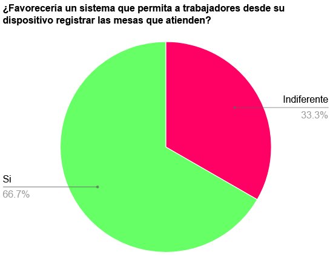

## Universidad Peruana de Ciencias Aplicadas

#### Nombre del curso: Aplicaciones Web
##### Carrera: Ingeniería de Software
##### Nombre del profesor: Ángel Augusto Velasquez Nuñez
##### Sección: WS53

#### "Informe de Trabajo Final"
##### Nombre de la Startup: Latte
##### Nombre del Producto: FoodSuit

#### Integrantes
Bernaola Pérez, André Arturo (U202114192) 
Grandez Mansilla, Jean Pierre (U202212484) 
Pacheco Astiguetta, Sebastian (U202110291) 
Paiva Quispe, Josue Gonzalo (U202119095) 
Velarde Luyo, Piero Alberto (U20211A620) 

**Agosto de 2024**

# Registro de Versiones del Informe

| Versión | Fecha | Autores | Descripción de modificación |
| - | - | - | - |
| 1 | 20/08/2024 | | |

## Contenido

- [Student Outcome](#student-outcome)
- [Project Report Collaboration Insights](#project-report-collaboration-insights)

- [Capítulo I: Introducción](#cap1)
    - [1.1. Startup Profile](#11-startup-profile)
        - [1.1.1. Descripción de la Startup](#111-descripción-de-la-startup)
        - [1.1.2. Perfiles de integrantes del equipo](#112-perfiles-de-integrantes-del-equipo)
    - [1.2. Solution Profile](#12-solution-profile)
        - [1.2.1 Antecedentes y problemática](#121-antecedentes-y-problemática)
        - [1.2.2 Lean UX Process](#122-lean-ux-process)
            - [1.2.2.1. Lean UX Problem Statements](#1221-lean-ux-problem-statements)
            - [1.2.2.2. Lean UX Assumptions](#1222-lean-ux-assumptions)
            - [1.2.2.3. Lean UX Hypothesis Statements](#1223-lean-ux-hypothesis-statements)
            - [1.2.2.4. Lean UX Canvas](#1224-lean-ux-canvas)
    - [1.3. Segmentos objetivo](#13-segmentos-objetivo)

- [Capítulo II: Requirements Elicitation & Analysis](#cap2)
    - [2.1. Competidores](#21-competidores)
        - [2.1.1. Análisis competitivo](#211-análisis-competitivo)
        - [2.1.2. Estrategias y tácticas frente a competidores](#212-estrategias-y-tácticas-frente-a-competidores)
    - [2.2. Entrevistas](#22-entrevistas)
        - [2.2.1. Diseño de entrevistas](#221-diseño-de-entrevistas)
        - [2.2.2. Registro de entrevistas](#222-registro-de-entrevistas)
        - [2.2.3. Análisis de entrevistas](#223-análisis-de-entrevistas)
    - [2.3. Needfinding](#23-needfinding)
        - [2.3.1. User Personas](#231-user-personas)
        - [2.3.2. User Task Matrix](#232-user-task-matrix)
        - [2.3.3. User Journey Mapping](#233-user-journey-mapping)
        - [2.3.4. Empathy Mapping](#234-empathy-mapping)
        - [2.3.5. As-is Scenario Mapping](#235-as-is-scenario-mapping)
    - [2.4. Ubiquitous Language](#24-ubiquitous-language)

- [Capítulo III: Requirements Specification](#cap3)
    - [3.1. To-Be Scenario Mapping](#31-to-be-scenario-mapping)
    - [3.2. User Stories](#32-user-stories)
    - [3.3. Impact Mapping](#33-impact-mapping)
    - [3.4. Product Backlog](#34-product-backlog)

- [Capítulo IV: Product Design](#cap4)
    - [4.1. Style Guidelines](#41-style-guidelines)
        - [4.1.1. General Style Guidelines](#411-general-style-guidelines)
        - [4.1.2. Web Style Guidelines](#412-web-style-guidelines)
    - [4.2. Information Architecture](#42-information-architecture)
        - [4.2.1. Organization Systems](#421-organization-systems)
        - [4.2.2. Labeling Systems](#422-labeling-systems)
        - [4.2.3. SEO Tags and Meta Tags](#423-seo-tags-and-meta-tags)
        - [4.2.4. Searching Systems](#424-searching-systems)
        - [4.2.5. Navigation Systems](#425-navigation-systems)
    - [4.3. Landing Page UI Design](#43-landing-page-ui-design)
        - [4.3.1. Landing Page Wireframe](#431-landing-page-wireframe)
        - [4.3.2. Landing Page Mock-up](#432-landing-page-mock-up)
    - [4.4. Web Applications UX/UI Design](#44-web-applications-uxui-design)
        - [4.4.1. Web Applications Wireframes](#441-web-applications-wireframes)
        - [4.4.2. Web Applications Wireflow Diagrams](#442-web-applications-wireflow-diagrams)
        - [4.4.3. Web Applications Mock-ups](#443-web-applications-mock-ups)
        - [4.4.4. Web Applications User Flow Diagrams](#444-web-applications-user-flow-diagrams)
    - [4.5. Web Applications Prototyping](#45-web-applications-prototyping)
    - [4.6. Domain-Driven Software Architecture](#46-domain-driven-software-architecture)
        - [4.6.1. Software Architecture Context Diagram](#461-software-architecture-context-diagram)
        - [4.6.2. Software Architecture Container Diagrams](#462-software-architecture-container-diagrams)
        - [4.6.3. Software Architecture Components Diagrams](#463-software-architecture-components-diagrams)
    - [4.7. Software Object-Oriented Design](#47-software-object-oriented-design)
        - [4.7.1. Class Diagrams](#471-class-diagrams)
        - [4.7.2. Class Dictionary](#472-class-dictionary)
    - [4.8. Database Design](#48-database-design)
        - [4.8.1. Database Diagram](#481-database-diagram)

- [Capítulo V: Product Implementation, Validation & Deployment](#cap5)
    - [5.1. Software Configuration Management](#51-software-configuration-management)
        - [5.1.1. Software Development Environment Configuration](#511-software-development-environment-configuration)
        - [5.1.2. Source Code Management](#512-source-code-management)
        - [5.1.3. Source Code Style Guide & Conventions](#513-source-code-style-guide--conventions)
        - [5.1.4. Software Deployment Configuration](#514-software-deployment-configuration)
    - [5.2. Landing Page, Services & Applications Implementation](#52-landing-page-services--applications-implementation)
        - [5.2.1. Sprint 1](#521-sprint-1)
            - [5.2.1.1. Sprint Planning 1](#5211-sprint-planning-1)
            - [5.2.1.2. Sprint Backlog 1](#5212-sprint-backlog-1)
            - [5.2.1.3. Development Evidence for Sprint Review](#5213-development-evidence-for-sprint-review)
            - [5.2.1.4. Testing Suite Evidence for Sprint Review](#5214-testing-suite-evidence-for-sprint-review)
            - [5.2.1.5. Execution Evidence for Sprint Review](#5215-execution-evidence-for-sprint-review)
            - [5.2.1.6. Services Documentation Evidence for Sprint Review](#5216-services-documentation-evidence-for-sprint-review)
            - [5.2.1.7. Software Deployment Evidence for Sprint Review](#5217-software-deployment-evidence-for-sprint-review)
            - [5.2.1.8. Team Collaboration Insights during Sprint](#5218-team-collaboration-insights-during-sprint)

- [Conclusiones](#conclusiones)
- [Bibliografía](#bibliografía)
- [Anexos](#anexos)

## Student Outcome

## Project Report Collaboration Insights

## Capítulo I: Introducción 

### 1.1. Startup Profile
En esta seccion presentaremos nuestra start-up, el sector que buscamos incursionar, la soluciona propuesta a la problematica escojida y demas informacion permitente para poder entender la vision del equipo con respecto al proyecto

#### 1.1.1. Descripción de la Startup
En el presente informe presentamos la start-up: “Latte” y la solucion que buscamos desarrollar llamada "Foodsuit" la cual tiene como objetivo ser una aplicación que facilite y organice el flujo de trabajo tanto de empleados como de gerentes en un restaurante u negocio similar. Para ello buscamos ofrecer a los dos sectores de usuario previamente mencionados un espacio donde poder consultar información relevante que necesite de actualización constante, como lo sería el inventario de productos perecibles, el ingreso diario en la caja, el rendimiento laboral, etc.

#### Misión
“Nuestra misión es la de ofrecer una interfaz de trabajo ágil, rápida e intuitiva para los empleados y encargados de un restaurante, con el fin de facilitar la consulta de información, agilizar el ingreso y actualización de datos relevantes de distintas áreas y permitir la consulta de dicha información para todo el equipo de trabajo”

#### Visión
“Nuestra visión es la de apoyar el crecimiento de diversos negocios emergentes y ya establecidos en nuestro país, con el fin de promover el crecimiento económico de pequeños empresarios que buscan incursionar en este sector empresarial”

#### 1.1.2. Perfiles de integrantes del equipo
### 1.2. Solution Profile
Como ya se menciono FoodSuit busca hacer eficiente la logistica de la administracion de un restaurante proporcionando diversas herramientas y caracteristicas que detallamos a continuacion:

- **Registro de inventario de productos perecibles:** Los administradores podran llevar un control del producto almacenado de una manera mas eficiente indicando fechas de caducidad, cantidad, tipo de producto, etc. Ellos podran registrar, modificar y eliminar componentes de este registro, podran consultarlo en el momento que deseen y los dias restantes de caducidad se actualizaran todos los dias en tiempo real

- **Ingreso diario de caja:** En esta seccion el administrador podra registrar su ingreso diario, esta informacion se almancenara en su calendario y podra consultarla, la aplicacion cada semana o mes le mostrara el crecimiento o decrecimiento con respecto a la semana pasada y mes pasado

- **Horario del personal:** El horario le permite al administrador indicar los turnos y horas de trabajo correspondientes a cada empleado con el fin de poder llevar un mejor control de su asistencia y sus horas de trabajo, al final de cada mes se le indicara al administrador cuantas horas trabajo cada empleado, facilitando asi el pago de los mismos
#### 1.2.1 Antecedentes y problemática
#### Uso de la técnica  The 5'W's w Y 2'H's

| LAS 5W y 2H | Pregunta| Descripción|
|-------------|---------------------------------------------------------|---------------------------------------------------------------------------------------------------------------------------------------------------------------------------------|
|Who?| ¿Quién podria beneficiarse?| Administradores y empleados de restaurantes y similares
|What?| ¿Cuál es el problema?|La complicada logistica detras de un restaurante y lo complicado que resulta consultar rapidamente informacion crucial|
|When?| ¿Cuando sucede?|Algunos problemas de logistica pueden ser cuando se acumula mucho producto sin fechar, llevar la cuenta de las horas de trabajo de un empleado sin un sistema de marcado, etc|
|Where?| ¿Donde aparece el problema?|En el ritmo frenetico de trabajo en un restaurante, pues se presentan situaciones todo el tiempo|
|Why?| ¿Porqué sucede el problema?|Es la naturaleza misma de este tipo de negocio, al ser un sector orientado a la atencion al cliente, siempre surgen situaciones y problematicas|
|How?| ¿Como?|Los negocion no cuentan con herramientas especificas para ellos, mas que las tradicionales pizarras y agendas que suelen acumular mucho registro y son complicadas de consultar|
|How much?| Cuanto?|Segun el INE cerca del 60% de restaurantes cierran en su primer año de vida y el 70% no pasa de los 5 años, estas son estadisticas preocupantes si tomamos en cuenta la gran cantidad de inversion que requiere un negocio de este estilo|
#### 1.2.2 Lean UX Process
##### 1.2.2.1. Lean UX Problem Statements
Al momento de gestionar un restaurante, los gerentes o encargados requieren de toda la información posible para poder realizar una óptima administración de los recursos para aumentar la eficiencia del establecimiento. No obstante, durante este proceso existes múltiples datos complejos de tener un seguimiento, los cuales, son vitales para una buena toma de decisiones. 

¿Cómo se puede mejorar la eficiencia de obtención de dichos datos y obtener una claridad para mejorar el desempeño general de un restaurante ?
##### 1.2.2.2. Lean UX Assumptions
**Business Assumptions** 

1. Creo que mis clientes necesitan graficos que simplifiquen la vista de la información vital para la gestión de su estableciemiento.
2. Mis clientes necesitan que sus trabajadores pertenecientes al área de cocina puedan hacer un registro del inventario de la misma.
3. Mis clientes requieren de una alerta que le advierta sobre la escacez de los productos en el inventario de la cocina.
4. El valor primordial que un encargado de restaurante busca de mi servicio es que la información que este le brinda sea confiable e intuitiva.
5. El valor primordial que un trabajador de restaurante busca de mi servicio es su fácil uso y rapidez para que estos puedan agilizar su labor.
6. Se obtendrá dinero desde el momento que la aplicación esté abierta al publico por su modelo de suscripción.
7. Atraeremos a la mayoría de nuestros clientes por medio de publicidads en redes sociales como Facebook, TikTok e Instagram.
8. Mi principal competencia en el mercado serán otras aplicaciones que también se encargan de la gestión de restaurantes.
9. Los venceremos debido a la intuitibidad y eficacia de mostrar la información relevante en nuestra aplicación, lo que le brindará más tiempo aprobechable al encargado del restaurante.
10. Mi mayor riesgo de servicio es la cantidad de información que se necesita almacenar en la base de datos.
11. Resolveremos el riesgo por medio de la implementación de más discos de capacidad, al igual que la optimización en el almacenaje de los datos.

**User Assumptions**

1. ¿Quién es el usuario? Los usuarios son los encargados o gerentes de restaurantes y sus trabajadores.
2. ¿Dónde encaja nuestro servicio? ¿En su trabajo o vida? Nuestro servicio encaja en su trabajo.
3. ¿Qué problemas resuelve nuestro servicio para el usuario? Reduce el esfuerzo y tiempo requerido al momento de administrar un restaurante, brindando con total fácilidad la información necesaria.
4. ¿En qué contexto utiliza el usuario nuestro producto? Nuestro servicio es usado diariamente por el gerente o encargado para monitorizar el desempeño del resturante, al igual que ciertas caracteristicas reservadas para el uso de los empleados.
5. ¿Qué características son importantes para el usuario? Las características que encontramos son de vital importancia para nuestro servicio es que sea fácil de usar, que genere gráfico con respecto a la información primordial para un encargado , sea esta el desempeño de los empleados, el flujo de dinero diaro, entre otros, que brinde alertas automáticas con respecto a los insumos utilizados por el personal de cocina y que permita registrar el horario de ingreso y salida de los empleados.
6. ¿Cómo debe verse nuestro servicio y cómo debe comportarse? Nuestro servicio debe mostrar toda la información del desempeño diario y general del restaurante de forma intuitiva, al igual que ofrecer una claridad de estos datos.

**User Outcomes**

1. El encargado del restaurante desea visualizar con claridad todos los datos respecto a la gestión del establecimiento, con el fin de poder ejercer una mejor toma de decisiones.
2. El encargado del restaurante desea tener la información en tiempo real con respecto al registro del inventario por parte del personal de la cocina, para así poder adquirir los productos faltantes a tiempo y no perjudicar el optimo funcionamiento del establecimiento.
3. El encargado del restaurante desea visualizar un registro del ingreso diario de caja para de esta manera saber el desempeño con respecto a los días o meses anteriores.
4. El personal del restaurante desea que la plataforma tenga una interfaz para el registro de pedidos de los clientes.
5. El personal del restaurante desea que la plataforma registre su horario de ingreso y salida para de esta manera hacer un seguimiento de su tiempo de trabajo.

**Business Outcomes**

1. El encargado del restaurante podrá realizar un mejor trabajo al momento de mejorar el desempeño de su establecimiento si este tiene acceso de fomra sencilla a toda la información necesaria.
2. El encargado del restaurante podrá evaluar el desempeño en lo que respecta a ingresos diarios del restaurante en un amplio rango de tiempo para poder analizar los días en los que más clientes asisten.
3. El encargado del restaurante podrá estar al tanto, en tiempo real, con respecto a los insumos utilizados en la cocina, así como recibir alertas si es que uno de estos empieza a escasear para no perjudicar la labor de sus empleados.
4. El encargado del restaurante podrá hacer un seguimiento sobre la eficiencia de sus empleados en el trabajo, al igual que establecer sus horarios de trabajo y visualizar el cumplimiento de estos mismos.
5. El personal del restaurante podrá aumentar trabajar sin complicación alguna si este mantiene un control diario del inventario de insumos de la cocina.

##### 1.2.2.3. Lean UX Hypothesis Statements

- Creemos que conseguiremos una mejora en la eficiencia de la gestión del restaurante si los encargados del restaurante logran visualizar de forma fácil y clara la información indispensable con los gráficos y tablas presentes en la aplicación.

- Creemos que conseguiremos evitar problemas en la elaboración de platillos si el personal encargado de la cocina logra registrar cada insumo que ingresa o es utilizado en la cocina con la opción de registro de inventario.

- Creemos que conseguiremos monitorear el desempeño laboral si los empleados logran agilizar sus tareas con la plataforma de registro de pedidos.

##### 1.2.2.4. Lean UX Canvas

### 1.3. Segmentos objetivo
Hemos identificado dos segmentos distintos de usuarios:

- Administrador: Se trata de usuarios de 25 años o mas, se trata de la persona que cubre el rol de de gerente o encargado del local, tiene que llevar en orden el inventariado, los ingresos, la cantidad de horas de trabajo de cada empleado, etc.

- Empleado: Este usuario puede encargarse de diversas areas del local, como la cocina, la atencion al cliente, caja, etc. Este sector cuenta con 18 años o mas.

## Capítulo II: Requirements Elicitation & Analysis 

### 2.1. Competidores
Identificamos tres competidores, cuyos productos son similares directamente o indirectamente a lo que nosotros queremos ofrecer.
1. **Restaurant\.pe**: Es un software para restaurantes que optimiza la gestión del restaurante mediante funcionalidades como un menú online, una plataforma para pedidos y emisión de comprobantes, visualizar ventas y stock, facturación electrónica, entre otros. Ofrece una interfaz amigable, es multiplataforma y puede funcionar con o sin conexión a internet. 
 

2. **El Tenedor**: Es un software para restaurantes y personas que buscan restaurantes donde comer. La aplicación almacena la carta del restaurante e información pública como reseñas, ubicación, etc. Permite a las personas reservar mesas del restaurante que disponga de esta aplicación para facilitar la atención. 
 

3. **Rest\.pe**: Es un software para restaurantes que optimiza la gestión del restaurante y capacita a los trabajadores para aumentar la eficacia del entorno laboral. Aparte de las funcionalidades básicas para un restaurante, presenta múltiples funcionalidades como publicidad local, recetarios, cocina smart, entre otros. Este software es customizable por empresa, por lo que se adapta a lo que la empresa desea según contrato. 
 

#### 2.1.1. Análisis competitivo
<table border="2" style="text-align: center;">
	<tbody>
		<tr >
			<td colspan="6">Competitive Analysis Landscape</td>
		</tr>
		<tr>
			<td colspan="2">¿Por que llevar a cabo este análisis?</td>
			<td colspan="4">El analizar nuestros competidores nos permite identificar qué estrategias debemos usar para poder desarrollar una aplicación que destaque en el mercado, analizando todos los detalles que diferencie nuestro producto de otros.
            </td>
		</tr>
		<tr>
			<td colspan="2"></td>
			<td>FoodSuite</td>
			<td>Restaurant.pe</td>
			<td>El Tenedor</td>
			<td>Rest.pe</td>
		</tr>
		<tr>
			<td rowspan="2">Perfil</td>
			<td>Overview</td>
			<td>Aplicación que ofrece funcionalidades de gestión para diversos áreas de un restaurante, como los pedidos. Permite la realización de actividades diarias en un restaurante que se pueda realizar en un dispositivo móvil o desde una aplicación web.</td>
			<td>Aplicación que optimiza la gestión del restaurante proporcionando una interfaz amigable de pedidos, emisión de comprobantes y visualización de ventas. Presenta un conteo de stock e inventario en tiempo real, además de poder ser manejado desde múltiples dispositivos.</td>
			<td>Aplicación que gestiona las mesas del restaurante de manera sencilla, además de un listado digital de reservas confirmadas. Estas reservas las permite la aplicación sin necesidad de llamar e incluye la opción de pago desde la misma app.</td>
			<td>Aplicación customizada por un equipo para cada empresa cliente, cuyas funcionalidades incluyen una cocina smart, capacitación, estadísticas, búsqueda por voz, recetarios, publicidad local, entre otros.</td>
		</tr>
		<tr>
			<td>Ventaja competitiva ¿Que valor ofrece a los clientes?</td>
			<td>Optimiza la gestión del inventario de restaurantes mediante actualizaciones y alertas en tiempo real, lo que permite a los usuarios mantener el control del stock desde cualquier lugar.</td>
			<td>Proporciona una solución para la gestión de restaurantes, que abarca desde el control de caja y la gestión de productos hasta la facturación electrónica y el delivery.</td>
			<td>Facilita la visibilidad en línea de los restaurantes a través de su plataforma de reservas y descubrimiento, lo que ayuda a atraer nuevos clientes y aumentar las reservas tanto locales como internacionales. </td>
			<td>Ofrece una solución integral y transparente para restaurantes, eliminando sobrecostos al proporcionar un sistema sin sorpresas, que es adaptable tanto para restaurantes pequeños como para cadenas medianas.</td>
		</tr>
		<tr>
			<td rowspan="2">Perfil de Marketing</td>
			<td>Mercado objetivo</td>
			<td>Restaurantes que buscan una solución especializada en la gestión administrativa</td>
			<td>Desde pequeños restaurantes y foodtrucks hasta grandes cadenas de restaurantes</td>
			<td>Restaurantes en Europa y Australia que desean mejorar su visibilidad en línea</td>
			<td>Restaurantes de tamaño mediano a grande que buscan una solución de punto de venta completa y adaptable</td>
		</tr>
		<tr>
			<td>Estrategias de marketing</td>
			<td><ul>
				<li>Optimización de Inventario</li>
				<li>Automatización y Eficiencia</li>
				<li>Informes y Análisis</li>
			</ul></td>
			<td><ul>
				<li>Ahorro de Tiempo y Dinero</li>
				<li>Multiplataforma y Flexibilidad</li>
				<li>Precio Competitivo</li>
			</ul></td>
			<td><ul>
				<li>Promociones y Descuentos</li>
				<li>Visibilidad en Línea</li>
				<li>Reducción de No-Shows</li>
			</ul></td>
			<td><ul>
				<li>Eliminación de Costos Adicionales</li>
				<li>Adaptabilidad y Soporte</li>
				<li>Experiencia y Fiabilidad</li>
			</ul></td>
		</tr>
		<tr>
			<td rowspan="3">Perfil de Producto</td>
			<td>Productos & Servicios</td>
			<td><ul>
				<li>Control y actualización del inventario en tiempo real</li>
				<li>Sincronización de datos entre dispositivos</li>
				<li>Generación de informes detallados</li>
				<li>Automatización de tareas y procesos</li>
			</ul></td>
			<td><ul>
				<li>Control de caja y gestión de productos</li>
				<li>Control de insumos y stock</li>
				<li>Facturación electrónica</li>
				<li>Gestión de pedidos, delivery interno y externo</li>
				<li>Registro de recetas y movimientos entre almacenes</li>
				<li>Operación en línea y fuera de línea</li>
			</ul></td>
			<td><ul>
				<li>Visibilidad en línea para restaurantes a través de una página personalizada</li>
				<li>Sistema de reservas</li>
				<li>Descuentos de hasta el 50% y programa de recompensas</li>
				<li>Herramientas para reducir la inasistencia de clientes</li>
				<li>Capacitación gratuita y soporte continuo</li>
			</ul></td>
			<td><ul>
				<li>Gestión de ventas, delivery interno y externo, y mesas mapeadas</li>
				<li>Carta QR funcional y aplicación/web propia para pedidos</li>
				<li>Facturación electrónica</li>
				<li>Control de inventario, estadísticas de ventas y cierre de caja</li>
				<li>Automatización de procesos</li>
			</ul></td>
		</tr>
		<tr>
			<td>Precios &amp; Costos</td>
			<td><ul>
				<li>Basic: $99</li>
				<li>Pro: $199</li>
				<li>Enterprise: $399</li>
			</ul></td>	
			<td><ul>
				<li>Para crecimiento: $94</li>
				<li>Para total control: $440</li>
			</ul></td>
			<td><ul>
				<li>Basic: $32</li>
				<li>Pro: $57</li>
				<li>Pro+: $113</li>
			</ul></td>	
			<td><ul>
				<li>Básico: $53</li>
				<li>Cadena: $120</li>
				<li>Básico (anual): $534</li>
				<li>Cadena (anual): $1334</li>
			</ul></td>	
		</tr>
		<tr>
			<td>Canales de distribución (Web y/o Móvil)</td>
			<td>Web y móvil</td>
			<td>Web y móvil</td>
			<td>Web y móvil</td>
			<td>Web y móvil</td>
		</tr>
		<tr>
			<td rowspan="4">Análisis SWOT</td>
			<td>Fortalezas</td>
			<td>Se especializa en gestión de inventario, automatización e interfaz intuitiva.</td>
			<td>Presenta una solución integral con una amplia gama de funciones cubriendo todas las áreas clave.</td>
			<td>Proporciona a los restaurantes una plataforma sólida para aumentar su visibilidad.</td>
			<td>Elimina sobrecostos y pagos adicionales, además de adaptarse a restaurantes de cualquier tamaño.</td>
		</tr>
		<tr>
			<td>Debilidades</td>
			<td>Tiene un enfoque limitado con respecto a trabajadores, no puede analizar roles que no necesitan de competencia.</td>
			<td>El costo inicial, aunque sea competitivo, puede ser una limitación para pequeños negocios.</td>
			<td>Su enfoque principal en un continente específico y algunos países puede limitar su alcance.</td>
			<td>Aunque tengan experiencia nacional e internacional, hay una falta de presencia internacional.</td>
		</tr>
		<tr>
			<td>Oportunidades</td>
			<td>Puede encajar fácilmente en el crecimiento de mercados emergentes gracias a la digitalización de la gestión.</td>
			<td>La digitalización de la gestión de restaurantes representa oportunidades para nuevos clientes, y tomó ventaja.</td>
			<td>Colaborar con otras plataformas de gestión de restaurantes ofreciendo una solución más completa.</td>
			<td>El desarrollo de funciones enfocados al análisis avanzado de datos o un marketing digital completo favorecería su crecimiento.</td>
		</tr>
		<tr>
			<td>Amenazas</td>
			<td>Podría perder mercado frente a software que presente una solución más completa y con más funciones.</td>
			<td>Tiene mucha dependencia tecnológica, y su servicio al cliente es limitado, por lo que genera desconfianza.</td>
			<td>Soluciones como éste tiene mucha competencia en el mercado, dificultando su dominio en el mismo.</td>
			<td>La saturación del mercado con respecto a competencia en soluciones de punto de venta puede limitar su crecimiento.</td>
		</tr>
	</tbody>
</table>

#### 2.1.2. Estrategias y tácticas frente a competidores.
Para destacar frente a los competidores, debemos establecer estrategias y tácticas que diferencie nuestro producto de otros. 
1. **Propuesta de Valor Único**:
* Estrategia: Diferenciación mediante una solución de gestión avanzado y específico.
* Táctica: Desarrollar y promover las estrategias de marketing que nuestro producto proporciona
2. **Experiencia del Usuario**:
* Estrategia: Enfoque en una interfaz de usuario intuitiva y un flujo de trabajo eficiente.
* Táctica: Implementar un soporte al cliente en la plataforma para resolver dudas.
3. **Ampliación de Base de Usuarios**
* Estrategia: Expandir la presencia en mercados emergentes y pequeños negocios.
* Táctica: Presentar un producto demo que permita a los usuarios poder experimentar con lo que ofrecemos.
4. **Marketing Digital Dirigido**
* Estrategia: Enfocar en la segmentación precisa dirigidas al marketing digital.
* Táctica: Utilizar estrategias de contenido público como redes sociales para promocionar a usuarios nuestro producto.
5. **Colaboraciones Estratégicas**
* Estrategia: Formar alianzas con empresas de mercado más relevantes para los restaurantes.
* Táctica: Colaborar con centros de suministros que proporcionen su contacto para que el usuario pueda tener contactos según su distrito.
### 2.2. Entrevistas
Las entrevistas siguientes nos sirven para conocer lo que los clientes esperan de un producto, qué experiencias tuvieron con productos similares y qué tipo de decisiones nosotros tenemos que tomar. Al analizar estas entrevistas, nosotros tendremos una idea de cómo desarrollar nuestro producto de manera que ésta se adapte a lo que el cliente desea.
#### 2.2.1. Diseño de entrevistas
El diseño de las entrevistas va acorde a la información que nosotros queremos conocer acerca de las experiencias y necesidades que nuestros grupos objetivos nos proporcionarán. Se han desarrollado preguntas para ambos grupos objetivos:
* **Administrador de restaurante**
1. Como administrador, ¿Qué papel desempeñas en la administración del restaurante? ¿Qué tipo de actividades debes desarrollar día a día?
2. ¿Cómo se organizan ustedes, administradores y trabajadores, en el restaurante?
3. ¿Has tenido problemas relacionados con el método de organización que mencionaste? ¿Qué tipo de soluciones deben llevar a cabo?
4. Aparte de la organización mencionada, ¿qué otros problemas has tenido que enfrentar?
5. ¿Tienen algún sistema que registre toda información relacionada con los aspectos de relaciones humanas, finanzas y productividad en general? ¿Llegó a ser lo que buscaban?
6. Acorde al tema de relaciones humanas, ¿qué pensarían de un sistema que permita a los trabajadores desde el móvil registrar las mesas que ha atendido y/o registrar los platos de una manera más eficiente?
7. Acorde al tema de finanzas, ¿qué pensarían de un sistema que pueda almacenar en un solo lugar (y de manera organizada) todos los reportes de inventario y gastos/ganancias que el negocio obtiene, además de generar estadísticas para una comparación sencilla?
8. Acorde al tema de productividad, ¿qué pensarían de un sistema que pueda mostrar gráficos mensuales conteniendo una comparación de productividad de un trabajador con fechas anteriores?
9. Si la aplicación presentara estadísticas, por ejemplo, cuándo se compra más un plato en el mes, ¿cómo crees que eso pueda ayudar? ¿Cambiarías el funcionamiento de la carta para beneficiar el negocio?
10. ¿Qué otras funcionalidades, muy aparte de los temas mencionados, quisieras que tuviera la aplicación?
11. Si esta aplicación tuviera todas estas funcionalidades, ¿sería suficiente para cambiar el sistema actual que el negocio usa?
12. ¿Cómo crees que los trabajadores reaccionarían ante un nuevo sistema?
* **Trabajador**
1. Como trabajador, ¿Qué actividades debes realizar en el restaurante?
2. ¿Tienen un sistema que ustedes usen para poder manejar pedidos, asistencia o similares?
3. Sea aplicación o manual la respuesta, ¿qué tan satisfecho te encuentras? ¿Estarías de acuerdo con que hubiera un cambio de sistema?
4. ¿Qué consideras que es importante que una aplicación de gestión de restaurante tenga para los trabajadores?
5. ¿Qué pensarías de una aplicación que te permitiera acceder a un sistema de pedidos y poder ingresar productos de la carta con mayor eficiencia?
6. ¿Qué pensarías de una aplicación que pueda calcular tu rendimiento laboral semanal y así poder insertar un sistema de recompensa si mantienes ese rendimiento alto?
7. Si la aplicación tuviera las funcionalidades mencionadas, ¿cómo crees que mejoraría tu rendimiento laboral? ¿Sería más eficiente?
#### 2.2.2. Registro de entrevistas.
Registramos las entrevistas para recopilar y organizar la información que se nos ha proporcionado. Gracias a las entrevistas a los grupos objetivos, podremos analizar y recalcar las necesidades que el cliente espera que la aplicación cumpla. 
Link a las entrevistas: https://tinyurl.com/55rja6hb 
*Las imágenes de las entrevistas pueden redireccionar al timestamp indicado.*
#### Administrador
* **Entrevista 1**  
Nombre completo: Verónica Astiguetta 
Edad: 54 años 
Papel desempeñado: Tesorera 
Empresa: Bodega Queirolo S.A.C. 
Distrito: Centro de Lima  
**Detalles de la entrevista:**   
Inicio de la entrevista: 0:28 
Fin de la entrevista: 13:09 
**Transcripción resumen de entrevista:** 
Expresa satisfacción con una organización regulada mediante un sistema, ya que describe que cuando era manual hubo complicaciones. Indica que el sistema actual que usan les ayuda mucho en las actividades básica de la empresa; sin embargo, hay demasiadas funciones que no sacan el provecho máximo del sistema debido a falta de tiempo o son innecesarios. Muestra interés por permitir a los trabajadores usar sus dispositivos en vez de usar un solo dispositivo el cual sería el sistema principal, lo cual consideraría uno de los problemas de este sistema. Muestra interés por lograr almacenar todos los documentos relacionados a las finanzas en un solo lugar, en especial una página web donde pueda acceder desde cualquier lado. Muestra interés por aumentar la productividad de los trabajadores mediante un sistema de cálculo de rendimiento y por tanto establecer una competencia como motivación. Ve importante utilizar las estadísticas de platos más vendidos en cierta temporada para ajustar la carta. Ve posible el cambio de sistema, pues opina que las características proporcionadas son buenas para el negocio.

* **Entrevista 2**
Nombre completo: Iván Pacheco 
Edad: 53 años 
Papel desempeñado: Administración general 
Empresa: Bodega Queirolo S.A.C. 
Distrito: Centro de Lima  
**Detalles de la entrevista:**   
Inicio de la entrevista: 13:35 
Fin de la entrevista: 53:43 
**Transcripción resumen de entrevista:** 
Opina que la estructura actual que tiene el negocio es adecuado y todos respetan los roles, pero hubo problemas con trabajadores nuevos. El sistema que utiliza el negocio respeta estos roles: solo la administración utiliza esta aplicación, mientras que los trabajadores aún dependen de ciertos elementos materiales. Expresa satisfacción con el sistema actual, ya que cumple con los requisitos que la empresa exige que la aplicación tenga; sin embargo, hay varios problemas que experimenta con la aplicación. Se muestra indiferente con respecto a permitir a los trabajadores usar dispositivos para facilitar su labor, ya que es más eficiente usar el método del papel para recibir los pedidos, pero si el dispositivo logra ser eficiente para ahorrar tiempo, ve útil la funcionalidad propuesta. Ve conveniente que el sistema pueda manejar los reportes financieros desde la misma aplicación web. No ve necesario utilizar estadísticas para calcular el reporte de trabajadores, ya que es más verificable el observar al trabajador en comparación con otro durante el periodo laboral en comparación a depender de un sistema. Muestra totalmente útil la funcionalidad de mostrar estadísticas de, por ejemplo, los platos más vendidos, ya que podrá priorizar la salida de platos más pedidos y acelerar el servicio. Ve posible el cambio de sistema, pero tiene expectativas con respecto a que el sistema no caiga, sea fácil de usar, sea cómodo y el proveedor de servicio de atención tenga disponibilidad de tiempo larga (comparando con su sistema actual, que tiene estas desventajas).

* **Entrevista 3**
Nombre completo: Eduardo Ventura 
Edad: 20 
Papel desempeñado: Tesorero 
Empresa: Emotiv 
Distrito: San Juan de Gaucho  
**Detalles de la entrevista:**   
Inicio de la entrevista: 54:21 
Fin de la entrevista: 1:04:49 
**Transcripción resumen de entrevista:** 
Expresa satisfacción con una organización regulada mediante un sistema, ya que describe que cuando era manual no era tan eficiente manejar papeles. A pesar de que el sistema que usa para manejar las finanzas es Excel, opina que la herramienta es suficiente para cumplir sus trabajos. Muestra interés por permitir a los trabajadores disponer de un sistema que les ayuda a realizar su labor de manera más rápida y que almacene pedidos para que él mismo pueda dar apoyo si hay muchas personas. Ve bien un sistema que almacene los reportes financieros, aunque el excel le satisface suficiente. No muestra tanto interés, pero le parece bien poder visualizar el rendimiento de los trabajadores mediante estadísticas. No muestra tanto interés, pero ve útil utilizar las estadísticas de platos más vendidos en cierta temporada para deshacerse de platos que no venden. Ve posible el cambio de sistema, pues opina que tener varias funciones automatizadas puede beneficiar al negocio.

#### Trabajador
* **Entrevista 4**
Nombre completo: Janaira Toledo 
Edad: 22 
Papel desempeñado: Cajera 
Distrito: San Miguel  
**Detalles de la entrevista:**   
Inicio de la entrevista: 1:04:59 
Fin de la entrevista: 1:06:59 
**Transcripción resumen de entrevista:** 
Prefiere que el restaurante tenga un nuevo sistema, ya que el actual presenta muchas fallas con respecto a asistencia y otros. Le parece buena idea el introducir un sistema que les permita registrar los pedidos desde sus dispositivos. Piensa que sería beneficioso un sistema que calcule el rendimiento de los trabajadores para impulsar el esfuerzo laboral que cada uno proporciona.

* **Entrevista 5**
Nombre completo: Fabricio Sánchez 
Edad: 20 
Papel desempeñado: Cocinero/Mozo 
Distrito: Chorrillos  
**Detalles de la entrevista:**   
Inicio de la entrevista: 1:07:10 
Fin de la entrevista: 1:09:56 
**Transcripción resumen de entrevista:** 
Se encuentra satisfecho con el sistema actual que usa la empresa, aunque suele ser lento en cuanto al rendimiento. Quiere que la aplicación sea rápida y permita a los trabajadores poder registrar los pedidos y ver el rendimiento laboral semanal. Le parece motivador tener funciones como ésta para que pueda desempeñar mejor ya que facilita la comunicación de los trabajadores.

* **Entrevista 6**
Nombre completo: Gonzalo Velarde 
Edad: 20 
Papel desempeñado: Cocinero/Mozo 
Distrito: Pueblo Libre  
**Detalles de la entrevista:**   
Inicio de la entrevista: 1:10:30 
Fin de la entrevista: 1:09:56 
**Transcripción resumen de entrevista:** 
El sistema actual que el restaurante usa no es sencillo para principiantes, tuvo que acostumbrarse al sistema y piensa que puede mejorar en algunos aspectos. Sugiere que lo mejor que puede tener la aplicación es una sección donde vea en qué puede mejorar. Se enfoca en el sector de atención al cliente, las sugerencias que se proporcionaron como el cálculo del rendimiento laboral y similares puede incentivar a los trabajadores a ser reconocidos por su esfuerzo y por tanto ser premiados.

#### 2.2.3. Análisis de entrevistas
Al analizar las entrevistas, podemos comprender las expectativas y necesidades que los usuarios piden, además de recibir feedback en cuanto a cómo debería ser su producto ideal. Con esto, recurriremos a la toma de decisiones para el desarrollo del producto.
#### **Administrador**
 
 
 
 
 
 

#### **Trabajador**
 
 

### 2.3. Needfinding
#### 2.3.1. User Personas

### User Persona Segmento Administrador
</a> 
 
### User Persona Segmento Trabajador
</a> 

#### 2.3.2. User Task Matrix
En esta sección se presentará el User Task Matrix, una herramienta que permite identificar las tareas más relevantes para cada segmento, así como la frecuencia e importancia de cada una de ellas.

<table>
  <tr>
    <th rowspan="2" valign="top"><b><i>User Task Matrix</i></b></th>
    <th colspan="2" valign="top"><b><i>Eduardo</i></b></th>
    <th colspan="2" valign="top"><b><i>Laura Martínez</i></b></th>
  </tr>
  <tr>
    <td valign="top"><b><i>Frecuencia</i></b></td>
    <td valign="top"><b><i>Importancia</i></b></td>
    <td valign="top"><b><i>Frecuencia</i></b></td>
    <td valign="top"><b><i>Importancia</i></b></td>
  </tr>
  <tr>
    <td>Registrar boletas y facturas</td>
    <td><b><i>Siempre</i></b></td>
    <td><b><i>Alta</i></b></td>
    <td><b><i>Nunca</i></b></td>
    <td><b><i>Baja</i></b></td>
  </tr>
  <tr>
    <td>Optimización de procesos internos</td>
    <td><b><i>A menudo</i></b></td>
    <td><b><i>Alta</i></b></td>
    <td><b><i>A veces</i></b></td>
    <td><b><i>Medio</i></b></td>
  </tr>
  <tr>
    <td>Supervisión de flujo de ingresos y egresos</td>
    <td><b><i>Siempre</i></b></td>
    <td><b><i>Alta</i></b></td>
    <td><b><i>A veces</i></b></td>
    <td><b><i>Alta</i></b></td>
  </tr>
  <tr>
    <td>Adopción de nuevas tecnologías para la gestión</td>
    <td><b><i>A menudo</i></b></td>
    <td><b><i>Alta</i></b></td>
    <td><b><i>A veces</i></b></td>
    <td><b><i>Alta</i></b></td>
  </tr>
  <tr>
    <td>Coordinación con el equipo de operaciones</td>
    <td><b><i>A veces</i></b></td>
    <td><b><i>Medio</i></b></td>
    <td><b><i>Siempre</i></b></td>
    <td><b><i>Alta</i></b></td>
  </tr>
  <tr>
    <td>Atención al cliente</td>
    <td><b><i>A veces</i></b></td>
    <td><b><i>Medio</i></b></td>
    <td><b><i>Siempre</i></b></td>
    <td><b><i>Alta</i></b></td>
  </tr>
  <tr>
    <td>Programación de servicios</td>
    <td><b><i>A veces</i></b></td>
    <td><b><i>Medio</i></b></td>
    <td><b><i>A menudo</i></b></td>
    <td><b><i>Alta</i></b></td>
  </tr>
  <tr>
    <td>Manejo de pedidos</td>
    <td><b><i>A veces</i></b></td>
    <td><b><i>Medio</i></b></td>
    <td><b><i>Siempre</i></b></td>
    <td><b><i>Alta</i></b></td>
  </tr>
  <tr>
    <td>Resolución de problemas operativos</td>
    <td><b><i>A menudo</i></b></td>
    <td><b><i>Alta</i></b></td>
    <td><b><i>Siempre</i></b></td>
    <td><b><i>Alta</i></b></td>
  </tr>
  <tr>
    <td>Seguimiento de la satisfacción del cliente</td>
    <td><b><i>A veces</i></b></td>
    <td><b><i>Medio</i></b></td>
    <td><b><i>Siempre</i></b></td>
    <td><b><i>Alta</i></b></td>
  </tr>
</table>

### Explicación de la User Task Matrix

- **Registrar boletas y facturas**: Eduardo lo hace siempre y es de alta importancia, ya que mediante a esto mantiene un flujo de caja organizado.
- **Optimización de procesos internos**: Eduardo lo hace a menudo y es de alta importancia, ya que busca mejorar la eficiencia de su empresa.
- **Supervisión de flujo de ingresos y egresos**: Eduardo lo hace siempre y es de alta importancia, ya que necesita tener un control de sus finanzas.
- **Adopción de nuevas tecnologías para la gestión**: Eduardo lo hace a menudo y es de alta importancia, ya que busca mejorar la eficiencia de su empresa.
- **Coordinación con el equipo de operaciones**: Laura lo hace siempre y es de alta importancia, ya que día a día necesita coordinarse con su equipo.
- **Atención al cliente**: Laura lo hace siempre y es de alta importancia, ya que necesita mantener una buena relación con sus clientes.
- **Programación de servicios**: Laura lo hace a menudo y es de alta importancia, y con esto mantiene un orden en su día de trabajo.
- **Manejo de pedidos**: Laura lo hace siempre y es de alta importancia, ya que necesita mantener un control de los pedidos.
- **Resolución de problemas operativos**: Laura lo hace siempre y es de alta importancia, ya que debe saber resolver estos casos con efectividad y rapidez para la
  satisfacción de los clientes.

#### 2.3.3. User Journey Mapping
Mediante los User Journey Maps, se representa la situación (AS-Is) de la experiencia de los usuarios al interactuar desde la creación hasta la finalización
del proyecto de gestión interna de un restaurante. Estos mapas permiten visualizar los puntos de contacto,
emociones y acciones de los usuarios a lo largo de su recorrido, identificando oportunidades de mejora y optimización.

#### **User Journey Map Administrador**
 
#### ** User Journey Map Trabajador**

 
#### 2.3.4. Empathy Mapping

- Empathy Map Administrador
 

- Empathy Map Trabajador
 

#### 2.3.5. As-is Scenario Mapping

**As-Is Scenario Mapping Administrador**
#### Preparación de la actividad
Graficamos el cuadro y lo dividimos en fases: Steps, Doing, Thinking y Feeling
 
 
#### Brainstorming
 Luego de la lluvia de ideas, se obtuvo el siguiente resultado:
 
#### As-Is Scenario Mapping Administrador
Luego de organizar las ideas e identificar las fases, se obtuvo el siguiente resultado:
 

**As-Is Scenario Mapping Trabajador**
#### Preparación de la actividad
Graficamos el cuadro y lo dividimos en fases: Steps, Doing, Thinking y Feeling
  
#### Brainstorming
Luego de la lluvia de ideas, se obtuvo el siguiente resultado:
 
#### As-Is Scenario Mapping Administrador
Luego de organizar las ideas e identificar las fases, se obtuvo el siguiente resultado:
 
### 2.4. Ubiquitous Language

En esta sección se presentará el lenguaje ubicuo, una herramienta que permite establecer un vocabulario común y preciso para la comunicación entre los miembros del equipo de desarrollo y los stakeholders.
Este lenguaje facilita la comprensión y el consenso en torno a los conceptos y términos clave del proyecto.

- **Admin:** Usuario que tiene acceso a la gestión de la empresa.
- **Trabajador:** Usuario que tiene acceso a la gestión de los pedidos.
- **Gestión:** Acción de administrar y organizar los recursos de la empresa.
- **Pedidos:** Solicitud de un cliente para adquirir un producto o servicio.
- **Facturas:** Documento que detalla la venta de un producto o servicio.
- **Boletas:** Documento que detalla la venta de un producto o servicio.
- **Ingresos:** Dinero que entra a la empresa.
- **Egresos:** Dinero que sale de la empresa.
- **Clientes:** Personas que adquieren productos o servicios de la empresa.

## Capítulo III: Requirements Specification 

### 3.1. To-Be Scenario Mapping

**To-Be Scenario Mapping Administrador**

#### Preparación de la actividad
Graficamos el cuadro y lo dividimos en fases: Steps, Doing, Thinking y Feeling
 
  

#### Brainstorming
Luego de la lluvia de ideas, se obtuvo el siguiente resultado:
 

#### To-Be Scenario Mapping Administrador
Luego de organizar las ideas e identificar las fases, se obtuvo el siguiente resultado:

 

**To-Be Scenario Mapping Trabajador**

#### Preparación de la actividad
Graficamos el cuadro y lo dividimos en fases: Steps, Doing, Thinking y Feeling
 
  

#### Brainstorming
Luego de la lluvia de ideas, se obtuvo el siguiente resultado:
 

#### To-Be Scenario Mapping Trabajador
Luego de organizar las ideas e identificar las fases, se obtuvo el siguiente resultado:
 

### 3.2. User stories

###### User Epics

| Epic ID | Título                              | Descripción                                                                                       |
|---------|-------------------------------------|---------------------------------------------------------------------------------------------------|
| EP001   | Optimización del Registro y Control de Finanzas | Implementar un sistema automatizado para registrar y controlar las finanzas del restaurante, incluyendo pedidos, gastos, e informes financieros. |
| EP002   | Mejora en la Gestión de Pedidos y Asistencia | Desarrollar una solución para registrar pedidos desde dispositivos móviles, marcar horas de trabajo y calcular automáticamente las horas trabajadas. |
| EP003   | Análisis y Optimización del Desempeño del Restaurante | Proporcionar herramientas para analizar la productividad del personal, ventas de platos y optimización del menú basada en datos. |
| EP004   | Gestión de Recursos                  | Facilitar la organización y disponibilidad de los recursos necesarios para el funcionamiento del restaurante, incluyendo inventario, asistencia, turnos y administración de mesas. |
| EP005   | Optimización y Adaptación Técnica de la Landing Page | Optimizar y adaptar la landing page para mejorar el rendimiento, la accesibilidad y la experiencia del usuario. |
| EP006   | Implementación de la Landing Page | Diseñar y desarrollar una landing page efectiva, que permita a los visitantes entender claramente el producto, sus características y beneficios, y facilite la conversión de visitantes en clientes potenciales |

 

###### User Stories for Administrators

| Epic / Story ID | Título                              | Descripción                                                                                                          | Criterios de Aceptación                                                                                                          | Epic ID |
|-----------------|-------------------------------------|----------------------------------------------------------------------------------------------------------------------|---------------------------------------------------------------------------------------------------------------------------------|---------------------------|
| US-01           | Registro Automático de Pedidos en un Historial | Como administrador, quiero registrar automáticamente los pedidos en un historial, para analizar los datos posteriormente. | **Escenario 1: Registro exitoso** **Dado** que se realiza un pedido **Cuando** se ingresa al sistema **Entonces** el pedido se guarda automáticamente en el historial de pedidos. **Escenario 2: Registro fallido** **Dado** que ocurre un error en el sistema **Cuando** se ingresa un pedido **Entonces** el sistema informa que el registro ha fallado y no se guarda el pedido. | EP001                    |
| US-02           | Alerta de Recursos Bajos            | Como administrador, quiero recibir alertas cuando los recursos estén bajos para asegurar una reposición oportuna.      | **Escenario 1: Alerta generada** **Dado** que un recurso alcanza la cantidad mínima **Cuando** se revisa el inventario **Entonces** se envía una alerta sobre las cantidades bajas del recurso. **Escenario 2: Sin alerta** **Dado** que el recurso está por encima de la cantidad mínima **Cuando** se revisa el inventario **Entonces** no se envía ninguna alerta. | EP001                    |
| US-03           | Generación de Reportes Financieros  | Como administrador, quiero generar reportes de finanzas para analizar el desempeño del restaurante.                    | **Escenario 1: Reporte de ingresos** **Dado** que se solicita un reporte de ingresos **Cuando** se genera el reporte **Entonces** se muestra un informe detallado de los ingresos. **Escenario 2: Reporte de gastos** **Dado** que se solicita un reporte de gastos **Cuando** se genera el reporte **Entonces** se muestra un informe detallado de los gastos. | EP001                    |
| US-04           | Registro de Gastos e Imprevistos    | Como administrador, quiero registrar los gastos imprevistos para tener un control exhaustivo de los gastos del restaurante. | **Escenario 1: Registro de gasto imprevisto** **Dado** que ocurre un gasto imprevisto **Cuando** se ingresa el gasto al sistema **Entonces** el gasto se registra correctamente en la categoría adecuada. **Escenario 2: Clasificación de gasto** **Dado** que se registra un gasto imprevisto **Cuando** se ingresa el gasto **Entonces** el sistema clasifica el gasto según la categoría correspondiente. | EP001                    |
| US-05           | Registro de Costos de Platos        | Como administrador, quiero registrar el costo de cada plato para calcular las ganancias netas diarias.                  | **Escenario 1: Registro de costo** **Dado** que se registra el costo de un nuevo plato **Cuando** se ingresa el costo **Entonces** el sistema muestra el costo total del plato. **Escenario 2: Actualización de costo** **Dado** que se actualiza el costo de un plato existente **Cuando** se ingresan los nuevos costos **Entonces** el sistema recalcula y muestra las ganancias netas actualizadas. | EP001                    |
| US-09           | Visualización de Productividad      | Como administrador, quiero visualizar gráficos de productividad para evaluar el rendimiento de los empleados.                | **Escenario 1: Visualización correcta** **Dado** que se solicita la visualización de gráficos de productividad **Cuando** se accede a los gráficos **Entonces** se muestran las estadísticas actualizadas de productividad. **Escenario 2: Datos insuficientes** **Dado** que no hay suficientes datos **Cuando** se accede a los gráficos **Entonces** se muestra un mensaje indicando que los datos son insuficientes para generar el gráfico. | EP003                    |
| US-10           | Comparación de Productividad        | Como administrador, quiero comparar la productividad del personal entre diferentes períodos para identificar mejoras.        | **Escenario 1: Comparación entre períodos** **Dado** que se seleccionan diferentes períodos para comparación **Cuando** se realiza la comparación **Entonces** se muestran las diferencias de productividad entre los períodos. **Escenario 2: Falta de datos para comparación** **Dado** que no hay datos para algunos períodos **Cuando** se intenta realizar la comparación **Entonces** el sistema muestra un mensaje indicando que faltan datos para algunos períodos. | EP003                    |
| US-11           | Informe de Ventas de Platos         | Como administrador, quiero recibir informes sobre los platos más y menos vendidos para ajustar el menú.                         | **Escenario 1: Informe de platos más vendidos** **Dado** que se solicita un informe de ventas **Cuando** se genera el informe **Entonces** se muestra una lista de los platos más vendidos. **Escenario 2: Informe de platos menos vendidos** **Dado** que se solicita un informe de ventas **Cuando** se genera el informe **Entonces** se muestra una lista de los platos menos vendidos. | EP003                    |
| US-12           | Optimización del Menú               | Como administrador, quiero recibir sugerencias basadas en datos de ventas para optimizar la carta del restaurante.      | **Escenario 1: Sugerencias basadas en datos** **Dado** que se analizan los datos de ventas **Cuando** se generan sugerencias **Entonces** se presentan recomendaciones para mejorar la carta. **Escenario 2: Ajuste de la carta según sugerencias** **Dado** que se reciben sugerencias de optimización **Cuando** se ajusta la carta **Entonces** se actualiza la oferta de platos en el menú según las recomendaciones. | EP003                    |
| US-13           | Registro de Inventario              | Como administrador, quiero registrar y actualizar el inventario para asegurar disponibilidad de insumos.               | **Escenario 1: Registro de nuevo inventario** **Dado** que se ingresa nuevo inventario **Cuando** se actualiza el registro **Entonces** el sistema refleja los cambios en tiempo real. **Escenario 2: Actualización de inventario existente** **Dado** que se actualiza el inventario existente **Cuando** se ingresan los nuevos datos **Entonces** el sistema muestra la información actualizada correctamente. | EP004                    |
| US-14           | Gestión de Asistencia               | Como administrador, quiero monitorear la asistencia del personal para identificar patrones y tomar decisiones.         | **Escenario 1: Monitoreo de asistencia** **Dado** que se accede al módulo de asistencia **Cuando** se consulta la asistencia de un empleado **Entonces** se muestran los registros de ausencias y tardanzas. **Escenario 2: Consulta en tiempo real** **Dado** que se revisa la asistencia en tiempo real **Cuando** se accede a la información **Entonces** se muestra la asistencia actual del personal. | EP004                    |
| US-15           | Programación de Turnos              | Como administrador, quiero programar y modificar los turnos del personal para asegurar una cobertura adecuada.         | **Escenario 1: Programación de nuevo turno** **Dado** que se accede a la programación de turnos **Cuando** se asigna un nuevo turno **Entonces** la programación se actualiza y se notifica al empleado. **Escenario 2: Modificación de turno existente** **Dado** que se accede a la programación de turnos **Cuando** se modifica un turno existente **Entonces** el sistema actualiza la programación y notifica al empleado. | EP004                    |
| US-16           | Optimización de la Carta de Platos  | Como administrador, quiero optimizar la carta de platos según la demanda histórica para mejorar la oferta del restaurante. | **Escenario 1: Optimización basada en ventas** **Dado** que se analizan las estadísticas de ventas **Cuando** se generan recomendaciones **Entonces** se presenta una carta personalizada para días específicos. **Escenario 2: Ajuste del menú según demanda** **Dado** que se revisan los datos de ventas **Cuando** se actualiza la carta **Entonces** el menú refleja los platos más demandados. | EP004                    |
| US-17           | Administración de Mesas             | Como administrador, quiero gestionar la asignación de mesas para maximizar la eficiencia en la atención al cliente.    | **Escenario 1: Asignación de mesa** **Dado** que se accede a la administración de mesas **Cuando** se asigna una mesa a un cliente **Entonces** la disponibilidad de mesas se actualiza en tiempo real. **Escenario 2: Reasignación de mesa** **Dado** que se necesita reasignar una mesa **Cuando** se asigna la mesa a un nuevo cliente **Entonces** se actualiza la disponibilidad de mesas adecuadamente. | EP004                    |
| US-18           | Presentación del Producto           | Como visitante, quiero ver una presentación clara del producto de administración de restaurantes en la landing page para entender sus características y beneficios. | **Escenario 1: Presentación visible** Dado que accede a la landing page Cuando visita la sección de presentación Entonces se muestra un resumen detallado del producto y sus características. **Escenario 2: Presentación incompleta** Dado que hay un problema con la carga de contenido Cuando visita la sección de presentación Entonces se muestra un mensaje de error. | EP006                      |
| US-19           | Características Principales         | Como visitante, quiero ver las características principales del producto en la landing page para evaluar si cumple con mis necesidades.                         | **Escenario 1: Características visibles** Dado que accede a la landing page Cuando visita la sección de características Entonces se muestran las características principales del producto. **Escenario 2: Características no disponibles** Dado que el contenido de características no se carga Cuando visita la sección Entonces se muestra un mensaje indicando que el contenido está temporalmente no disponible. | EP006                      |
| US-20           | Llamada a la Acción                 | Como visitante, quiero encontrar botones de llamada a la acción (CTA) para solicitar una demo o contactar con el equipo de ventas fácilmente.                 | **Escenario 1: CTA visible** Dado que accede a la landing page Cuando visita la página Entonces se deben mostrar botones de solicitud de demo y contacto en ubicaciones prominentes. **Escenario 2: CTA no funcional** Dado que un botón de CTA no funciona Cuando intenta usar el botón Entonces el sistema muestra un mensaje de error o no realiza la acción esperada. | EP006                      |
| US-21           | Accesibilidad en Dispositivos Móviles | Como visitante, quiero que la landing page sea accesible y funcional en dispositivos móviles para asegurarme de que puedo navegar y acceder a la información correctamente. | **Escenario 1: Accesibilidad correcta** Dado que accede a la landing page desde un dispositivo móvil Cuando navega por la página Entonces el contenido debe ser accesible y funcional. **Escenario 2: Accesibilidad limitada** Dado que hay problemas con la accesibilidad Cuando navega en un dispositivo móvil Entonces se debe mostrar un mensaje indicando que algunas funciones pueden no estar disponibles. | EP006                      |
 

###### User Stories for Workers

| Epic / Story ID | Título                              | Descripción                                                                                                          | Criterios de Aceptación                                                                                                          | Relacionado con (Epic ID) |
|-----------------|-------------------------------------|----------------------------------------------------------------------------------------------------------------------|---------------------------------------------------------------------------------------------------------------------------------|---------------------------|
| US-06           | Registro de Pedidos en Móvil        | Como trabajador, quiero registrar los pedidos desde un dispositivo móvil para agilizar el proceso.                     | **Escenario 1: Registro exitoso en móvil** **Dado** que se ingresa un pedido desde el móvil **Cuando** se envía el pedido al sistema **Entonces** el pedido se registra correctamente. **Escenario 2: Error en el registro** **Dado** que se presenta un error en la conexión **Cuando** se intenta registrar un pedido **Entonces** el sistema muestra un mensaje de error y no se guarda el pedido. | EP002                    |
| US-07           | Marcación de Horas                  | Como trabajador, quiero marcar mis horas de entrada y salida para un registro preciso.                                | **Escenario 1: Marcación de hora correcta** **Dado** que se marca la hora de entrada o salida **Cuando** se realiza la marcación **Entonces** la hora se registra correctamente. **Escenario 2: Error en la marcación** **Dado** que ocurre un problema técnico **Cuando** se marca la hora **Entonces** el sistema muestra un mensaje de error y no se registra la hora. | EP002                    |
| US-08           | Cálculo Automático de Horas Trabajadas| Como trabajador, quiero que la aplicación calcule automáticamente las horas trabajadas para facilitar el proceso de pago. | **Escenario 1: Cálculo correcto de horas** **Dado** que se han registrado las horas trabajadas **Cuando** se calcula el total de horas **Entonces** el total de horas se refleja correctamente en el reporte. **Escenario 2: Error en el cálculo** **Dado** que se presenta un problema con el cálculo **Cuando** se realiza el cálculo de horas **Entonces** el sistema muestra un mensaje de error indicando que los registros son incorrectos o incompletos, y no se calcula el total de horas hasta que se corrijan los datos. | EP002                    |

 

###### Technical Stories

| Epic / Story ID | Título                              | Descripción                                                                                                          | Criterios de Aceptación                                                                                                          | Relacionado con (Epic ID) |
|-----------------|-------------------------------------|----------------------------------------------------------------------------------------------------------------------|---------------------------------------------------------------------------------------------------------------------------------|--------------------------|
| TS-01           | Implementación de Diseño Responsivo | Como desarrollador, quiero asegurar que la landing page esté completamente adaptada para dispositivos móviles, incluyendo la navegación y el contenido. | - **Escenario 1: Visualización en Dispositivos Móviles** **Dado** que la landing page se visualiza en un dispositivo móvil **Cuando** se accede a la página **Entonces** la navegación debe ser accesible mediante un menú hamburguesa y el contenido debe ajustarse correctamente al tamaño de la pantalla.  - **Escenario 2: Navegación en Móviles** **Dado que** el menú hamburguesa está implementado **Cuando** un usuario interactúa con el menú en un dispositivo móvil **Entonces** el menú debe desplegarse correctamente y permitir la navegación entre secciones. | EP005                  |
| TS-02           | Optimización de SEO Básica          | Como desarrolador, quiero aplicar prácticas básicas de SEO en la landing page para mejorar la visibilidad en motores de búsqueda. | - **Escenario 1: Configuración de Etiquetas Meta** **Dado** que se han añadido etiquetas meta relevantes a la landing page **Cuando** se visualiza el código fuente de la página **Entonces** las etiquetas meta deben estar correctamente configuradas y visibles.  - **Escenario 2: Análisis de SEO** **Dado que** la optimización SEO está configurada **Cuando** se analiza la página con herramientas SEO **Entonces** la página debe mostrar una puntuación mejorada en comparación con la versión anterior. | EP005                    |
| TS-03           | Implementación de Accesibilidad Web | Como desarrolador, quiero asegurar que la landing page cumpla con los estándares de accesibilidad web (WCAG) para usuarios con discapacidades. | - **Escenario 1: Navegación con Teclado** **Dado* que la landing page está cargada **Cuando** un usuario navega utilizando solo el teclado **Entonces** todos los elementos interactivos deben ser accesibles y enfocados correctamente.  - **Escenario 2: Uso con Lectores de Pantalla** **Dado que** la landing page está cargada **Cuando** un usuario utiliza un lector de pantalla **Entonces** el contenido debe ser legible y navegable con el lector de pantalla. | EP005                  |

### 3.3. Impact Mapping
### 3.4. Product Backlog

| # Orden | User Story Id | Título                              | Descripción                                                                                | Story Points (1 / 2 / 3 / 5 / 8) |
|---------|---------------|-------------------------------------|--------------------------------------------------------------------------------------------|---------------------------------|
| 1       | US-18         | Presentación del Producto           | Como visitante, quiero ver una presentación clara del producto de administración de restaurantes en la landing page para entender sus características y beneficios. | 1                               |
| 2       | US-19         | Características Principales         | Como visitante, quiero ver las características principales del producto en la landing page para evaluar si cumple con mis necesidades.                          | 1                               |
| 3       | US-20         | Llamada a la Acción                 | Como visitante, quiero encontrar botones de llamada a la acción (CTA) para solicitar una demo o contactar con el equipo de ventas fácilmente.                  | 1                               |
| 4       | US-21         | Accesibilidad en Dispositivos Móviles | Como visitante, quiero que la landing page sea accesible y funcional en dispositivos móviles para asegurarme de que puedo navegar y acceder a la información correctamente. | 3                               |
| 5       | US-13         | Registro de Inventario              | Como administrador, quiero registrar y actualizar el inventario para asegurar disponibilidad de insumos. | 5                               |
| 6       | US-01         | Registro Automático de Pedidos en un Historial| Como administrador, quiero registrar automáticamente los pedidos en un historial, para analizar los datos posteriormente. | 3                             |
| 7       | US-04         | Registro de Gastos e Imprevistos    | Como administrador, quiero registrar los gastos imprevistos para tener un control exhaustivo de los gastos del restaurante. | 5                               |
| 8       | US-05         | Registro de Costos de Platos        | Como administrador, quiero registrar el costo de cada plato para calcular las ganancias netas diarias. | 5                               |
| 9       | US-07         | Marcación de Horas                  | Como trabajador, quiero marcar mis horas de entrada y salida para un registro preciso. | 3                               |
| 10      | US-08         | Cálculo Automático de Horas Trabajadas | Como trabajador, quiero que la aplicación calcule automáticamente las horas trabajadas para facilitar el proceso de pago. | 5                               |
| 11      | US-03         | Generación de Reportes Financieros  | Como administrador, quiero generar reportes de finanzas para analizar el desempeño del restaurante. | 5                               |
| 12      | US-02         | Alerta de Recursos Bajos            | Como administrador, quiero recibir alertas cuando los recursos estén bajos para asegurar una reposición oportuna. | 3                               |
| 13      | US-06         | Registro de Pedidos en Móvil        | Como trabajador, quiero registrar los pedidos desde un dispositivo móvil para agilizar el proceso. | 5                               |
| 14      | US-14         | Gestión de Asistencia               | Como administrador, quiero monitorear la asistencia del personal para identificar patrones y tomar decisiones. | 5                               |
| 15      | US-15         | Programación de Turnos              | Como administrador, quiero programar y modificar los turnos del personal para asegurar una cobertura adecuada. | 5                               |
| 16      | US-16         | Optimización de la Carta de Platos  | Como administrador, quiero optimizar la carta de platos según la demanda histórica para mejorar la oferta del restaurante. | 5                               |
| 17      | US-17         | Administración de Mesas             | Como administrador, quiero gestionar la asignación de mesas para maximizar la eficiencia en la atención al cliente. | 5                               |
| 18      | US-09         | Visualización de Productividad      | Como administrador, quiero visualizar gráficos de productividad para evaluar el rendimiento de los empleados. | 5                               |
| 19      | US-10         | Comparación de Productividad        | Como administrador, quiero comparar la productividad del personal entre diferentes períodos para identificar mejoras. | 5                               |
| 20      | US-11         | Informe de Ventas de Platos         | Como administrador, quiero recibir informes sobre los platos más y menos vendidos para ajustar el menú. | 5                               |
| 21      | US-12         | Optimización del Menú               | Como administrador, quiero recibir sugerencias basadas en datos de ventas para optimizar la carta del restaurante. | 5                               |

## Capítulo IV: Product Design 

### 4.1. Style Guidelines
#### 4.1.1. General Style Guidelines
#### 4.1.2. Web Style Guidelines
### 4.2. Information Architecture
#### 4.2.1. Organization Systems
#### 4.2.2. Labeling Systems
#### 4.2.3. SEO Tags and Meta Tags
#### 4.2.4. Searching Systems
#### 4.2.5. Navigation Systems
### 4.3. Landing Page UI Design
#### 4.3.1. Landing Page Wireframe
#### 4.3.2. Landing Page Mock-up
### 4.4. Web Applications UX/UI Design
#### 4.4.1. Web Applications Wireframes
#### 4.4.2. Web Applications Wireflow Diagrams
#### 4.4.3. Web Applications Mock-ups
#### 4.4.4. Web Applications User Flow Diagrams
### 4.5. Web Applications Prototyping
### 4.6. Domain-Driven Software Architecture
La arquitectura de software orientada al dominio proporciona una imagen de lo que se quiere en la estructura de software de nuestro producto. Tal imagen refleja lo que nosotros, Latte, planteamos para FoodSuit: identificar las funcionalidades de la solución y cómo se van a estructurar adaptándose a los elementos a usar.
#### 4.6.1. Software Architecture Context Diagram
Los elementos presentes son:

- Visitor (Visitante): Visualiza el landing page.
- Business Administrator (Administrador de Negocio): Accede a la aplicación web.
- Worker (Trabajador): Accede a la aplicacion móvil
- System Administrator (Administrador de Sistema): Supervisa el funcionamiento de las aplicaciones.
- FoodSuit: Software que los usuarios utilizarán.

#### 4.6.2. Software Architecture Container Diagrams
Los elementos presentes son:

- Landing Page: Página que presenta el producto.
- Web App: Frontend donde los administradores de empresa interactúan con la aplicación web.
- Mobile App: Frontend donde los trabajadores de empresa interactúan con la aplicación móvil.
- API: Conexión entre el frontend y backend.
- Bounded Contexts: Las funcionalidades que el sistema proporciona a los usuarios.
- Bases de datos: Almacenará datos como inventario y toda la logística de la empresa.

#### 4.6.3. Software Architecture Components Diagrams
**Order and Inventory** 
Los elementos presentes son:
- Controllers: Controlan un conjunto de funcionalidades.
- Managers: Realizan una secuencia para llevar a cabo una acción.
- Repositories: Permiten el acceso a una base de datos o un servicio externo.

**Finance Monitoring** 
Los elementos presentes son:
- Controller: Controla un conjunto de funcionalidades.
- Manager: Realiza una secuencia para llevar a cabo una acción.
- Generator: Realiza una generación de un archivo en base a datos proporcionados.
- Calculador: Realiza una serie de cálculos en base a datos proporcionados.

**Business Optimization** 
Los elementos presentes son:
- Controller: Controla un conjunto de funcionalidades.
- Manager: Realiza una secuencia para llevar a cabo una acción.
- Generator: Realiza una generación de un archivo en base a datos proporcionados.
- Evaluator: Genera una evaluación en base a datos proporcionados

**Menu Optimization** 
Los elementos presentes son:
- Controller: Controla un conjunto de funcionalidades.
- Analyzers: Analiza datos proporcionados para devolver un resultado.
- Adjuster: Ajusta un dato.
- Visualizer: Permite la visualización de un análisis.

**Client Management** 
Los elementos presentes son:
- Controller: Controla un conjunto de funcionalidades.
- Manager: Realiza una secuencia para llevar a cabo una acción.

### 4.7. Software Object-Oriented Design
#### 4.7.1. Class Diagrams
#### 4.7.2. Class Dictionary
### 4.8. Database Design
#### 4.8.1. Database Diagram

## Capítulo V: Product Implementation, Validation & Deployment 

### 5.1. Software Configuration Management
#### 5.1.1. Software Development Environment Configuration
#### 5.1.2. Source Code Management
#### 5.1.3. Source Code Style Guide & Conventions
#### 5.1.4. Software Deployment Configuration
### 5.2. Landing Page, Services & Applications Implementation
#### 5.2.1. Sprint 1
##### 5.2.1.1. Sprint Planning 1
##### 5.2.1.2. Sprint Backlog 1
##### 5.2.1.3. Development Evidence for Sprint Review
##### 5.2.1.4. Testing Suite Evidence for Sprint Review
##### 5.2.1.5. Execution Evidence for Sprint Review
##### 5.2.1.6. Services Documentation Evidence for Sprint Review
##### 5.2.1.7. Software Deployment Evidence for Sprint Review
##### 5.2.1.8. Team Collaboration Insights during Sprint

## Conclusiones

## Bibliografía

## Anexos
